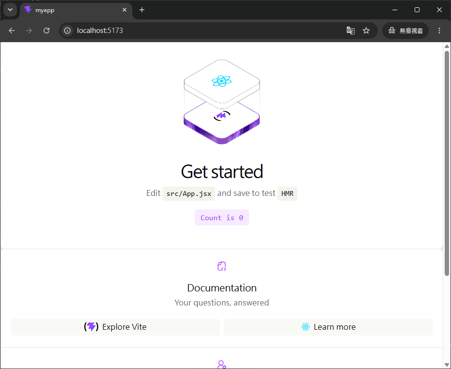
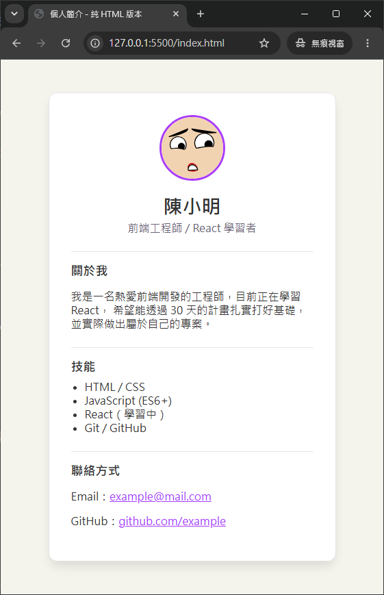

# Day 01｜React 是什麼 & 開發環境建置

- 今日範例程式碼：[`Day01\examples`](https://github.com/ShaoYuKao/2026-ithome-ironman-react-v19-30days/Day01/examples)

## 一、React 是什麼？

[React](https://react.dev) 是由 Meta（前身為 Facebook）開發並維護的一套 **JavaScript 函式庫（Library）**，主要用來建構使用者介面（User Interface, UI），特別擅長處理「畫面會隨著資料變化而更新」的網頁應用程式，例如社群動態牆、後台管理系統、電商網站等。

### 1. Library 還是 Framework？

初學者常搞混 React 到底是 Library 還是 Framework，這兩者的差異其實會直接影響你怎麼組織一個專案：

| 比較項目 | Library（函式庫） | Framework（框架） |
| --- | --- | --- |
| 控制權 | 你的程式碼主動呼叫 Library 提供的功能 | Framework 主動呼叫你寫的程式碼（Inversion of Control） |
| 彈性 | 高：可以自由選擇路由、狀態管理、打包工具等周邊套件 | 較低：通常有一套規定好的專案結構與規則 |
| 學習曲線 | 只需要先學核心概念，其餘工具邊做邊補 | 需要一次理解整套框架的規範 |
| 舉例 | **React**、Vue（核心部分）、jQuery | Angular、Next.js、Nest.js |

> React 官方對自己的定位就是「a JavaScript **library** for building user interfaces」。因為 React 只專注在「畫面」這一層，實務上開發一個完整專案時，我們通常會再自行搭配：
> - **路由（Routing）**：[`react-router`](https://reactrouter.com/)
> - **全域狀態管理（State Management）**：[`redux-toolkit`](https://redux-toolkit.js.org/) + [`react-redux`](https://react-redux.js.org/)
>

### 2. 為什麼要用元件化（Component-Based）開發？

在傳統寫法中，一個網頁的 HTML、CSS、JavaScript 往往是分開維護的：畫面結構寫在 HTML，樣式寫在 CSS，互動邏輯寫在 JavaScript，三者要「對照著看」才知道某一段邏輯到底控制哪一塊畫面。

React 提出的解法是 **Component（元件）**：把「畫面結構 + 資料 + 互動邏輯」封裝成一個個獨立、可重複使用的積木。例如一個部落格頁面可以拆成：

```
<App>
 ├─ <Header />        頁首（Logo、導覽列）
 ├─ <ArticleList />   文章列表
 │    └─ <ArticleCard />  單篇文章卡片（可重複使用）
 └─ <Footer />        頁尾
```

每個元件只需要專注做好自己的事情，彼此之間透過「資料（Props）」溝通。這種思維方式的好處：

- **重複使用**：同一個 `<ArticleCard />` 可以在列表頁、搜尋結果頁重複使用，不用複製貼上 HTML。
- **易於維護**：要修改某個區塊的樣式或邏輯，只需要打開對應的元件檔案，不用在整份大檔案裡面找。
- **好測試**：元件是獨立的單位，可以個別針對它撰寫測試。

元件化的觀念會貫穿整個 30 天內容，之後過幾天會更深入介紹如何實際拆分與撰寫元件。

### 3. Virtual DOM 概念

DOM（Document Object Model）是瀏覽器用來描述網頁結構的元件樹（Component Tree），我們平常用 JavaScript 操作畫面（例如 `document.getElementById(...).innerText = ...`）就是在操作真實 DOM。但直接、頻繁地操作真實 DOM 是比較昂貴的操作，因為瀏覽器每次異動都可能要重新計算版面（Layout）與重新繪製畫面（Repaint）。

React 的做法是在真實 DOM 之上，多一層用 JavaScript 物件模擬出來的 **Virtual DOM（虛擬 DOM）**：

1. 當資料狀態（State）改變時，React 不會馬上去動真實 DOM，而是先在記憶體中產生一份新的 Virtual DOM Tree。
2. React 會拿新的 Virtual DOM Tree 跟前一次的版本做「差異比對」，這個過程稱為 **Diffing（差異比對演算法）**。
3. 最後 React 只會把「真正有變化的地方」一次性、有效率地更新到真實 DOM 上，這個動作稱為 **Reconciliation（協調）**。

簡單來說，Virtual DOM 讓開發者不用再手動計算「這次資料改變後，畫面到底哪裡需要更新」，只要告訴 React「資料變成什麼樣子」，剩下交給 React 去算出最有效率的更新方式。

### 4. 宣告式（Declarative）vs 命令式（Imperative）

這是理解 React 開發思維很關鍵的一個對比：

- **命令式（Imperative）**：像原生 JavaScript 操作 DOM 一樣，一步一步下指令告訴瀏覽器「怎麼做」。
  ```js
  const btn = document.createElement('button')
  btn.innerText = '點我'
  btn.addEventListener('click', () => {
    btn.innerText = '已點擊'
  })
  document.body.appendChild(btn)
  ```
- **宣告式（Declarative）**：只需要描述「畫面在某個狀態下應該長什麼樣子」，不用管中間怎麼一步步操作 DOM。
  ```jsx
  function ClickButton() {
    const [clicked, setClicked] = useState(false)
    return (
      <button onClick={() => setClicked(true)}>
        {clicked ? '已點擊' : '點我'}
      </button>
    )
  }
  ```

React 採用的就是「宣告式」的開發方式：你只要描述「資料狀態（State）長怎樣，畫面就該長怎樣」，至於畫面實際上要怎麼從 A 狀態變成 B 狀態，交給 React 內部處理。

> 註：`useState` 的細節會在之後過幾天會詳細說明，這裡先有個印象即可。

## 二、開發環境建置

### 1. 安裝 Node.js

React 專案的開發、打包都需要透過 [Node.js](https://nodejs.org/) 提供的 JavaScript 執行環境與 `npm`（Node Package Manager）套件管理工具。建議安裝 **LTS（長期支援版）**。

**Windows 上安裝 Node.js**

在 Windows 上安裝 Node.js 最簡單且最推薦的方法是至 [Node.js 官方網站](https://nodejs.org/zh-tw/download)下載安裝檔（`.msi`）進行安裝，它會一併安裝套件管理工具 npm。

- **方法一**：使用官方安裝檔（最快最簡單）
  - 前往 Node.js 官方下載頁面 [https://nodejs.org/zh-tw/download](https://nodejs.org/zh-tw/download)。
  - 建議下載 **LTS（長期支援版）**，這個版本最穩定。
  - 下載後雙擊 `.msi` 檔案，一直點選「Next」完成安裝（建議保留預設勾選項目，會自動設定環境變數與 npm）。

- **方法二**：使用 NVM 進行版本管理（適合多版本需求）
  - 下載並安裝 [NVM for Windows](https://github.com/coreybutler/nvm-windows/releases) 的 `nvm-setup.exe`。
  - 開啟命令提示字元（cmd）或 PowerShell，輸入 `nvm install lts` 安裝最新長期支援版。
  - 輸入 `nvm use <版本號>` 來切換並啟用對應的 Node.js 版本。

**macOS 上安裝 Node.js**

使用 **NVM (Node 版本管理器)** 來管理不同版本，或者直接至 [Node.js 官方網站](https://nodejs.org/) 下載安裝檔。

- **方法一**：使用官方安裝檔（最直覺）
  - 前往 Node.js 官方網站。
  - 下載帶有 **LTS（長期支援版）** 的 macOS 安裝包 (`.pkg`)。
  - 雙擊下載的檔案，跟著畫面指示點選「繼續」完成安裝。

- **方法二**：使用 NVM 安裝（推薦，方便切換版本）
  - 下載並安裝 NVM，在終端機（Terminal）輸入指令：\
      `curl -o- https://raw.githubusercontent.com/nvm-sh/nvm/v0.40.3/install.sh | bash`
  - 重新載入終端機設定。
  - 安裝最新長期支援版本 (LTS)：\
      `nvm install --lts`
  - 使用該版本：\
      `nvm use --lts`

**Linux 上安裝 Node.js**

在 Linux 上安裝 Node.js 最推薦的方法是使用版本管理工具 **NVM (Node Version Manager)**，它可以讓你輕鬆安裝與切換不同版本的 Node.js。

- **方法一**：使用 NVM 安裝（最推薦）
  1. 安裝 curl（若系統尚未安裝）：

      ```bash
      sudo apt update && sudo apt install curl -y
      ```

  2. 下載並安裝 NVM：

      ```bash
      curl -o- https://raw.githubusercontent.com/nvm-sh/nvm/v0.40.7/install.sh | bash
      ```

  3. 載入設定檔（或重新開啟終端機）：

      ```bash
      source ~/.bashrc
      ```

  4. 安裝 Node.js 長期支援版 (LTS)：

      ```bash
      nvm install --lts
      ```

- **方法二**：使用 APT 套件管理器（適用於 Ubuntu/Debian 快速安裝）

  如果你不需要切換版本，可以直接用系統套件安裝：

  ```bash
  sudo apt update
  sudo apt install nodejs npm -y
  ```

安裝完成後，開啟終端機（Windows 可用命令提示字元 (cmd) 或 PowerShell）確認版本：

```bash
node -v
npm -v
```

只要能看到版本號（例如 `v22.x.x`、`12.x.x`）就代表安裝成功。本次 30 天學習裡的範例都會是在 Node.js `v24.x.x` 環境下測試建立的，只要是近期的 LTS 版本都可以正常使用。

### 2. 用 Vite 建立 React 19 專案

早期建立 React 專案常用 `create-react-app`，但這個工具目前已經停止維護，現在官方文件與社群主流做法都改用 **[Vite](https://vite.dev/)**。Vite 是一套新世代的前端建構工具（Build Tool），主要特色：

- **啟動極快**：開發模式下利用瀏覽器原生支援的 ES Module（`<script type="module">`）直接載入原始碼，不需要像傳統打包工具一樣，每次啟動都要先把整個專案打包一次。
- **Hot Module Replacement（HMR）**：修改程式碼存檔後，畫面會局部即時更新，不需要整頁重新整理，也不會遺失目前的元件狀態。
- **正式部署打包**：實際 `npm run build` 上線時，內部仍然會用 [Rollup](https://rollupjs.org/) 把程式碼打包、壓縮成最佳化過的靜態檔案。

打開終端機，切換到你想放置專案的資料夾(`myapp`)，執行：

```bash
npm create vite@latest myapp
```

執行後會出現互動式的選項（框架、變體），依序選擇：

```
? Select a framework:
❯ React

? Select a variant:
❯ JavaScript

? Which linter to use:
❯ Oxlint

? Install with npm and start now:
❯ Yes
```

> 說明：Vite 也支援 `--template react` 這種非互動式參數，可以跳過選單直接指定，例如：
> ```bash
> npm create vite@latest myapp -- --template react
> ```

#### ESLint 與 oxlint 有什麼差異？

目前 `npm create vite@latest` 選單裡的 Linter（程式碼檢查工具）預設選項已經是 **oxlint**，而不是大家比較熟悉的 **ESLint**。兩者的目的相同：在你寫程式的當下，就先抓出「潛在錯誤」與「不建議的寫法」（例如宣告了卻沒用到的變數、`useEffect` 依賴陣列漏寫等等），但底層實作與使用體驗差異不小：

| 比較項目 | ESLint | oxlint |
| --- | --- | --- |
| 底層語言 | JavaScript（透過 Node.js 逐條規則解讀執行） | Rust（編譯成原生執行檔） |
| 檢查速度 | 專案越大、規則越多時會明顯變慢 | 官方宣稱可比 ESLint 快上數十倍，大型專案也能在極短時間內完成檢查 |
| 生態系與外掛 | 非常成熟，幾乎任何框架、套件都找得到現成的規則套件（Plugin） | 仍在快速成長中，內建規則已涵蓋常見情境（包含本次 30 天學習用到的 React Hooks 規則），但客製化彈性目前不如 ESLint |
| 設定檔格式 | `eslint.config.js`（用 JavaScript 程式碼組合規則，彈性高但寫法較複雜） | `.oxlintrc.json`（單純的 JSON 設定檔，對初學者更直覺好懂） |

簡單來說：**oxlint 主打「開箱即用、速度快」**，很適合本次 30 天學習這種全新專案、想快速拿到程式碼檢查回饋的情境；**ESLint 主打「彈性高、生態系成熟」**，適合已經投入大量自訂規則、或需要特定冷門外掛的專案。兩者其實也可以在同一個專案中搭配使用（先用 oxlint 做第一層快速檢查，再視需求疊加 ESLint 的進階規則），並非只能二選一。本次 30 天學習範例會統一採用預設的 **oxlint**。

建立完成後，依照終端機的提示安裝套件並啟動開發伺服器：

```bash
cd myapp
npm install
npm run dev
```

看到終端機顯示類似下面的內容：

```
  VITE vX.X.X  ready in xxx ms

  ➜  Local:   http://localhost:5173/
```

用瀏覽器打開 `http://localhost:5173/`，能看到 Vite 預設的歡迎畫面，就代表環境建置成功。

### 3. 專案初始畫面說明

Vite 預設產生的畫面會包含 React 與 Vite 的 Logo，以及一個簡單的計數器按鈕（示範 HMR 效果）。這是官方模板提供的示範內容，之後我們會把它換成自己的畫面。



## 三、專案結構解析

用 Vite 建立好的 React 專案，預設的資料夾結構大致如下：

```
myapp/
├── index.html           # 網頁進入點（真實 DOM 只有一個 <div id="root">）
├── package.json         # 專案設定與套件相依清單
├── vite.config.js       # Vite 建構工具設定檔
├── .oxlintrc.json       # oxlint 程式碼檢查規則設定檔
├── public/              # 靜態資源（不會被打包處理，直接原樣複製）
│   ├── favicon.svg
│   └── icons.svg
└── src/                 # 主要原始碼資料夾
    ├── main.jsx         # React 應用程式的進入點
    ├── App.jsx          # 根元件（Root Component）
    ├── App.css          # App 元件的樣式
    ├── index.css        # 全域樣式
    └── assets/          # 元件內會用到的圖片等靜態資源
        ├── hero.png
        ├── react.svg
        └── vite.svg
```

### `index.html`

```html
<!doctype html>
<html lang="en">
  <head>
    <meta charset="UTF-8" />
    <title>myapp</title>
  </head>
  <body>
    <div id="root"></div>
    <script type="module" src="/src/main.jsx"></script>
  </body>
</html>
```

這是瀏覽器實際載入的網頁檔案，可以注意到 `<body>` 裡面幾乎是空的，只有一個 `id="root"` 的 `<div>`。這就是所謂的 **SPA（Single Page Application，單頁應用程式）** 開發模式：整個網站實際上只有這一份 HTML，畫面的內容全部由 React 在瀏覽器端透過 JavaScript 動態產生、掛載（Mount）到 `#root` 這個容器裡面。

### `src/main.jsx`

```jsx
import { StrictMode } from 'react'
import { createRoot } from 'react-dom/client'
import './index.css'
import App from './App.jsx'

createRoot(document.getElementById('root')).render(
  <StrictMode>
    <App />
  </StrictMode>,
)
```

這是整個 React 應用程式的**進入點（Entry Point）**，做的事情很單純：

1. `createRoot(document.getElementById('root'))`：告訴 React「請接管 `index.html` 裡面 `id="root"` 的這個節點」。
2. `.render(<App />)`：把 `App` 這個根元件（Component）渲染（Render）進去。
3. `<StrictMode>` 是 React 提供的開發輔助工具，只在開發模式下作用，用來提前偵測一些潛在問題（例如不安全的生命週期用法），不會影響正式上線後的畫面，也不會有任何使用者看得到的 UI。

### `src/App.jsx`

`App.jsx` 就是一個最基本的 **Function Component（函式元件）**，型態上就是一個「回傳畫面內容」的 JavaScript 函式：

```jsx
function App() {
  return (
    <>
      {/* 畫面內容 */}
    </>
  )
}

export default App
```

函式裡面 `return` 出來、看起來很像 HTML 的語法，其實是 **JSX**（JavaScript XML）。JSX 讓我們可以用近似 HTML 的方式描述畫面結構，同時又能直接嵌入 JavaScript 的變數與邏輯。詳細 JSX 語法規則會在 Day 2 深入說明，今天只需要知道：**`App.jsx` 就是我們接下來要開始動手修改的「主要畫面」**。

### `package.json`

```json
{
  "name": "myapp",
  "private": true,
  "version": "0.0.0",
  "type": "module",
  "scripts": {
    "dev": "vite",
    "build": "vite build",
    "lint": "oxlint .",
    "preview": "vite preview"
  },
  "dependencies": {
    "react": "^19.2.8",
    "react-dom": "^19.2.8"
  },
  "devDependencies": {
    "@types/react": "^19.2.17",
    "@types/react-dom": "^19.2.3",
    "@vitejs/plugin-react": "^6.0.4",
    "oxlint": "^1.75.0",
    "vite": "^8.2.0"
  }
}
```

比較重要的幾個 `scripts` 指令：

- `npm run dev`：啟動開發伺服器（本地開發用，含 HMR）。
- `npm run build`：打包成正式上線用的靜態檔案（輸出到 `dist/` 資料夾），之後部署時會用到。
- `npm run preview`：在本機預覽 `build` 之後的成果，模擬正式環境的執行結果。

`dependencies` 裡的 `react`、`react-dom` 是執行階段（Runtime）真正需要的套件；`devDependencies` 裡的 `vite` 只有開發、打包階段會用到，並不會被包進最終上線的程式碼裡。

### `.oxlintrc.json`

```json
{
  "$schema": "./node_modules/oxlint/configuration_schema.json",
  "plugins": ["react", "oxc"],
  "rules": {
    "react/rules-of-hooks": "error",
    "react/only-export-components": ["warn", { "allowConstantExport": true }]
  }
}
```

這是 oxlint 的設定檔，格式是單純的 JSON，比 ESLint 的 Flat Config（用 JavaScript 程式碼組合規則）更容易一眼看懂：

- `$schema`：指向 oxlint 套件內附的 JSON Schema，讓編輯器（例如 VS Code）在你編輯這個檔案時，能提供自動完成與格式檢查提示。
- `plugins`：啟用的規則插件（Plugin）。`"react"` 提供 React 專屬的檢查規則，`"oxc"` 是 oxlint 自身額外提供的一組通用規則。
- `rules`：實際套用的規則清單，可以個別設定成 `"off"`（關閉）、`"warn"`（警告，不會讓指令失敗）或 `"error"`（錯誤，會讓 `npm run lint` 指令回傳失敗）。
  - `react/rules-of-hooks`：檢查 React Hooks 使用規則（例如 `useEffect` 不能寫在條件判斷式裡面）。
  - `react/only-export-components`：確保檔案裡「只匯出（Export）元件」，這是 Vite 的 Fast Refresh（HMR）能正常運作所需要的條件；`allowConstantExport` 則允許額外匯出簡單的常數（Constant）。

### `vite.config.js`

```js
import { defineConfig } from 'vite'
import react from '@vitejs/plugin-react'

export default defineConfig({
  plugins: [react()],
})
```

這是 Vite 的設定檔，目前只載入了 `@vitejs/plugin-react` 這個 Plugin，讓 Vite 知道如何處理 `.jsx` 檔案（把 JSX 語法轉換成瀏覽器看得懂的 `React.createElement(...)` 呼叫）。之後如果要加上路由、環境變數、路徑別名（Alias）等設定，也都會寫在這個檔案裡。

## 四、今日範例：把靜態 HTML 個人簡介頁面改寫成 React 專案

- 今日範例程式碼：[`Day01\examples`](xxxxxxxxxx)

接下來實際動手，把一份「純 HTML 寫成的個人簡介頁面」改寫成能在 React 專案裡執行的版本。資料夾結構如下：

```
├── static-html/          # 步驟一：原始的純 HTML 靜態頁面
│   ├── index.html
│   └── style.css
└── react-profile/        # 步驟二：改寫後的 React（Vite）專案
    └── src/
        ├── App.jsx
        └── App.css
```

### 步驟一：準備靜態 HTML 頁面

先看一份最單純、不含任何框架的個人簡介頁面：

Day01\examples\static-html\index.html
```html
<!DOCTYPE html>
<html lang="zh-Hant">
  <head>
    <meta charset="UTF-8" />
    <title>個人簡介 - 純 HTML 版本</title>
    <link rel="stylesheet" href="./style.css" />
  </head>
  <body>
    <div class="profile-card">
      
      <h1 class="name">陳小明</h1>
      <p class="title">前端工程師 / React 學習者</p>

      <section class="bio">
        <h2>關於我</h2>
        <p>我是一名熱愛前端開發的工程師，目前正在學習 React……</p>
      </section>

      <section class="skills">
        <h2>技能</h2>
        <ul>
          <li>HTML / CSS</li>
          <li>JavaScript (ES6+)</li>
          <li>React（學習中）</li>
          <li>Git / GitHub</li>
        </ul>
      </section>

      <section class="contact">
        <h2>聯絡方式</h2>
        <p>Email：<a href="mailto:example@mail.com">example@mail.com</a></p>
        <p>GitHub：<a href="https://github.com/" target="_blank">github.com/example</a></p>
      </section>
    </div>
  </body>
</html>
```

Day01\examples\static-html\style.css
```css
* {
  box-sizing: border-box;
}

body {
  margin: 0;
  min-height: 100vh;
  display: flex;
  align-items: center;
  justify-content: center;
  background: #f4f3ec;
  font-family: system-ui, "Segoe UI", Roboto, sans-serif;
  color: #333;
}

.profile-card {
  width: 420px;
  max-width: 90vw;
  background: #fff;
  border: 1px solid #e5e4e7;
  border-radius: 12px;
  padding: 32px;
  text-align: center;
  box-shadow: 0 10px 15px -3px rgba(0, 0, 0, 0.1);
}

.avatar {
  width: 96px;
  height: 96px;
  border-radius: 50%;
  border: 3px solid #aa3bff;
}

.name {
  margin: 16px 0 4px;
  font-size: 28px;
}

.title {
  margin: 0 0 24px;
  color: #6b6375;
}

.bio,
.skills,
.contact {
  text-align: left;
  margin-top: 24px;
  border-top: 1px solid #e5e4e7;
  padding-top: 16px;
}

.bio h2,
.skills h2,
.contact h2 {
  font-size: 18px;
  margin: 0 0 8px;
}

.skills ul {
  margin: 0;
  padding-left: 20px;
}

.contact a {
  color: #aa3bff;
}
```

這份檔案可以直接用瀏覽器打開（雙擊 `index.html`）就能看到畫面，完全不需要任何建構工具，這也是它跟 React 專案最大的差異：**沒有元件、沒有資料驅動畫面的機制，內容全部都是寫死（Hard-code）在 HTML 裡的**。



### 步驟二：建立 React 專案

依照本章第二節的方式，用 Vite 建立一個新專案：

```bash
npm create vite@latest react-profile -- --template react
cd react-profile
npm install
```

### 步驟三：把 HTML 內容搬進 `App.jsx`

打開 `src/App.jsx`，把預設的示範內容清空，改成跟靜態頁面一樣的結構。搬移時需要注意三個 JSX 與 HTML 語法不同的地方：

| HTML 寫法 | JSX 寫法 | 原因 |
| --- | --- | --- |
| `class="profile-card"` | `className="profile-card"` | `class` 是 JavaScript 的保留字，JSX 改用 `className` |
| `` | `` | JSX 要求所有標籤都要「自我封閉（Self-closing）」或有對應的結束標籤 |
| 多個並列的區塊 | 需要一個唯一的根節點包起來，或用 `<>...</>`（Fragment）包住 | 一個元件的 `return` 只能回傳單一個根節點 |

改寫後的 `App.jsx`：

Day01\examples\react-profile\src\App.jsx
```jsx
import './App.css'

function App() {
  return (
    <div className="profile-card">
      
      <h1 className="name">陳小明</h1>
      <p className="title">前端工程師 / React 學習者</p>

      <section className="bio">
        <h2>關於我</h2>
        <p>
          我是一名熱愛前端開發的工程師，目前正在學習 React，
          希望能透過 30 天的計畫扎實打好基礎，並實際做出屬於自己的專案。
        </p>
      </section>

      <section className="skills">
        <h2>技能</h2>
        <ul>
          <li>HTML / CSS</li>
          <li>JavaScript (ES6+)</li>
          <li>React（學習中）</li>
          <li>Git / GitHub</li>
        </ul>
      </section>

      <section className="contact">
        <h2>聯絡方式</h2>
        <p>
          Email：<a href="mailto:example@mail.com">example@mail.com</a>
        </p>
        <p>
          GitHub：
          <a href="https://github.com/" target="_blank" rel="noreferrer">
            github.com/example
          </a>
        </p>
      </section>
    </div>
  )
}

export default App
```

Day01\examples\react-profile\src\App.css
```css
.profile-card {
  width: 420px;
  max-width: 90vw;
  background: #fff;
  border: 1px solid #e5e4e7;
  border-radius: 12px;
  padding: 32px;
  text-align: center;
  box-shadow: 0 10px 15px -3px rgba(0, 0, 0, 0.1);
  margin: 48px auto;
}

.avatar {
  width: 96px;
  height: 96px;
  border-radius: 50%;
  border: 3px solid #aa3bff;
}

.name {
  margin: 16px 0 4px;
  font-size: 28px;
}

.title {
  margin: 0 0 24px;
  color: #6b6375;
}

.bio,
.skills,
.contact {
  text-align: left;
  margin-top: 24px;
  border-top: 1px solid #e5e4e7;
  padding-top: 16px;
}

.bio h2,
.skills h2,
.contact h2 {
  font-size: 18px;
  margin: 0 0 8px;
}

.skills ul {
  margin: 0;
  padding-left: 20px;
}

.contact a {
  color: #aa3bff;
}
```

Day01\examples\react-profile\src\index.css
```css
* {
  box-sizing: border-box;
}

body {
  margin: 0;
  min-height: 100vh;
  display: flex;
  align-items: center;
  justify-content: center;
  background: #f4f3ec;
  font-family: system-ui, "Segoe UI", Roboto, sans-serif;
  color: #333;
}
```

> 這一步只是把「畫面能不能跑起來」搞定，內容（姓名、技能、簡介）暫時還是寫死的純文字，跟 HTML 版本沒有本質上的差異。**動態化（例如把姓名、技能清單改成用 JavaScript 變數 / 陣列渲染）會在 Day 2、Day 3 補上**，先求有、再求好。

> 註：`index.css` 和 `App.css` 差異
> 
> |                | `index.css`                         | `App.css`                                      |
> |----------------|-------------------------------------|------------------------------------------------|
> | **引入位置**   | `main.jsx`（應用入口）              | `App.jsx`（App 元件）                          |
> | **作用層級**   | 全域／整頁基底                      | 與 `App` 元件畫面相關的樣式                    |
> | **本專案內容** | `*`、`body`（版面置中、背景、字體） | `.profile-card`、`.avatar`、`.name` 等元件樣式 |
> 
> `main.jsx` 先載入全域樣式，再掛載 `App`；`App.jsx` 再載入自己的樣式：
> 
> src/main.jsx
> ```jsx
> import './index.css'
> import App from './App.jsx'
> ```
> 
> src/App.jsx
> ```jsx
> import './App.css'
> ```
> 
> ## 什麼時候寫到哪裡？
> 
> **寫進 `index.css`：**
> - 整站共用：`box-sizing`、`body`/`html` 預設、字體、背景色、連結預設色
> - CSS 變數（`:root`）這類全域 token
> - reset / normalize
> 
> **寫進 `App.css`：**
> - 只服務 `App` 這層 UI 的 class（例如本專案的個人卡片）
> - 元件專屬排版、間距、顏色細節
> 
> ## 實務建議（Vite + React 常見做法）
> 
> 1. **全域基底 => `index.css`**
> 2. **某個元件的樣式 => 跟該元件放一起**（`App.css` 對應 `App.jsx`；之後可有 `ProfileCard.css` 等）
> 3. 避免在 `index.css` 堆一堆元件 class，也避免在 `App.css` 改 `body` 這類全域規則
> 
> 本範例目前分法是：`index.css` 負責「整頁怎麼擺、長什麼底色」，`App.css` 負責「個人簡介卡片長什麼樣」。

### 步驟四：啟動並驗證畫面

開啟終端機（Windows 可用命令提示字元 (cmd) 或 PowerShell）輸入以下命令啟動：

```bash
npm run dev
```

打開瀏覽器進到 `http://localhost:5173/`，應該要能看到跟純 HTML 版本一模一樣的個人簡介卡片畫面。恭喜你，第一個 React 專案正式跑起來了！


### 小提醒：兩個版本的本質差異

雖然畫面看起來一樣，但背後的運作方式完全不同：

- **`static-html` 版本**：瀏覽器直接解析 HTML 檔案，畫面內容從頭到尾不會變。
- **`react-profile` 版本**：瀏覽器先載入幾乎空白的 `index.html`，由 JavaScript（React）在執行期間動態產生 DOM 並掛載到 `#root`。之後只要修改 `App.jsx` 裡的資料或邏輯，React 就能透過 Virtual DOM 的 Diffing 機制，只更新畫面上真正變化的部分——這就是第一節提到的「宣告式開發」與「Virtual DOM」在實務上的體現。

## 參考資源

- [Vite 官方文件](https://vite.dev/guide/)
- [react.dev - Installation](https://react.dev/learn/installation)
- [react.dev - Describing the UI](https://react.dev/learn/describing-the-ui)
