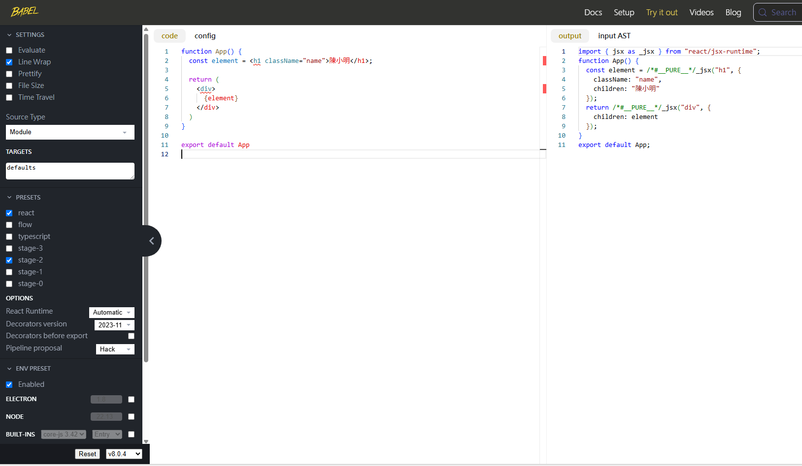
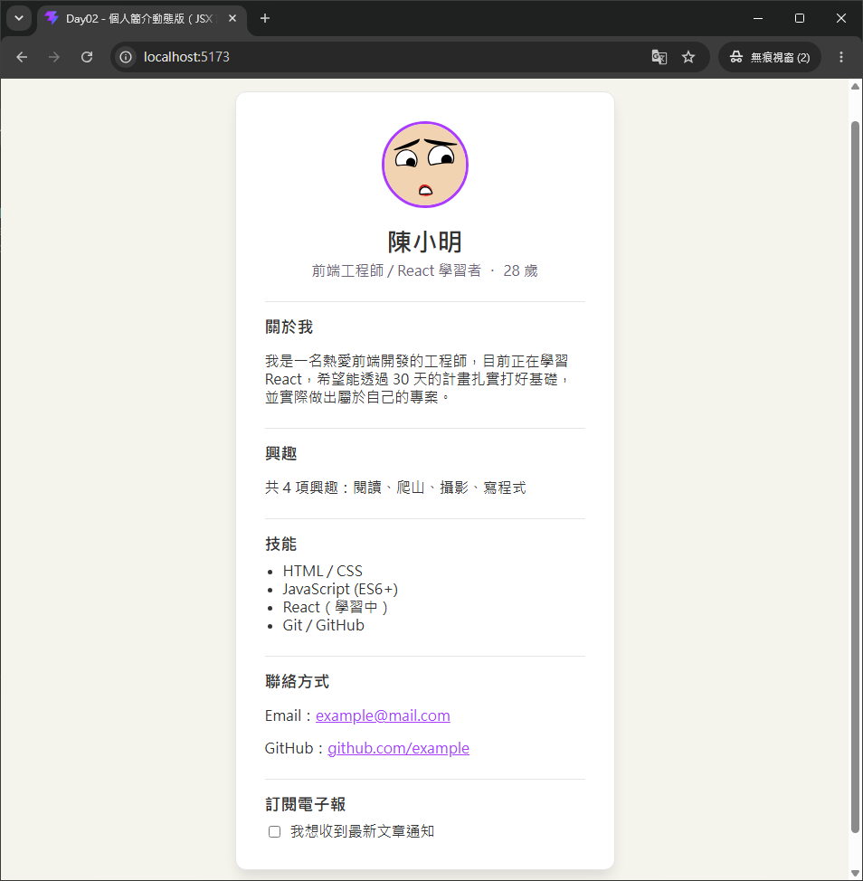

# Day 02｜JSX 語法

- 今日範例程式碼：[`Day02\examples\profile-dynamic`](xxxxxxxxxx)

## 一、JSX 是什麼？

**JSX（JavaScript XML）** 是 JavaScript 的一種**語法擴充（Syntax Extension）**，讓我們可以在 `.jsx` 檔案裡，用類似 HTML 標籤的寫法來描述畫面結構，例如 Day01 寫過的：

```jsx
function App() {
  return (
    <div className="profile-card">
      <h1>陳小明</h1>
    </div>
  )
}
```

看起來很像 HTML，但它**既不是字串，也不是 HTML**，瀏覽器本身完全看不懂 JSX。JSX 只是讓開發者「寫起來比較直覺」的語法糖，實際上會先經過建構工具 （Build Tool）編譯，轉換成一般的 JavaScript 函式呼叫之後，瀏覽器才能執行。

### 1. JSX 編譯之後長什麼樣子？

以前（React 17 之前）JSX 會被編譯成 `React.createElement(...)` 的呼叫；React 17 之後官方導入了「新版 JSX 轉換（New JSX Transform）」，改成呼叫 `jsx(...)` / `jsxs(...)` 這兩個函式，**不需要再手動 `import React`**。這兩個函式就定義在 React GitHub 專案 [`packages/react/jsx-runtime.js`](https://github.com/react/react/blob/main/packages/react/jsx-runtime.js)：

```js
export {Fragment, jsx, jsxs} from './src/jsx/ReactJSX';
```

用一個簡單的例子對照「編譯前的 JSX」跟「編譯後大致長怎樣」：



```jsx
// 編譯前：我們實際撰寫的 JSX
const element = <h1 className="name">陳小明</h1>
```

```js
// 編譯後：Vite / Babel 轉換出來的結果（簡化示意）
import { jsx as _jsx } from 'react/jsx-runtime'
const element = _jsx('h1', { className: 'name', children: '陳小明' })
```

`jsx()` 函式做的事情，本質上就是回傳一個描述「這個節點要用什麼標籤、有哪些屬性（props）、裡面包含什麼子節點」的**一般 JavaScript 物件**（React 內部稱為 React Element）。React 之後就是根據這些物件，透過 Day01 提過的 Virtual DOM Diffing 機制，決定要如何更新畫面。

> 換句話說：**JSX 只是 `jsx(...)` 函式呼叫的「另一種寫法」**，兩者是完全等價的，只是 JSX 讓我們不用手動一層層呼叫函式、巢狀括號堆疊，可讀性好非常多。

### 2. 為什麼要用 JSX？

- **貼近 HTML、學習曲線低**：前端開發者原本就熟悉 HTML 標籤結構，JSX 讓「畫面長什麼樣子」一目了然。
- **可以直接嵌入 JavaScript 邏輯**：透過 `{}`（下面第三節詳細說明），資料、邏輯、畫面結構可以寫在同一個地方，不用再像傳統做法「HTML 一份、JS 操作 DOM 又一份」分開維護。
- **編譯期就能檢查錯誤**：標籤沒有閉合、屬性寫錯等問題，建構工具在開發階段就會報錯，不用等到瀏覽器執行才發現。
- **良好的工具支援**：編輯器（如 VS Code）可以針對 JSX 提供語法高亮、自動完成、跳轉定義等輔助功能。

## 二、JSX 與 HTML 的語法差異

JSX 長得很像 HTML，但因為它終究會被編譯成 JavaScript 程式碼，所以有幾個地方**故意跟 HTML 不一樣**，初學者最容易在這幾點卡關：

### 1. `class` => `className`

`class` 是 JavaScript 的保留字（用來定義 class 類別），所以 JSX 改用 `className` 這個屬性名稱來設定 CSS 類別：

```html
<!-- HTML -->
<div class="profile-card">...</div>
```

```jsx
{/* JSX */}
<div className="profile-card">...</div>
```

### 2. `for` => `htmlFor`

同樣道理，HTML `<label>` 標籤用來關聯 `<input>` 的 `for` 屬性，`for` 在 JavaScript 裡是 `for` 迴圈的保留字，JSX 因此改用 `htmlFor`：

```html
<!-- HTML -->
<label for="newsletter">訂閱電子報</label>
<input type="checkbox" id="newsletter" />
```

```jsx
{/* JSX */}
<label htmlFor="newsletter">訂閱電子報</label>
<input type="checkbox" id="newsletter" />
```

### 3. 屬性命名採用 camelCase（小駝峰）

除了 `class`、`for` 這兩個特例，大部分 HTML 屬性到了 JSX 也會改成 camelCase 命名，例如 `tabindex` => `tabIndex`、`readonly` => `readOnly`。事件屬性也不例外，例如 `onclick` => `onClick`。`data-*`、`aria-*` 這類屬性則維持原本 HTML 的寫法（不會轉成 camelCase）。

### 4. 自閉合標籤（Self-closing Tag）

HTML 允許 ``、`<input>`、`<br>` 這種「單一標籤、沒有結束標籤」的寫法；但 JSX 要求**所有標籤都必須有結束標籤，或是自我封閉**，即使是原生就沒有子內容的標籤也一樣：

```html
<!-- HTML：合法 -->

<br>
```

```jsx
{/* JSX：一定要自我封閉（斜線 + 大於） */}

<br />
```

少寫這個 `/` 是初學者最常見的編譯錯誤之一。

### 5. 單一根節點（Single Root Node）與 `Fragment`

一個元件的 `return`，JSX 語法規定**只能回傳一個根節點**。以下寫法會編譯錯誤，因為 `h1` 和 `p` 是兩個並列的根節點：

```jsx
// ❌ 錯誤：回傳了兩個並列的元素，沒有唯一的根節點
function ProfileHeader() {
  return (
    <h1>陳小明</h1>
    <p>前端工程師</p>
  )
}
```

最直覺的解法是外面包一層 `<div>`：

```jsx
function ProfileHeader() {
  return (
    <div>
      <h1>陳小明</h1>
      <p>前端工程師</p>
    </div>
  )
}
```

但如果只是為了符合語法規則而加上 `<div>`，有時候反而會讓畫面多出不必要的巢狀結構（例如破壞 CSS 的 flex/grid 版面配置）。這時候可以改用 **Fragment**，讓元件回傳多個並列元素，但不會在真正的 DOM 上多產生任何標籤：

```jsx
import { Fragment } from 'react'

function ProfileHeader() {
  return (
    <Fragment>
      <h1>陳小明</h1>
      <p>前端工程師</p>
    </Fragment>
  )
}
```

實務上更常使用 Fragment 的**簡寫語法** `<>...</>`（不需要額外 `import`）：

```jsx
function ProfileHeader() {
  return (
    <>
      <h1>陳小明</h1>
      <p>前端工程師</p>
    </>
  )
}
```

> 補充：如果你之後需要在列表中渲染 Fragment、並且需要指定 `key` 屬性，就必須使用完整寫法 `<Fragment key={...}>`，簡寫的 `<>...</>` 沒辦法附加任何屬性。

### 6. 內聯樣式（Inline Style）用雙大括號物件

如果要用 `style` 屬性設定內聯樣式，JSX 要求傳入的是一個 **JavaScript 物件**（CSS 屬性名稱要改成 camelCase），而不是 HTML 那種分號字串：

```html
<!-- HTML -->
<p style="color: red; font-size: 16px;">文字</p>
```

```jsx
{/* JSX：外層 {} 代表「這裡是 JavaScript 表達式」，內層 {} 才是真正的物件字面量 */}
<p style={{ color: 'red', fontSize: '16px' }}>文字</p>
```

### 7. 註解寫法

JSX 裡不能直接使用 HTML 的 `<!-- 註解 -->`，必須把註解包在 `{}` 裡面，寫成 JavaScript 的區塊註解：

```jsx
function App() {
  return (
    <div>
      {/* 這是一段 JSX 註解 */}
      <p>內容</p>
    </div>
  )
}
```

## 三、在 JSX 中嵌入 JavaScript 表達式 `{}`

JSX 最強大的地方，就是可以用 `{}` 把「畫面」跟「資料 / 邏輯」寫在同一個地方。`{}` 裡面可以放**任何合法的 JavaScript 表達式（Expression）**——也就是「會回傳一個值」的程式碼。

### 1. 常見可以放進 `{}` 的東西

| 類型 | 範例 |
| --- | --- |
| 變數 | `<h1>{name}</h1>` |
| 物件屬性存取 | `<p>{profile.jobTitle}</p>` |
| 算術運算 | `<p>{age + 1} 歲</p>` |
| 字串模板（Template Literal） | ``  `` |
| 三元運算子（Ternary） | `<p>{isOnline ? '線上' : '離線'}</p>` |
| 邏輯運算子 `&&` | `<p>{hasError && '發生錯誤'}</p>` |
| 函式呼叫 | `<p>{formatDate(date)}</p>` |
| 陣列方法 | `<p>{hobbies.join('、')}</p>`、`<ul>{items.map(item => <li key={item}>{item}</li>)}</ul>` |

### 2. `{}` 裡面「不能」放的東西

`{}` 只能放**表達式**，不能放**陳述式（Statement）**，例如 `if...else`、`for` 迴圈、變數宣告 `const x = 1` 都不能直接寫在 `{}` 裡面：

```jsx
{/* ❌ 錯誤：if 是 Statement，不是 Expression */}
<div>
  {if (isOnline) { '線上' }}
</div>
```

如果需要條件判斷，改用三元運算子或 `&&`：

```jsx
{/* ✅ 正確：三元運算子是 Expression */}
<div>{isOnline ? '線上' : '離線'}</div>
```

### 3. 屬性也可以用 `{}` 帶入表達式

不只是標籤中間的內容，標籤的**屬性值**一樣可以用 `{}` 帶入變數或表達式，這時候屬性值前後就不需要再加引號：

```jsx
const avatarUrl = 'https://api.dicebear.com/10.x/adventurer-neutral/svg?seed=Felix'

// 屬性值是變數，不加引號，直接用 {}


// 屬性值是固定字串，才用引號

```

## 四、今日範例：把 Day01 的個人簡介頁面資料化

- 今日範例程式碼：[`Day02\examples\profile-dynamic`](xxxxxxxxxx)

接下來把 Day01 `react-profile` 專案裡「寫死」的姓名、年齡、興趣、技能，改成用一個 JavaScript 物件管理，再透過 JSX 表達式動態渲染。

### 步驟一：把資料抽成物件

```jsx
const profile = {
  name: '陳小明',
  birthYear: 1998,
  jobTitle: '前端工程師 / React 學習者',
  avatarSeed: 'Felix',
  bio: '我是一名熱愛前端開發的工程師，目前正在學習 React……',
  // 興趣清單用陣列儲存，畫面渲染邏輯不用管實際有幾筆資料
  hobbies: ['閱讀', '爬山', '攝影', '寫程式'],
  skills: ['HTML / CSS', 'JavaScript (ES6+)', 'React（學習中）', 'Git / GitHub'],
  contact: {
    email: 'example@mail.com',
    github: 'https://github.com/example',
  },
}
```

跟 Day01 版本最大的不同：姓名、興趣、技能不再是散落在 JSX 裡的固定文字，而是集中放在 `profile` 這個變數裡，之後要修改內容，只需要改這一份資料，不用到處找 JSX 標籤裡的文字。

### 步驟二：年齡用運算式即時算出

```jsx
function App() {
  // 年齡 = 目前年份 - 出生年份，每次 render 都會重新計算
  const age = new Date().getFullYear() - profile.birthYear

  return (
    <>
      <h1 className="name">{profile.name}</h1>
      <p className="title">
        {profile.jobTitle} ・ {age} 歲
      </p>
    </>
  )
}
```

這裡示範了 `{}` 裡面可以放**運算式**（`new Date().getFullYear() - profile.birthYear`），而不只是單純的變數名稱。

### 步驟三：興趣清單用三元運算子 + 陣列方法組成句子

```jsx
<section className="hobbies">
  <h2>興趣</h2>
  <p>
    {profile.hobbies.length > 0
      ? `共 ${profile.hobbies.length} 項興趣：${profile.hobbies.join('、')}`
      : '目前尚未填寫興趣'}
  </p>
</section>
```

- `profile.hobbies.length > 0 ? ... : ...`：三元運算子依照陣列長度決定要顯示哪一句話。
- `` `共 ${profile.hobbies.length} 項興趣：${profile.hobbies.join('、')}` ``：字串模板裡面又可以再嵌入表達式（陣列長度、`.join()` 組合出來的字串）。

### 步驟四：技能清單用 `.map()` 渲染成列表

```jsx
<ul>
  {profile.skills.map((skill) => (
    <li key={skill}>{skill}</li>
  ))}
</ul>
```

`.map()` 會把 `skills` 陣列的每一筆資料轉換成一個 `<li>` 元素，最後回傳一個「元素陣列」，JSX 可以直接把陣列當作子節點渲染出來。這裡先加上 `key={skill}` 讓 React 能追蹤每個項目——`key` 完整的運作原理與列表渲染的細節，會在之後過幾天**條件渲染 & 列表渲染**單元時詳細說明，今天重點只放在「陣列也是一種可以嵌入 `{}` 的表達式」。

### 步驟五：`htmlFor` 與自閉合標籤實例

```jsx
<label htmlFor="newsletter-checkbox">
  <input type="checkbox" id="newsletter-checkbox" />
  我想收到最新文章通知
</label>
```

`<input />` 使用自閉合寫法；`htmlFor="newsletter-checkbox"` 對應 `<input id="newsletter-checkbox" />`，點擊文字時也能連動勾選 checkbox（這裡先只示範標籤語法，checkbox 要能被 React 控制、即時反應狀態，屬於「表單處理進階」的受控元件主題）。

### 執行方式

```bash
cd Day02/examples/profile-dynamic
npm install
npm run dev
```

打開 `http://localhost:5173/`，應該能看到跟 Day01 外觀相同的個人簡介卡片，但這次姓名、年齡、興趣、技能全部都是從 `profile` 物件動態渲染出來的——試著修改 `profile.hobbies` 陣列的內容存檔，畫面就會立刻反映最新的興趣清單。



## 參考資源

- [Writing Markup with JSX – React](https://react.dev/learn/writing-markup-with-jsx)
- [JavaScript in JSX with Curly Braces – React](https://react.dev/learn/javascript-in-jsx-with-curly-braces)
- [Passing Props to a Component – React](https://react.dev/learn/passing-props-to-a-component)
