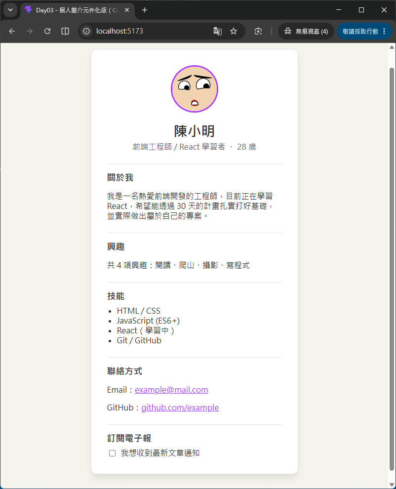

# Day 03｜元件（Component）與 Props

- 今日範例程式碼：[`Day03\examples\profile-components`](https://github.com/ShaoYuKao/2026-ithome-ironman-react-v19-30days/tree/master/Day03/examples/profile-components)

## 一、Function Component 是什麼？

從 Day01、Day02 開始，我們寫的 `App` 其實就已經是一個「元件（Component）」。今天要更完整地認識它：**元件本質上就是一個「回傳 JSX」的 JavaScript 函式**，沒有比這更複雜。

```jsx
function Greeting() {
  return <h1>你好，React！</h1>
}
```

React 會呼叫這個函式，拿到它回傳的 JSX（也就是 Day02 提過的、由 `jsx(...)` 產生的 React Element 物件），再依此決定畫面上要顯示什麼內容。元件可以像積木一樣互相組合、重複使用——這就是「元件化開發」的核心概念。

### 1. 兩種常見寫法

Function Component 主要有兩種等價的寫法，實務上都會遇到：

```jsx
// 寫法一：function 宣言（function declaration）
function ProfileCard() {
  return <div className="profile-card">...</div>
}

// 寫法二：箭頭函式（arrow function）+ const
const ProfileCard = () => {
  return <div className="profile-card">...</div>
}
```

兩種寫法在功能上完全相同，選擇哪一種主要是團隊風格偏好。整個 30 天內容與範例程式碼統一採用**寫法一（function 宣言）**，這也是[React 官方文件](https://react.dev) 最常使用的寫法，好處是函式名稱清楚寫在最前面，閱讀時一眼就能看出這是哪個元件。

### 2. 命名規則：一定要大寫開頭（PascalCase）

元件名稱**必須以大寫字母開頭**（例如 `ProfileCard`、`SkillList`），這不是單純的風格建議，而是 JSX 編譯規則的硬性要求：

```jsx
<div />          {/* 小寫開頭 → 編譯成字串 'div'，代表原生 HTML 標籤 */}
<ProfileCard />  {/* 大寫開頭 → 編譯成變數 ProfileCard，代表自訂元件 */}
```

JSX 的編譯器看到標籤名稱是**小寫開頭**時，會把它當成**字串**傳入；看到**大寫開頭**時，則會把它當成 **變數識別字（Identifier）** 去查找對應的函式或類別。**如果元件名稱寫成小寫開頭**（例如 `profileCard`），JSX 編譯器會誤判成 HTML 標籤字串 `'profilecard'`，畫面就不會出現任何內容，也不會呼叫到你寫的函式——這是初學者很容易踩到的錯誤。

## 二、Props：元件之間傳遞資料的橋樑

元件如果只能顯示寫死的內容，就沒辦法重複使用。**Props（properties 的縮寫）** 就是讓「呼叫元件的一方」把資料傳遞給「元件內部」的機制，概念上很像函式的參數（parameter）。

### 1. 從呼叫端傳入 Props

在 JSX 標籤上寫屬性，就是在傳遞 props，寫法跟傳遞 HTML 屬性很像，但值可以是任何 JavaScript 資料型別（字串、數字、陣列、物件、函式……都可以）：

```jsx
<ProfileCard name="陳小明" age={28} hobbies={['閱讀', '爬山']} />
```

這行程式碼會讓 `ProfileCard` 元件收到一個 props 物件：

```js
{ name: '陳小明', age: 28, hobbies: ['閱讀', '爬山'] }
```

### 2. 元件內部接收 Props：不解構 vs 解構寫法

元件函式永遠只有**一個參數**，就是這個 props 物件，React 會在呼叫元件函式時自動把它當作第一個參數傳入。因此最原始的寫法，是直接用 `props.xxx` 存取：

```jsx
// 寫法一：不解構，直接用 props.xxx
function ProfileCard(props) {
  return (
    <div className="profile-card">
      <h1>{props.name}</h1>
      <p>{props.age} 歲</p>
    </div>
  )
}
```

但每個欄位都要多打一次 `props.`，內容一多會很囉嗦。實務上更常見、也更建議的寫法，是在參數位置直接用 **解構賦值（Destructuring）** 取出需要的欄位：

```jsx
// 寫法二：解構賦值，一眼就能看出這個元件用了哪些 props
function ProfileCard({ name, age }) {
  return (
    <div className="profile-card">
      <h1>{name}</h1>
      <p>{age} 歲</p>
    </div>
  )
}
```

兩種寫法功能完全相同，但解構寫法有個明顯優點：**只要看函式簽名（`{ name, age }`），就能知道這個元件依賴哪些 props**，不用整個函式內文找一遍 `props.` 出現在哪裡。本篇範例程式碼的 `ProfileCard`、`SkillList` 都採用解構寫法，`ContactInfo` 則刻意示範不解構的寫法，方便對照。

### 3. Props 是唯讀的（Read-only）

Props 有一個很重要的原則：**子元件不能直接修改收到的 props**，資料的流向永遠是「由上（父元件）往下（子元件）」單向流動，這稱為 **單向資料流（One-way Data Flow）**。如果子元件想要「改變」畫面上顯示的內容，正確做法是請父元件重新傳入新的 props（之後過幾天會學到搭配 `useState` 讓父元件管理可變動的資料）。

這個「唯讀」原則不只是慣例，React 在開發模式（development mode）下會**實際用程式碼強制**：

```js
// 從 React GitHub 專案裡可以發現(https://github.com/react/react/blob/main/packages/react/src/jsx/ReactJSXElement.js)
if (Object.freeze) {
  Object.freeze(element.props);
  Object.freeze(element);
}
```

也就是說，在開發模式下，如果你嘗試在子元件裡執行 `props.name = '新名字'` 這種直接修改 props 的程式碼，會被 `Object.freeze` 擋下來（嚴格模式下甚至會噴錯），這也是 Day04 會提到「immutability（不可變性）」概念的第一次現身。

> 註：`Object.freeze()` 是 JavaScript 的一個方法，用來凍結一個物件（Object）。被凍結後，這個物件（Object）就不能再被修改：無法新增屬性（properties）、無法刪除屬性（properties）、也無法修改現有屬性（properties）的值或設定。這能確保資料完整性，避免資料被意外改變。

## 三、`children`：JSX 標籤之間的內容

### 1. `children` 是什麼？

如果在自訂元件的**開始標籤與結束標籤之間**寫內容，這段內容會被自動收集成一個特殊的 prop，名稱固定叫做 `children`：

```jsx
<Card>
  <h2>標題</h2>
  <p>這是一段說明文字</p>
</Card>
```

上面這段 JSX，`Card` 元件收到的 props 會是：

```js
{ children: (<><h2>標題</h2><p>這是一段說明文字</p></>) }
```

`Card` 元件只要在需要的位置寫 `{children}`，就能把這段內容渲染出來：

```jsx
function Card({ children }) {
  return <div className="card">{children}</div>
}
```

### 2. 什麼時候會用到 `children`？

`children` 最適合用在 **「容器型（Container）」元件**：這個元件負責提供外觀、佈局或行為（例如卡片外框、彈出視窗、版面配置），但**不在乎裡面實際放了什麼內容**。常見情境：

- 版面配置元件（例如 `<Layout>`、`<Card>`、`<Modal>`），只負責外框樣式，內容由使用它的人決定。
- 今天範例中的 `ProfileCard`：卡片本身的頭像、姓名、簡介是固定的 props，但「卡片下半部要放哪些區塊（技能？聯絡方式？其他自訂內容？）」透過 `children` 讓外部決定，`ProfileCard` 完全不需要知道裡面放的是 `SkillList` 還是別的元件。

`children` 跟一般 props 最大的差別，只在於**寫法**（寫在標籤之間，而不是 `attr={value}` 的形式），本質上它就是一個普通的 prop，一樣遵守「唯讀、由父傳子」的規則。

## 四、預設值：用 Default Parameter 取代 `defaultProps`

實務上很常遇到「這個 prop 是選填的，沒傳的話要有個合理預設值」的情境。過去 React 提供了 `Component.defaultProps` 靜態屬性來設定預設值，但這個寫法目前已經**在 Function Component 上被移除**，官方建議改用 JavaScript 原生的 **ES6 預設參數（Default Parameter）**。

```jsx
// ❌ 舊寫法：React 19 起，Function Component 已不再支援 defaultProps
function SkillList({ title, skills }) {
  return (/* ... */)
}
SkillList.defaultProps = { title: '技能' } // 不會生效，且會被標記為已過時的寫法

// ✅ 建議寫法：直接在解構賦值時給預設值
function SkillList({ title = '技能', skills }) {
  return (
    <section className="skills">
      <h2>{title}</h2>
      <ul>
        {skills.map((skill) => (
          <li key={skill}>{skill}</li>
        ))}
      </ul>
    </section>
  )
}
```

`title = '技能'` 的意思是：呼叫 `<SkillList skills={[...]} />` 沒有傳入 `title` 時（也就是解構出來的值是 `undefined`），會自動套用 `'技能'` 這個預設值；如果呼叫時有傳入 `title="專長"`，就會改用傳入的值。這是 JavaScript 函式參數本身就支援的語法，不是 React 特有的功能，所以無論元件用哪種寫法宣告，都能直接套用。

## 五、元件拆分原則：什麼時候該把畫面拆成子元件？

元件化開發最容易讓初學者卡關的，往往不是語法，而是「這個畫面到底該不該拆、要拆成幾個元件」。以下幾個原則可以作為判斷依據：

1. **語意上是獨立的一個區塊**：例如「技能清單」「聯絡方式」在畫面上、邏輯上都是可以獨立描述的區塊，適合拆成各自的元件（對照今天範例的 `SkillList`、`ContactInfo`）。
2. **內容會在別的地方重複使用**：如果「聯絡方式」這個區塊除了個人簡介頁，未來還會出現在其他頁面（例如頁尾），拆成獨立元件就能直接重複使用，不用複製貼上程式碼。
3. **元件函式太長、太多職責，難以閱讀**：當一個元件同時處理「頭像顯示」「興趣清單」「技能清單」「聯絡方式」「表單」等好幾件事，程式碼會變得又長又難維護，這時候依照職責拆分，每個元件只做一件事，會大幅提升可讀性（這也是軟體工程常提到的「單一職責原則」在元件上的體現）。
4. **需要各自管理狀態或獨立測試**：雖然今天的範例還沒用到 `useState`，但可以先預想：如果某個區塊之後需要有自己的開關狀態、獨立的互動邏輯，先拆成獨立元件，之後加狀態會更單純，不會互相干擾其他區塊的程式碼。
5. **不要為了拆而拆**：如果一個區塊只有一兩行 JSX、也不會被重複使用、邏輯上也跟主要元件密不可分，硬拆成獨立元件反而會增加檔案數量、增加「要多跳一個檔案才看得懂畫面長怎樣」的心智負擔。拆分是為了讓程式碼更好懂、更好維護，不是目的本身。

## 六、今日範例：把個人簡介頁拆成三個元件

延續 Day02 `profile-dynamic` 的 `profile` 資料物件與畫面，今天不改資料、不改外觀，只把原本擠在同一個 `App.jsx` 裡的 JSX，依照上一節的拆分原則，拆成 `ProfileCard`、`SkillList`、`ContactInfo` 三個元件。

### 步驟一：規劃元件的職責與 Props

先想清楚每個元件「負責什麼」「需要哪些 props」：

| 元件 | 負責的畫面區塊 | 需要的 Props |
| --- | --- | --- |
| `ProfileCard` | 卡片外框、頭像、姓名、職稱、關於我、興趣 | `name`、`jobTitle`、`age`、`avatarSeed`、`bio`、`hobbies`、`children`（放技能、聯絡方式等其他區塊） |
| `SkillList` | 技能清單 | `title`（選填，有預設值）、`skills` |
| `ContactInfo` | 聯絡方式（Email、GitHub） | `email`、`github` |

### 步驟二：`ProfileCard` —— 容器型元件，善用 `children`

```jsx
// src\components\ProfileCard.jsx
function ProfileCard({ name, jobTitle, age, avatarSeed, bio, hobbies, children }) {
  return (
    <div className="profile-card">
      
      <h1 className="name">{name}</h1>
      <p className="title">{jobTitle} ・ {age} 歲</p>

      <section className="bio">
        <h2>關於我</h2>
        <p>{bio}</p>
      </section>

      <section className="hobbies">
        <h2>興趣</h2>
        <p>
          {hobbies.length > 0
            ? `共 ${hobbies.length} 項興趣：${hobbies.join('、')}`
            : '目前尚未填寫興趣'}
        </p>
      </section>

      {/* 技能、聯絡方式等區塊，由外部決定放什麼內容 */}
      {children}
    </div>
  )
}

export default ProfileCard
```

`ProfileCard` 只負責「頭像 + 姓名 + 關於我 + 興趣」這個固定區塊，至於卡片下半部要接哪些內容，完全交給 `children`，`ProfileCard` 本身不需要 `import` `SkillList` 或 `ContactInfo`，兩者是完全解耦（decoupled）的。

### 步驟三：`SkillList` —— 用預設參數設定選填的 `title`

```jsx
// src\components\SkillList.jsx
function SkillList({ title = '技能', skills }) {
  return (
    <section className="skills">
      <h2>{title}</h2>
      <ul>
        {skills.map((skill) => (
          <li key={skill}>{skill}</li>
        ))}
      </ul>
    </section>
  )
}

export default SkillList
```

呼叫時只要 `<SkillList skills={profile.skills} />`，`title` 就會自動套用預設值 `'技能'`；如果哪天想改標題文字，呼叫端只要多傳 `<SkillList title="專長" skills={...} />` 即可，不需要修改 `SkillList` 內部的程式碼。

### 步驟四：`ContactInfo` —— 對照「不解構」的寫法

```jsx
// src\components\ContactInfo.jsx
function ContactInfo(props) {
  const { email, github } = props

  return (
    <section className="contact">
      <h2>聯絡方式</h2>
      <p>Email：<a href={`mailto:${email}`}>{email}</a></p>
      <p>
        GitHub：
        <a href={github} target="_blank" rel="noreferrer">
          {github.replace('https://', '')}
        </a>
      </p>
    </section>
  )
}

export default ContactInfo
```

`ContactInfo` 刻意保留完整的 `props` 參數，內部再用一行 `const { email, github } = props` 解構。跟 `ProfileCard`、`SkillList` 直接在參數位置解構相比，兩者效果相同，只是寫法先後順序不同——實務上比較推薦直接在參數解構（一眼看出用了哪些 props），但你在維護別人專案時，兩種寫法都可能遇到，能看懂即可。

### 步驟五：在 `App.jsx` 組裝三個元件

```jsx
// src\App.jsx
import ProfileCard from './components/ProfileCard.jsx'
import SkillList from './components/SkillList.jsx'
import ContactInfo from './components/ContactInfo.jsx'

const profile = { /* 跟 Day02 相同的資料物件 */ }

function App() {
  const age = new Date().getFullYear() - profile.birthYear

  return (
    <ProfileCard
      name={profile.name}
      jobTitle={profile.jobTitle}
      age={age}
      avatarSeed={profile.avatarSeed}
      bio={profile.bio}
      hobbies={profile.hobbies}
    >
      <SkillList skills={profile.skills} />
      <ContactInfo email={profile.contact.email} github={profile.contact.github} />
      <section className="newsletter">
        <h2>訂閱電子報</h2>
        <label htmlFor="newsletter-checkbox">
          <input type="checkbox" id="newsletter-checkbox" />
          我想收到最新文章通知
        </label>
      </section>
    </ProfileCard>
  )
}

export default App
```

`App` 現在的角色很單純：**準備資料、把資料透過 props 傳給 `ProfileCard`，並決定卡片下半部要放哪些區塊（`SkillList`、`ContactInfo`、還有一段沒有拆成元件的訂閱電子報 `<section>`）**。這裡也順便示範了 `children` 不一定只能放一個元素——`<ProfileCard>` 跟 `</ProfileCard>` 之間可以放任意數量、任意種類的 JSX 內容，React 會自動把它們收集成一個陣列。

### 執行方式

```bash
cd Day03/examples/profile-components
npm install
npm run dev
```

打開 `http://localhost:5173/`，畫面應該跟 Day02 完全一樣——這正是元件拆分該有的結果：**外觀不變，但程式碼的組織方式變得更清楚、更容易維護**。可以試著把 `SkillList` 元件抽出來、複製一份改個 `title`，放在其他頁面練習重複使用。



## 七、本日重點整理

- **Function Component** 本質上是一個「回傳 JSX」的 JavaScript 函式，可以用 `function` 宣言或箭頭函式撰寫；名稱**必須大寫開頭**，因為 JSX 編譯規則用「大小寫」判斷標籤要編譯成字串（原生標籤）還是變數識別字（自訂元件）。
- **Props** 是元件之間單向傳遞資料的機制：呼叫端用 `attr={value}` 傳入，元件內部可以用 `props.xxx` 或解構賦值 `{ xxx }` 接收；Props 是**唯讀**的，React 在開發模式下會用 `Object.freeze` 強制這個規則。
- **`children`** 是一個特殊的 prop，代表寫在元件開始／結束標籤之間的內容，很適合用來做「容器型」元件（例如卡片、版面配置），讓元件不需要知道裡面實際放了什麼內容。
- **預設值**請直接用 ES6 的**預設參數**（例如 `{ title = '技能' }`），這是目前 React 官方建議的做法，取代已經在 Function Component 上失效的 `defaultProps`。
- **元件拆分**沒有絕對的答案，但可以參考幾個原則：語意上獨立的區塊、會被重複使用、避免單一元件職責過多、之後需要獨立管理狀態；同時也要避免「為了拆而拆」增加不必要的檔案與心智負擔。
- 練習重點：把 Day02 個人簡介頁裡「頭像＋姓名＋關於我＋興趣」拆成 `ProfileCard`（容器型元件，用 `children` 承接其他區塊）、把「技能清單」拆成 `SkillList`（示範預設參數）、把「聯絡方式」拆成 `ContactInfo`（示範不解構的寫法），三者都透過 props 從 `App` 取得資料。

## 參考資源

- [Your First Component – React](https://react.dev/learn/your-first-component)
- [Passing Props to a Component – React](https://react.dev/learn/passing-props-to-a-component)
- [Component – React](https://react.dev/reference/react/Component#static-defaultprops)
