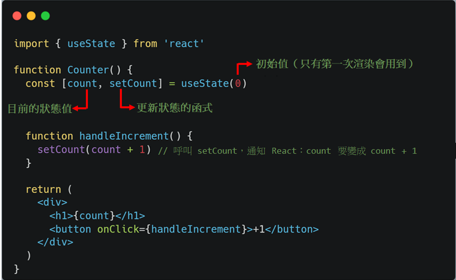
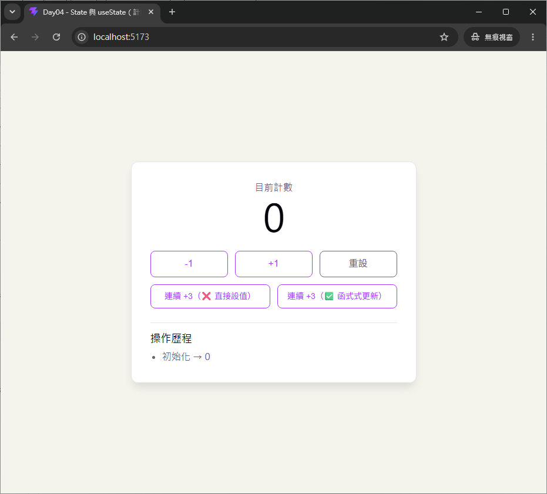

# Day 04｜State 與 `useState`

- 今日範例程式碼：[`Day04\examples\counter-app`](https://github.com/ShaoYuKao/2026-ithome-ironman-react-v19-30days/tree/master/Day04/examples/counter-app)

## 一、State 是什麼？跟 Props 有什麼不同？

Day03 學過，**Props** 是父元件傳給子元件的資料，特性是「由外部決定、元件內部只能讀不能改（唯讀）」。但如果一個元件想要「自己記住某個會隨時間改變的資料」——例如計數器目前的數字、輸入框目前打了什麼字、這個開關是打開還關閉——就不能只靠 Props，因為 Props 是外部傳進來的，元件自己沒辦法主動去修改它。

這時候就需要 **State（狀態）**：**元件自己宣告、自己擁有、而且可以隨時間改變的資料**。

### 1. 一般 JavaScript 變數為什麼不能拿來當 State？

先看一個直覺但錯誤的寫法：

```jsx
function Counter() {
  let count = 0 // ❌ 這只是一般的區域變數

  function handleIncrement() {
    count = count + 1
    console.log(count) // 數字確實變了……
  }

  return (
    <div>
      <h1>{count}</h1>
      <button onClick={handleIncrement}>+1</button>
    </div>
  )
}
```

點擊按鈕後，`count` 的值在記憶體裡確實變成了 `1`、`2`、`3`……但畫面上的 `<h1>` 永遠顯示 `0`。原因是：**一般的區域變數，重新賦值並不會讓 React 重新呼叫這個元件函式**。React 只有在「重新渲染」時才會再跑一次 `Counter()`，拿到新的 JSX 去更新畫面；而普通變數的賦值，只是改了記憶體裡的值，沒有任何機制通知 React「畫面需要更新了」。而且更根本的問題是：函式每次被呼叫（重新渲染）時，`let count = 0` 這行都會重新執行一次，把 `count` 重設回 `0`，之前累加的結果根本不會被保留下來。

**`useState` 要解決的，正是這兩個問題**：

1. 讓資料在多次重新渲染之間**被記住**（不會每次都重設回初始值）。
2. 提供一個專用的更新函式，呼叫它就能**通知 React：「這個元件需要重新渲染了」**。

### 2. State 與 Props 對照表

| | Props | State |
| --- | --- | --- |
| 資料來源 | 由**父元件**從外部傳入 | 元件**自己**宣告、自己擁有 |
| 可否修改 | **唯讀**，子元件不能直接改（Day03 提過 `Object.freeze`） | **可變**，透過專用的 `set` 函式更新 |
| 誰決定何時改變 | 父元件重新傳入新的 props 時才會變 | 元件自己呼叫 `setState` 就能改變 |
| 改變後的結果 | 觸發使用這個元件的畫面重新渲染 | 觸發**這個元件自己**重新渲染 |
| 適合存放 | 元件外部就決定好、不需要元件自己修改的資料 | 元件內部需要「隨使用者互動或時間改變」的資料 |

簡單來說：**Props 像是函式的參數（外部決定），State 則像是元件自己的記憶——而且這份記憶是「特權記憶」，只要更新它，React 就會自動重新畫一次畫面**，這是一般 JavaScript 變數完全沒有的能力。

## 二、`useState` 的基本語法

```js
const [state, setState] = useState(initialState);
```

> 宣告一個元件內部的狀態變數，可直接呼叫 `setState` 更新，更新後觸發重新渲染。

拆解這一行程式碼：



### 1. 為什麼回傳的是「陣列」，而不是「物件」？

`useState(0)` 回傳的是一個長度為 2 的陣列 `[count, setCount]`，用**陣列解構賦值**取出兩個值。這是刻意的設計：陣列解構是「依照順序」對應，你可以自由幫這兩個值取任何名字（`count`/`setCount`、`age`/`setAge`、`isOpen`/`setIsOpen`……），不需要像物件解構那樣被固定的屬性名稱綁住。這也是為什麼一個元件裡可以放心多次呼叫 `useState`，每次都能取一組獨立的名字：

```jsx
function ProfileForm() {
  const [name, setName] = useState('')
  const [age, setAge] = useState(0)
  const [isSubscribed, setIsSubscribed] = useState(false)
  // ……
}
```

### 2. Hooks 的呼叫規則（Rules of Hooks）

`useState` 屬於 React 的 **Hook**（所有以 `use` 開頭的 API 都是），Hooks 有一個重要規則：**只能寫在元件（或自訂 Hook）的最頂層呼叫，不能寫在 `if`、`for`、巢狀函式裡面**，而且每次渲染呼叫 Hook 的**順序必須完全一致**。原因會在下一節看到：React 內部是依照呼叫順序，把每個 `useState` 對應到專屬的一份記憶體（Hook 物件），如果順序在渲染之間改變，就會對應錯誤，讀到不屬於自己的 state。

```jsx
// ❌ 錯誤：不能把 Hook 包在條件式裡面
function Counter({ enabled }) {
  if (enabled) {
    const [count, setCount] = useState(0) // 違反 Rules of Hooks
  }
  // ...
}
```

## 三、初始值的兩種寫法：一般值 vs Lazy Initializer

`useState(initialState)` 的參數，除了直接傳一個值（`useState(0)`、`useState('')`、`useState([])`），還可以傳一個**函式**，這個寫法稱為 **Lazy Initializer（惰性初始化）**：

```jsx
// 寫法一：直接傳值
const [count, setCount] = useState(0)

// 寫法二：Lazy Initializer，傳一個「回傳初始值」的函式
const [history, setHistory] = useState(() => {
  console.log('這行只會在 State 初始化時印出')
  return [{ id: 0, label: '初始化', value: 0 }]
})
```

```jsx
// ❌ 效能陷阱：每次重新渲染，expensiveCompute() 都會被呼叫一次，
//    只是從第二次渲染開始，算出來的結果會被丟棄不用（因為 useState 只在掛載時採用它）。
const [data, setData] = useState(expensiveCompute())

// ✅ 正確寫法：傳「函式本身」，而不是「呼叫函式的結果」。
//    expensiveCompute() 不會在每次重新渲染時重複執行，而只會在 State 初始化時執行。
const [data, setData] = useState(() => expensiveCompute())
```

判斷原則：**當初始值可以直接取得，例如 `0`、`''`、`false`、`[]`、`{}`，通常直接傳值即可；如果產生初始值需要執行額外工作，例如資料轉換、解析 JSON、讀取 `localStorage` 或較昂貴的計算，可以使用 Lazy Initializer，避免這些程式碼在每次重新渲染時重複執行**。

> ⚠️ 不過要注意：上面「`expensiveCompute()` 只會在 State 初始化時執行」這句話，在**開發環境啟用 `<StrictMode>`** 時需要修正一下——React 可能會**刻意呼叫 initializer 兩次**，用來檢查這個函式是否夠「純」；其中一次的結果會被丟棄不用。Production 環境不會做這個額外檢查，只會呼叫一次。詳見下面的「三個重要注意事項」。

### `Lazy Initializer` 的三個重要注意事項

```jsx
const [data, setData] = useState(() => createInitialData())
```

1. **Initializer 只用來初始化 State**：後續重新渲染時，React 會忽略傳進去的 `initialState`（或 initializer 的回傳值），直接使用已經保存的 State，不會重新呼叫它。
2. **Initializer 必須保持純粹（Pure）**：函式應該不接受參數、回傳初始值，且不修改外部變數、不操作 DOM、不執行其他副作用。
3. **開發環境的 `<StrictMode>` 可能執行兩次**：React 會刻意呼叫 initializer 兩次，協助檢查它是否為純函式；其中一次結果會被忽略。Production 環境不受這項檢查影響，只會呼叫一次。

```jsx
// ✅ Pure initializer：沒有副作用
function createInitialTodos() {
  return [
    { id: 1, text: 'Learn React' },
    { id: 2, text: 'Learn useState' },
  ]
}

const [todos, setTodos] = useState(createInitialTodos)
```

`createInitialTodos` 只負責產生初始資料，沒有修改外部變數，也沒有操作 DOM，因此是純函式。接著直接傳入 `useState(createInitialTodos)`，React 會在 State 初始化時呼叫它，取得回傳值作為初始 State。

```jsx
let nextId = 0

// ❌ 不建議：修改了外部變數 nextId，不是純函式
function createInitialTodos() {
  return [{ id: nextId++, text: 'Learn React' }]
}

const [todos, setTodos] = useState(createInitialTodos)
```

### 常見陷阱：如果初始 State 本身就是函式

`useState(someFunction)` 傳進去的 `someFunction` 一律會被 React 當成 **initializer 執行**，而不是把函式本身存成 State。如果真的想把一個函式存進 State，必須用 `() => someFunction` 包起來：

```jsx
function handleSomething() {
  console.log('Hello')
}

// ❌ handleSomething 會被 React 當成 initializer 呼叫執行
const [callback, setCallback] = useState(handleSomething)

// ✅ 回傳「函式本身」，才會把 handleSomething 存進 State 而不執行它
const [callback, setCallback] = useState(() => handleSomething)
```

### 綜合比較：四種常見寫法一次搞懂

把上面 `handleSomething`（沒有 `return`、只印出訊息）跟前面「三個重要注意事項」用過的 `createInitialTodos`（回傳一個 todos 陣列）放在一起比較，可以更清楚看出「呼叫函式」「傳函式參考」「用箭頭函式包一層」這幾種寫法的差異：

```jsx
function handleSomething() {
  console.log('Hello')
}

function createInitialTodos() {
  return [
    { id: 1, text: 'Learn React' },
    { id: 2, text: 'Learn useState' },
  ]
}

// (1) 直接呼叫，把「呼叫結果」傳給 useState
const [todosA, setTodosA] = useState(handleSomething())

// (2) 直接傳「函式參考」給 useState
const [todosB, setTodosB] = useState(handleSomething)

// (3) 用箭頭函式包一層，回傳「函式參考本身」
const [todosC, setTodosC] = useState(() => createInitialTodos)

// (4) 用箭頭函式包一層，回傳「呼叫後的結果」
const [todosD, setTodosD] = useState(() => createInitialTodos())
```

| 寫法 | `useState` 實際收到的參數 | React 的行為 | 最終 State 的值 | 常見誤區 |
| --- | --- | --- | --- | --- |
| (1) `useState(handleSomething())` | `handleSomething()` **執行後的結果**：`undefined`（因為 `handleSomething` 沒有 `return`） | 參數已經不是函式了（`typeof undefined !== 'function'`），React 直接把 `undefined` 當成初始值使用 | `undefined` | `handleSomething()` 是在呼叫 `useState` 之前，由 JavaScript 先求值的一般函式呼叫，所以**每一次重新渲染都會被執行一次**，不是只有初始化時才跑；如果函式有副作用（像這裡的 `console.log`），每次重繪都會再印一次 |
| (2) `useState(handleSomething)` | `handleSomething` 這個**函式參考** | `typeof initialState === 'function'` 成立，React 把它當成 **Lazy Initializer**，只在掛載時呼叫一次 `handleSomething()` | `undefined`（`handleSomething()` 的回傳值） | 容易誤以為「把函式存進 State 了」，但實際上 React 已經把它執行掉並丟棄回傳值，State 拿到的不是函式本身，而是它執行後的結果 |
| (3) `useState(() => createInitialTodos)` | 一個箭頭函式，**回傳 `createInitialTodos` 這個函式參考**（注意沒有加 `()` 呼叫它） | React 只在掛載時呼叫這個箭頭函式一次，取得回傳值——也就是 `createInitialTodos` 這個函式本身（尚未執行） | `createInitialTodos` 這個**函式**，不是陣列 | 如果原本目的是想產生「初始的 todos 陣列」，這裡忘了在 `createInitialTodos` 後面加 `()`，會拿到函式本身而不是陣列，之後對它呼叫 `.map()`、讀取 `.length` 都會報錯；這個寫法只有在「真的想把函式本身存成 State」（例如存一個 callback）時才是正確的，用途跟前面 `useState(() => handleSomething)` 一樣 |
| (4) `useState(() => createInitialTodos())` | 一個箭頭函式，**呼叫 `createInitialTodos()` 並回傳它的結果** | React 只在掛載時呼叫這個箭頭函式一次；箭頭函式內部再呼叫一次 `createInitialTodos()`，取得陣列 | `[{ id: 1, text: 'Learn React' }, { id: 2, text: 'Learn useState' }]` | 這正是「用 Lazy Initializer 產生初始陣列」的正確寫法：`createInitialTodos()` 只會在掛載時執行一次，重新渲染不會再重複呼叫 |

一句話統整：

- **要不要在最外層包一層 `() =>`，決定 React「什麼時候」執行裡面的函式**：沒有包（(1)、(2)），函式會在「現在」被執行——(1) 是每次渲染前都執行，(2) 是 React 當成 initializer 只在掛載時執行一次；有包（(3)、(4)），才會透過 Lazy Initializer 的機制，保證只在掛載時執行一次。
- **箭頭函式裡面，目標函式後面要不要加 `()` 去呼叫它，決定最終存進 State 的是「函式本身」還是「函式執行後的回傳值」**：不加 `()`（(3)）存進去的是函式參考，適合「就是想把 callback 存成 State」的情境；加了 `()`（(4)）存進去的才是計算出來的初始資料，適合「用函式產生初始值」的情境，也是本節「三個重要注意事項」示範 `createInitialTodos` 時真正想要的寫法。

---


### Lazy Initializer 與一般初始值的比較

| 寫法 | 行為 |
| --- | --- |
| `useState(0)` | 使用 `0` 作為初始值 |
| `useState(createInitialTodos())` | 先立即執行 `createInitialTodos()` |
| `useState(createInitialTodos)` | 使用 `createInitialTodos` 作為 Lazy Initializer |
| `useState(() => createInitialTodos())` | 初始化時才執行 `createInitialTodos()` |
| `useState(() => createInitialTodos)` | 將 `createInitialTodos` 本身存進 State |

## 四、`setState` 如何觸發重新渲染？

這是今天最重要的觀念之一：

> **呼叫 `setCount(...)` 並不是「立刻把目前的 `count` 變數改掉」，而是向 React 提出一次 State 更新要求，讓 React 在後續的渲染中使用新的 State。**

例如：

```jsx
function Counter() {
  const [count, setCount] = useState(0)

  function handleIncrement() {
    console.log(count) // 0

    setCount(count + 1)

    console.log(count) // 還是 0
  }

  return <button onClick={handleIncrement}>{count}</button>
}
```

為什麼第二個 `console.log(count)` 還是 `0`？

因為 **State 可以理解成某一次渲染（render）的快照（snapshot）**。這次 React 執行 `Counter()` 時，`count === 0`，因此這次 render 所建立的 `handleIncrement` 裡，看到的 `count` 就是 `0`。呼叫 `setCount(1)` 並不會回頭修改這一次函式呼叫裡已經存在的 `count` 變數，而是告訴 React：**下一次重新渲染時，這個 State 應該更新成 `1`。**

可以把整個過程理解成：

```text
使用者點擊按鈕
        ↓
執行 handleIncrement()
        ↓
呼叫 setCount(1)
        ↓
React 記錄這筆 State 更新
        ↓
React 排程重新渲染
        ↓
再次執行 Counter()
        ↓
useState 取得新的 count
        ↓
產生新的 JSX
        ↓
React 比較前後 UI
        ↓
必要時更新 DOM
```

因此下一次 React 再執行 `Counter()`、呼叫 `useState(0)` 時，取得的 `count` 才會是新的值 `1`。

### `setState` 不代表立刻重新渲染

React 也會對同一批發生的多筆 State 更新進行 **Batching（批次處理）**。例如：

```jsx
function handleClick() {
  setCount(1)
  setName('ShaoYu')
  setVisible(true)
}
```

不要把它理解成「`setCount` => render => `setName` => render => `setVisible` => render」這種每呼叫一次就重新渲染一次的線性流程。React 通常會先收集這一批 State 更新，等目前的事件處理函式執行完成後，再一次處理並重新渲染，藉此避免不必要的重複渲染。

這也能自然銜接下一節「連續呼叫 `setCount(count + 1)` 三次為什麼只 +1」的討論。

### 重新渲染不等於一定修改 DOM

還有一個初學者常混淆的地方：**React 重新渲染（re-render），不代表瀏覽器 DOM 一定會被修改。**

重新渲染主要代表 React 會再次執行元件函式（例如 `Counter()`），取得新的 JSX，再拿去跟前一次的結果比較；只有真正發生變化、需要同步到畫面的部分，React 才會在後續的 **Commit** 階段更新 DOM。因此可以把 React 的更新流程簡化理解成：

```text
Trigger（觸發更新）
        ↓
Render（重新執行元件、計算 UI）
        ↓
Commit（必要時修改 DOM）
```

另外，如果傳入的新 State 與目前 State 相同，React 可以透過 `Object.is` 判定沒有實際變化，並跳過不必要的重新渲染。例如 `useState(0)` 之後呼叫 `setCount(0)`，因為 `Object.is(0, 0)` 為 `true`，React 可以判斷這次 State 並沒有真正改變，因此沒有必要重新渲染。

> **重點：`setState` 的真正意思不是「現在立刻修改變數」，而是「要求 React 在後續 render 使用新的 State」。目前這一次 render 中讀到的 State 仍然是原本的 snapshot。**

## 五、函式式更新（Functional Update）vs 直接設值

`setState` 接受的參數，可以是「一個值」，也可以是「一個函式」。從 [React GitHub 專案](https://github.com/react/react/blob/main/packages/react-reconciler/src/ReactFiberHooks.js)裡可以發現，判斷方式在 `basicStateReducer`：

```js
// packages/react-reconciler/src/ReactFiberHooks.js
function basicStateReducer<S>(state: S, action: BasicStateAction<S>): S {
  return typeof action === 'function' ? action(state) : action;
}
```

- **直接設值**：`setCount(5)` —— `action` 是數字 `5`，不是函式，所以直接拿 `5` 當作新的 state。
- **函式式更新**：`setCount(prevCount => prevCount + 1)` —— `action` 是一個函式，React 會呼叫 `action(state)`，把「當時佇列裡最新的狀態」當作參數傳進去，用回傳值當作新的 state。

### 1. 陷阱：連續呼叫直接設值，只會生效一次

```jsx
function handleWrongTripleIncrement() {
  setCount(count + 1) // count 是這次渲染的值，例如 0，所以這裡等於 setCount(1)
  setCount(count + 1) // count 還是同一次渲染的 0，所以還是 setCount(1)
  setCount(count + 1) // 一樣是 setCount(1)
  // 結果：count 最後只會變成 1，而不是預期中的 3
}
```

問題出在：`count` 是這次函式呼叫（這次渲染）裡的**固定值**（透過 JavaScript 閉包（Closure）捕捉），三次呼叫用的都是同一個 `count`，所以三次 `setCount(count + 1)` 其實都在說「把 state 換成同一個數字」，並不是「在前一次的基礎上再加一次」。

### 2. 正確做法：改用函式式更新

```jsx
function handleCorrectTripleIncrement() {
  setCount((prevCount) => prevCount + 1) // 0 + 1 = 1
  setCount((prevCount) => prevCount + 1) // 1 + 1 = 2
  setCount((prevCount) => prevCount + 1) // 2 + 1 = 3
  // 結果：count 正確變成 3
}
```

因為每一次傳入的都是「函式」，React 會依序執行 `basicStateReducer`：拿「上一步驟算出來的結果」當作這一步驟的 `prevCount`，三次呼叫依序疊加，最後正確得到 `3`。

> **經驗法則：只要新的 state 需要依賴「前一個 state」來計算，就一律使用函式式更新 `setState(prev => ...)`，而不是 `setState(state值 + 1)`**。這樣不管呼叫幾次、呼叫的時機為何，結果都會正確疊加，不會受到 JavaScript 閉包（Closure）捕捉到舊值的影響。本篇範例的 Counter 元件特地做了「連續 +3」的兩個按鈕，可以直接點擊比較兩種寫法的實際差異。

---

## 六、不可變性（Immutability）：為什麼不能直接修改 State

前面第四節看到，React 判斷「要不要重新渲染」的其中一個依據，是用 **`Object.is` 比較新舊狀態**。這件事對**陣列、物件**這類「參照型別（Reference Type）」的 state 特別重要：

```jsx
const [items, setItems] = useState(['蘋果', '香蕉'])

// ❌ 錯誤：直接修改原本的陣列
function addItemWrong(name) {
  items.push(name)     // 直接改動原本的陣列內容
  setItems(items)      // 傳進去的還是「同一個陣列」（同一塊記憶體參照）
}

// ✅ 正確：用展開運算符（spread）建立一個「新陣列」
function addItemCorrect(name) {
  setItems((prevItems) => [...prevItems, name]) // 產生新的陣列，內容包含舊資料 + 新資料
}
```

`items.push(name)` 是**直接修改（mutate）原本那個陣列物件本身**，`items` 這個變數的參照（記憶體位址）完全沒有變。就算接著呼叫 `setItems(items)`，React 內部用 `Object.is(eagerState, currentState)` 比較時，拿到的會是「同一個參照」，判斷成「沒有變化」，**很可能就直接 bail out（跳過重新渲染），畫面完全不會更新**，即使陣列的內容其實已經被改掉了——這是初學者很容易踩到、而且不容易察覺原因的 Bug。

正確的做法，是**每次更新都建立一個全新的陣列或物件**，而不是修改原本那一份：

| 想做的事 | ❌ 直接修改（錯誤） | ✅ 建立新的（正確） |
| --- | --- | --- |
| 陣列新增一筆 | `arr.push(x)` | `[...arr, x]` |
| 陣列刪除一筆 | `arr.splice(i, 1)` | `arr.filter((_, idx) => idx !== i)` |
| 陣列修改某一筆 | `arr[i] = x` | `arr.map((item, idx) => (idx === i ? x : item))` |
| 物件修改某個欄位 | `obj.name = 'x'` | `{ ...obj, name: 'x' }` |

這個「不可變更新」的原則，不只是為了讓 `Object.is` 判斷正確而已，也讓程式碼更好推理：**每一次 state 的變化，都是一份全新、獨立的資料**，不會有「別的地方偷偷改到同一份資料」的意外副作用。

## 七、今日範例：計數器（Counter）元件

今天的練習是做一個計數器元件，除了基本的加一、減一、重設，範例額外加了一份「操作歷程」清單，用來實際示範 Lazy Initializer 跟不可變更新這兩個觀念。

### 步驟一：規劃元件需要的 State

| State     | 型別     | 用途                                                                       |
|-----------|----------|----------------------------------------------------------------------------|
| `count`   | `number` | 目前的計數值，透過 `+1`／`-1`／「重設」按鈕更新                            |
| `history` | `array`  | 操作歷程紀錄，示範用 Lazy Initializer 設定初始值、用展開運算符做不可變更新 |

### 步驟二：宣告 State，實作加一、減一、重設

```jsx
// src/components/Counter.jsx
import { useState } from 'react'

let nextHistoryId = 1

// Lazy Initializer：只有 State 初始化時才會呼叫（重新渲染不會再呼叫）
// 注意：這裡的 nextHistoryId++ 修改了外部變數，嚴格來說不是純函式；
// 開發環境啟用 <StrictMode> 時，這個函式可能被連續呼叫兩次，
// nextHistoryId 也會因此多加一次，屬於範例中刻意保留、可觀察的陷阱。
function createInitialHistory() {
  console.log('createInitialHistory() 執行了')
  return [{ id: nextHistoryId++, label: '初始化', value: 0 }]
}

function Counter() {
  const [count, setCount] = useState(0)
  const [history, setHistory] = useState(createInitialHistory)

  // 不可變更新：一律用展開運算符建立「新陣列」
  function addHistory(label, value) {
    setHistory((prevHistory) => [
      ...prevHistory,
      { id: nextHistoryId++, label, value },
    ])
  }

  function handleIncrement() {
    const nextCount = count + 1
    setCount(nextCount)
    addHistory('+1', nextCount)
  }

  function handleDecrement() {
    const nextCount = count - 1
    setCount(nextCount)
    addHistory('-1', nextCount)
  }

  function handleReset() {
    setCount(0)
    addHistory('重設', 0)
  }

  // ……（連續 +3 的兩個示範函式，見下一步）
}
```

留意 `useState(createInitialHistory)` 這裡傳的是 `createInitialHistory` 這個**函式本身**，沒有加 `()`——這正是第三節提到的 Lazy Initializer 寫法。之後不管按了再多次按鈕、觸發再多次重新渲染，React 都不會再重新呼叫這個 initializer，只會沿用第一次的結果。

打開瀏覽器開發者工具的 Console 觀察 `createInitialHistory() 執行了` 這行 log：因為這個範例的 `examples/counter-app` 在 `main.jsx` 用了 `<StrictMode>`，**開發環境下這行 log 很可能會印出兩次**，`nextHistoryId` 也會因此多加一次（例如第一筆歷程紀錄的 `id` 可能是 `2` 而不是 `1`）。這是因為 `createInitialHistory` 用 `nextHistoryId++` 修改了外部變數，不是純函式，而 React 在 `<StrictMode>` 開發環境下會刻意呼叫 initializer 兩次來檢查它是否夠純，其中一次結果會被丟棄。Production 環境不會做這項檢查，只會呼叫一次。

### 步驟三：加上「連續 +3」按鈕，比較兩種更新寫法

```jsx
// ❌ 錯誤示範：連續三次直接設值，讀到的都是同一次渲染的 count，結果只 +1
function handleWrongTripleIncrement() {
  setCount(count + 1)
  setCount(count + 1)
  setCount(count + 1)
  addHistory('連續 +3（❌ 直接設值，結果只 +1）', count + 1)
}

// ✅ 正確做法：函式式更新，依序疊加，結果正確 +3
function handleCorrectTripleIncrement() {
  setCount((prevCount) => prevCount + 1)
  setCount((prevCount) => prevCount + 1)
  setCount((prevCount) => prevCount + 1)
  addHistory('連續 +3（✅ 函式式更新，結果 +3）', count + 3)
}
```

實際點擊這兩個按鈕，觀察畫面上的數字變化，就能直接驗證第五節講的「直接設值」與「函式式更新」差異：一個只會 +1，另一個才會正確 +3。

### 步驟四：畫面渲染與操作歷程

```jsx
  return (
    <div className="counter-app">
      <p className="count-label">目前計數</p>
      <h1 className="count-display">{count}</h1>

      <div className="button-group">
        <button type="button" onClick={handleDecrement}>-1</button>
        <button type="button" onClick={handleIncrement}>+1</button>
        <button type="button" className="reset" onClick={handleReset}>重設</button>
      </div>

      <div className="button-group secondary">
        <button type="button" onClick={handleWrongTripleIncrement}>連續 +3（❌ 直接設值）</button>
        <button type="button" onClick={handleCorrectTripleIncrement}>連續 +3（✅ 函式式更新）</button>
      </div>

      <section className="history">
        <h2>操作歷程</h2>
        <ul>
          {history.map((item) => (
            <li key={item.id}>{item.label} → {item.value}</li>
          ))}
        </ul>
      </section>
    </div>
  )
}

export default Counter
```

`history.map(...)` 會在 Day06（條件渲染 & 列表渲染）詳細介紹，這裡先直接使用：每筆紀錄有獨立的 `id`（用來當 `key`），渲染出一行「操作 → 結果」的文字，讓「操作歷程」隨著每次按鈕點擊持續累加，直接把「不可變更新」的效果視覺化呈現出來。

### 步驟五：`App.jsx` 掛載元件

`Day04\examples\counter-app\src\App.jsx`
```jsx
import './App.css'
import Counter from './components/Counter.jsx'

function App() {
  return <Counter />
}

export default App
```

今天的練習重點單純聚焦在 `useState` 本身，所以 `App` 只需要掛載 `<Counter />`，不需要額外傳遞 props。

### 執行方式

```bash
cd Day04/examples/counter-app
npm install
npm run dev
```

打開 `http://localhost:5173/`，可以實際操作：

- 按「+1」「-1」觀察數字變化，以及下方「操作歷程」跟著新增紀錄。
- 按「重設」讓計數器歸零。
- 分別按「連續 +3（❌ 直接設值）」與「連續 +3（✅ 函式式更新）」，比較兩者的實際結果差異。
- 打開瀏覽器開發者工具的 Console，重新整理頁面後觀察 `createInitialHistory()` 的 log；因為範例啟用了 `<StrictMode>`，開發環境下很可能會看到印出兩次（Production 環境只會印出一次）。



## 八、常見誤區

- **以為 `setState` 會立刻同步改變變數的值**：實際上 `setState` 只是「排程」一次重新渲染，當下這次函式呼叫裡的變數（例如 `count`）不會馬上改變，要等下一次渲染才會拿到新值。
- **需要依賴前一個狀態計算時，卻用直接設值**：連續呼叫 `setCount(count + 1)` 好幾次，容易因為 JavaScript 閉包（Closure）捕捉到同一個舊值而只生效一次；只要新狀態需要根據舊狀態計算，一律改用函式式更新 `setCount(prev => prev + 1)`。
- **直接修改陣列／物件 state 再呼叫 setState**：例如 `arr.push(x); setArr(arr)`，因為參照沒有改變，`Object.is` 比較會判斷成「沒有變化」，畫面很可能不會更新；務必用展開運算符等方式建立全新的陣列／物件。
- **把 Hook 寫在條件式或迴圈裡**：違反 Rules of Hooks，會讓 React 內部對應到錯誤的 Hook 記憶體。
- **昂貴的初始值計算沒有用 Lazy Initializer**：寫成 `useState(expensiveCompute())` 會讓每次重新渲染都白白呼叫一次 `expensiveCompute()`，應該寫成 `useState(() => expensiveCompute())`。
- **誤以為 Lazy Initializer 在開發環境保證只執行一次**：State 初始值只會在初始化時被「採用」沒錯，但如果啟用了 `<StrictMode>`，開發環境可能會刻意呼叫 initializer 兩次來檢查它是否為純函式；務必讓 initializer 保持 pure（不修改外部變數、不操作 DOM），否則兩次呼叫可能造成不一致的結果。

## 九、本日重點整理

- **State** 是元件自己宣告、自己擁有、可以隨時間改變的資料，跟「由外部傳入、唯讀」的 Props 本質不同；一般的 JavaScript 變數無法勝任，因為重新賦值不會觸發重新渲染，也不會在多次渲染之間被記住。
- **`useState(initialState)`** 回傳 `[state, setState]` 陣列，用陣列解構自由命名；初始值可以是一般值，也可以用 **Lazy Initializer**（`() => ...`）避免產生初始值的程式碼在每次重新渲染時重複執行。Initializer 必須是純函式，因為開發環境啟用 `<StrictMode>` 時，React 可能會刻意呼叫它兩次來檢查純粹性，Production 環境才只呼叫一次。
- 呼叫 `setState` 的本質，是向 React 提出一次 State 更新要求：React 會將更新加入待處理佇列，並在適當時機重新執行元件函式（Render），取得新的 JSX 後才在 Commit 階段視需要更新 DOM——這也是「觸發重新渲染」這句話真正的意思。目前這次 render 讀到的 State 仍是原本的 **Snapshot**，同一批更新也會被 React **Batching**（批次處理）；若下一個 State 與目前 State 經 `Object.is` 判定相同，React 可以跳過不必要的重新渲染。
- **函式式更新** `setState(prev => ...)` 會依序拿「前一步驟算出的值」計算，適合「新狀態依賴舊狀態」的情境；**直接設值** `setState(value)` 則是單純替換成傳入的值，連續呼叫多次容易因為 closure 捕捉到同一個舊值而只生效一次。
- **Immutability（不可變性）**：更新陣列、物件狀態時，一律建立「全新的」陣列或物件（展開運算符、`map`、`filter`），絕不能直接修改原本的資料再傳入 `setState`，否則參照沒有改變，React 可能判斷成「沒有變化」而跳過重新渲染。
- 今日範例練習重點：計數器元件用 `useState` 管理 `count`（加一、減一、重設），並額外用 `history` 陣列狀態示範 Lazy Initializer 與不可變更新，搭配「連續 +3」的兩個按鈕直接比較函式式更新與直接設值的差異。

## 參考資源

- [State: A Component's Memory – React](https://react.dev/learn/state-a-components-memory)
- [useState – React](https://react.dev/reference/react/useState)
- [Queueing a Series of State Updates – React](https://react.dev/learn/queueing-a-series-of-state-updates)
- [Updating Objects in State – React](https://react.dev/learn/updating-objects-in-state)
- [Updating Arrays in State – React](https://react.dev/learn/updating-arrays-in-state)
