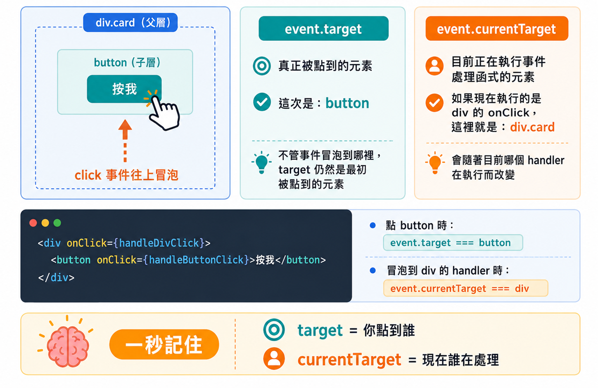

# Day 05｜事件處理（Event Handling）

- 今日範例程式碼：[`Day05\examples\event-playground`](https://github.com/ShaoYuKao/2026-ithome-ironman-react-v19-30days/tree/master/Day05/examples/event-playground)

## 一、合成事件（SyntheticEvent）是什麼？

在原生 JavaScript 裡，我們會這樣綁定事件：

```html
<button onclick="handleClick()">點我</button>
<!-- 或 -->
<script>
  document.querySelector('button').addEventListener('click', handleClick)
</script>
```

在 React 裡，寫法看起來很像，但其實完全是另一套機制：

```jsx
function App() {
  function handleClick() {
    console.log('被點擊了')
  }

  return <button onClick={handleClick}>點我</button>
}
```

乍看只是把 `onclick`（全小寫）改成 `onClick`（小駝峰），但這個小小的命名差異，正是分辨「原生事件屬性」跟「React 合成事件」最簡單的方法：**HTML 原生事件屬性一律全小寫（`onclick`、`onchange`），React 事件則一律用小駝峰命名（`onClick`、`onChange`）**。這不只是命名風格的選擇，背後代表 React 建立了一整套自己的事件系統。

### 1. 為什麼 React 不直接使用原生事件？

> React 主要支援以小駝峰命名（camelCase）封裝的內建合成事件（SyntheticEvent），這些事件可以直接綁定在標準的 HTML 元件上。

React 把原生瀏覽器事件包裝成一個**跨瀏覽器行為一致**的「合成事件物件」，主要解決幾個問題：

1. **抹平瀏覽器差異**：不同瀏覽器對同一個原生事件的實作細節不盡相同（例如舊版瀏覽器的 `event.keyCode` 跟新版的 `event.key`），React 統一包裝成一致的介面，開發者不需要自己處理相容性問題。
2. **提供原生 DOM 沒有、但實務上很好用的事件**：例如 `onMouseEnter` / `onMouseLeave`，實際上是 React 在內部監聽原生的 `mouseover` / `mouseout` 事件後，自行運算出「進入」「離開」的語意。
3. **統一透過事件委派（Event Delegation）處理，而不是替每個 DOM 節點個別掛監聽器**——這件事對效能與記憶體管理很重要。

### 2. 合成事件跟原生事件的關係

合成事件並不是憑空捏造出來的物件，它包裝（wrap）了原生事件，並且把原生事件保留在 `event.nativeEvent` 屬性上，需要用到瀏覽器獨有的欄位時，仍然可以透過這個屬性取用：

```jsx
function handleClick(event) {
  console.log(event.type) // 'click'：合成事件的類型
  console.log(event.nativeEvent) // 原生的 MouseEvent 物件
  console.log(event.nativeEvent.isTrusted) // 原生事件才有的欄位，例如是否為使用者真實觸發
}
```

### 3. 事件（Event）分類速查

React 19 支援的許多合成事件，依用途分成常見大類：

| 分類 | 常見事件 |
| --- | --- |
| 滑鼠事件 (Mouse Events) | `onClick`、`onDoubleClick`、`onMouseDown`、`onMouseEnter`、`onMouseLeave` |
| 表單事件 (Form Events) | `onChange`、`onInput`、`onSubmit`、`onReset`、`onInvalid` |
| 鍵盤事件 (Keyboard Events) | `onKeyDown`、`onKeyUp`（`onKeyPress` 已逐漸廢棄） |
| 焦點事件 (Focus Events) | `onFocus`、`onBlur` |
| 剪貼簿事件 (Clipboard Events) | `onCopy`、`onCut`、`onPaste` |
| 觸控 / 指標事件 | `onTouchStart`、`onPointerDown`…… |

今天先聚焦在最常用的五個：`onClick`、`onChange`、`onSubmit`、`onMouseEnter` / `onMouseLeave`、`onKeyDown`，其餘分類留到之後遇到實際需求時再討論。

## 二、React 是怎麼處理事件的？

前面我們已經知道，在 React 裡可以這樣處理按鈕的點擊事件：

```jsx
function App() {
  function handleClick() {
    console.log('按鈕被點擊了')
  }

  return <button onClick={handleClick}>點我</button>
}
```

當使用者真的按下「點我」按鈕時，整體流程可以先簡化成這張圖：

```text
使用者點擊按鈕
        ↓
瀏覽器產生 click 事件
        ↓
React 接收到這個事件
        ↓
React 準備好 event 事件物件
        ↓
React 找到這個元素設定的 onClick
        ↓
呼叫 handleClick(event)
        ↓
執行我們撰寫的程式碼
```

也就是：

> **使用者操作 => 發生事件 => React 接收事件 => 呼叫我們指定的事件處理函式，並自動帶入 `event`。**

接下來幾個小節，會把這張流程圖拆開，一步一步說明細節。

### 1. `onClick={handleClick}`：告訴 React「發生這個事件時要執行哪個函式」

```jsx
<button onClick={handleClick}>點我</button>
```

可以拆成兩個部分理解：

```text
onClick      → 要監聽什麼事件？
handleClick  → 事件發生後要執行哪一個函式？
```

這種負責處理事件的函式，通常稱為 **Event Handler（事件處理函式）**。

### 2. 為什麼是 `handleClick`，不是 `handleClick()`？

寫 `onClick={handleClick}` 時，並不是「現在馬上執行」，而是把 `handleClick` 這個**函式本身**交給 React，讓 React 記住「之後按鈕被點擊時，要呼叫這個函式」。等到使用者真的點擊按鈕，React 才會呼叫它：

```jsx
// ✅ 把函式交給 React，等點擊時才執行
<button onClick={handleClick}>點我</button>

// ❌ 渲染當下就立即執行，並把回傳值（通常是 undefined）交給 onClick
<button onClick={handleClick()}>點我</button>
```

這個「交給 React、之後才呼叫」的觀念，在後面學「事件傳參數的寫法」時還會再用到。

### 3. handler 怎麼拿到 `event`？不同事件帶來不同資訊

使用者觸發事件時，React 會自動準備一個**事件物件（event）**，並當作參數傳給 handler：

```jsx
function handleClick(event) {
  console.log(event.type) // click
}
```

我們不用自己寫 `handleClick(event)`，React 會在呼叫時自動帶入。不同的事件，`event` 裡帶的資訊也不同：

| 事件 | 範例程式 | 常用資訊 |
| --- | --- | --- |
| `onClick` | `console.log(event.type)` | `event.type`（`'click'`）、`event.target` |
| `onChange` | `console.log(event.target.value)` | 使用者目前輸入的內容 |
| `onKeyDown` | `console.log(event.key)` | 使用者按下的按鍵（例如 `'Enter'`） |

可以把 `event` 想像成：**React 幫我們準備的一包「這次事件的相關資訊」**，handler 再依需求從裡面取出需要的資料。

### 4. 事件冒泡：事件會從內層往外層傳遞

假設畫面上有兩層元素：

```jsx
function App() {
  function handleOuterClick() {
    console.log('外層 div')
  }

  function handleButtonClick() {
    console.log('內層 button')
  }

  return (
    <div onClick={handleOuterClick}>
      <button onClick={handleButtonClick}>點我</button>
    </div>
  )
}
```

如果使用者點擊 `button`，會先執行內層的 `handleButtonClick`，接著事件繼續往外傳，所以外層 `div` 也會收到通知：

```text
內層 button
外層 div
```

這種事件由內層元素一路往外層元素傳遞的現象，稱為**事件冒泡（Event Bubbling）**：

```text
          外層 div
            ↑
        ┌───────┐
        │ button│  ← 使用者實際點擊的元素
        └───────┘
```

後面介紹 `event.target`、`event.currentTarget` 與 `stopPropagation()` 時，都會用到這個觀念。

### 5. 複習：這裡的機制其實就是第一、二節提過的事件委派與 SyntheticEvent

* React 並不會替每個按鈕分別註冊監聽器，而是使用**事件委派（Event Delegation）**，把監聽器集中掛在根容器上，再由 React 內部判斷要呼叫哪一個 handler。
* handler 收到的 `event`，是 React 包裝過的 **SyntheticEvent（合成事件）**，用法與原生事件大致相同（`event.target`、`event.type`、`event.preventDefault()`...），觀念可回顧「一、合成事件（SyntheticEvent）是什麼？」。

初學階段不需要重新研究底層實作，只要記得：**我們只需要在 JSX 上寫 `onClick`、`onChange` 等事件，事件如何註冊與派送，React 會處理好。**

### 6. 一句話記住 React 事件處理

> 在 JSX 上用 **`on事件名稱={handler}`** 告訴 React「發生這個事件時要執行哪個函式」；事件真的發生時，React 會呼叫 handler，並自動把 **`event`** 事件物件傳進去。

例如：

```jsx
function App() {
  function handleClick(event) {
    console.log('按鈕被點擊了，事件類型：', event.type)
  }

  return <button onClick={handleClick}>點我</button>
}
```

點擊後 Console 會看到：

```text
按鈕被點擊了，事件類型： click
```

掌握這個模型，就已經足夠繼續學習接下來的 `onClick`、`onChange`、`onSubmit`、`onKeyDown`、事件冒泡與表單事件。

## 三、今天要熟悉的五個常用事件

### 1. `onClick`：滑鼠點擊

```jsx
function LikeButton() {
  function handleClick(event) {
    console.log('按鈕被點擊了', event.type) // 'click'
  }

  return <button onClick={handleClick}>按讚</button>
}
```

### 2. `onChange`：表單輸入值改變

`onChange` 是 React 裡「輸入框內容改變」的標準事件，跟原生 DOM 的 `onchange`（通常要失焦後才觸發）行為不太一樣——**React 的 `onChange` 會在每一次按鍵、每一次輸入時就觸發**，行為上比較接近原生的 `oninput`：

```jsx
function NameInput() {
  function handleChange(event) {
    console.log('目前輸入的值：', event.target.value)
  }

  return <input type="text" onChange={handleChange} />
}
```

### 3. `onSubmit`：表單提交

```jsx
function SearchForm() {
  function handleSubmit(event) {
    event.preventDefault() // 阻止瀏覽器預設的「整頁重新整理」行為
    console.log('表單送出了')
  }

  return (
    <form onSubmit={handleSubmit}>
      <input type="text" name="keyword" />
      <button type="submit">搜尋</button>
    </form>
  )
}
```

### 4. `onMouseEnter` / `onMouseLeave`：滑鼠移入移出

```jsx
function HoverBox() {
  function handleMouseEnter() {
    console.log('滑鼠進入了')
  }

  function handleMouseLeave() {
    console.log('滑鼠離開了')
  }

  return (
    <div onMouseEnter={handleMouseEnter} onMouseLeave={handleMouseLeave}>
      把滑鼠移上來
    </div>
  )
}
```

### 5. `onKeyDown`：鍵盤按鍵按下

```jsx
function SearchInput() {
  function handleKeyDown(event) {
    if (event.key === 'Enter') {
      console.log('按下了 Enter，執行搜尋')
    }
  }

  return <input type="text" onKeyDown={handleKeyDown} />
}
```

## 四、事件傳參數的寫法

### 1. 為什麼不能直接寫 `onClick={handleVote('like')}`？

初學者很容易寫出這樣的錯誤程式碼：

```jsx
// ❌ 錯誤：這是「立刻呼叫」handleVote('like')，並把它的回傳值（通常是 undefined）當作 onClick
<button onClick={handleVote('like')}>讚</button>
```

`{}` 裡面放的是一個 **JavaScript 表達式**，`handleVote('like')` 這段程式碼在 JSX 渲染的當下就會被「立刻執行」一次，而不是「等按鈕被點擊時才執行」。`onClick` 需要的是一個**函式參照（function reference）**，而不是「呼叫函式後的回傳結果」。

### 2. 正確寫法一：inline arrow function

```jsx
function VoteButtons() {
  function handleVote(type, event) {
    console.log('投票類型：', type)
    console.log('事件類型：', event.type)
  }

  return (
    <div>
      <button onClick={(event) => handleVote('like', event)}>讚</button>
      <button onClick={(event) => handleVote('dislike', event)}>倒讚</button>
    </div>
  )
}
```

用 `(event) => handleVote('like', event)` 包一層新的箭頭函式：這個箭頭函式**才是**真正傳給 `onClick` 的函式參照，只有在按鈕被點擊時才會執行；執行的當下，才會呼叫 `handleVote('like', event)`，同時傳入自訂的 `'like'` 參數與 React 自動帶入的合成事件 `event`。

### 3. 正確寫法二：只需要自訂參數、不需要 event 時

```jsx
<button onClick={() => handleVote('like')}>讚</button>
```

如果 handler 內部根本用不到 `event` 物件，也可以直接省略，只在箭頭函式裡呼叫 `handleVote('like')`。

### 4. `event.target.value`：表單取值的標準模式

處理輸入框、下拉選單、textarea 的內容變化時，固定會用到 `event.target.value` 這個寫法：

```jsx
function ControlledInput() {
  const [text, setText] = useState('')

  function handleChange(event) {
    setText(event.target.value) // event.target 是觸發事件的 DOM 節點，.value 是它目前的值
  }

  return <input type="text" value={text} onChange={handleChange} />
}
```

這個「`value` + `onChange` + `event.target.value`」的組合，在之後幾天會深入介紹的 **受控元件（Controlled Component）** 的核心雛型：畫面上顯示的值，永遠等於 state 的值；使用者輸入造成的變化，透過 `onChange` 回報給 state，再由 state 決定畫面要顯示什麼——資料流永遠是「單向」的。

## 五、`event.target` vs `event.currentTarget`

這是事件冒泡情境下，最容易搞混的一對屬性：

- **`event.target`**：使用者「實際點擊／觸發事件」的那個最深層元素，在事件冒泡的整個過程中**固定不變**。
- **`event.currentTarget`**：目前「正在執行 handler」的這個元素本身，也就是這個 handler 是綁定在哪個元素上的。

```jsx
function BubbleDemo() {
  function handleOuterClick(event) {
    console.log('target:', event.target) // 使用者實際點到的元素（可能是內層的按鈕）
    console.log('currentTarget:', event.currentTarget) // 一定是 outer 這個 div，因為 handler 綁在這裡
  }

  return (
    <div onClick={handleOuterClick}>
      outer
      <button>inner button</button>
    </div>
  )
}
```

如果使用者點的是裡面的 `<button>`，因為事件會冒泡到外層的 `div`，`handleOuterClick` 還是會被執行，此時 `event.target` 會是那個 `<button>`，但 `event.currentTarget` 永遠是 `div`（因為 handler 是綁在 `div` 上）。



## 六、`preventDefault()` 與 `stopPropagation()`

| 方法 | 作用 | 常見情境 |
| --- | --- | --- |
| `event.preventDefault()` | 阻止瀏覽器對這個事件的**預設行為** | 表單 `onSubmit` 阻止整頁重新整理；`<a>` 標籤 `onClick` 阻止跳轉 |
| `event.stopPropagation()` | 阻止事件繼續**冒泡**到外層祖先元素 | 巢狀可點擊區塊，內層點擊不希望觸發外層的 `onClick` |

```jsx
function SubmitForm() {
  function handleSubmit(event) {
    event.preventDefault() // 不阻止的話，表單送出會讓瀏覽器整頁重新整理
    console.log('改用 JavaScript 自己處理送出邏輯')
  }

  return <form onSubmit={handleSubmit}>{/* ... */}</form>
}

function NestedClickable() {
  function handleOuterClick() {
    console.log('outer 被觸發')
  }

  function handleInnerClick(event) {
    event.stopPropagation() // 擋下事件，outer 的 handleOuterClick 就不會被呼叫
    console.log('inner 被觸發')
  }

  return (
    <div onClick={handleOuterClick}>
      <button onClick={handleInnerClick}>inner</button>
    </div>
  )
}
```

兩者是完全獨立的兩件事，不要搞混：`preventDefault()` 管的是「瀏覽器原本會自動做的事」（例如送出表單、點連結跳轉），`stopPropagation()` 管的是「事件還要不要繼續往外層傳遞」。

## 七、今日範例：event-playground

今天的練習是做一個簡易輸入框，輸入文字即時顯示在畫面上；範例額外做成一個「Playground」，用六張卡片分別對照本篇提到的每一種事件情境。

### 卡片一：`ClickCounter.jsx` — `onClick` + inline arrow function 傳參數

```jsx
function ClickCounter() {
  const [likes, setLikes] = useState(0)
  const [dislikes, setDislikes] = useState(0)
  const [lastEvent, setLastEvent] = useState(null)

  function handleVote(type, event) {
    if (type === 'like') {
      setLikes((prev) => prev + 1)
    } else {
      setDislikes((prev) => prev + 1)
    }
    setLastEvent({
      type: event.type,
      target: event.currentTarget.textContent,
      isTrusted: event.nativeEvent.isTrusted,
    })
  }

  return (
    <>
      <button type="button" onClick={(event) => handleVote('like', event)}>👍 讚 {likes}</button>
      <button type="button" onClick={(event) => handleVote('dislike', event)}>👎 倒讚 {dislikes}</button>
    </>
  )
}
```

留意 `handleVote` 跟元件的 `return` 是分開的兩件事：`handleVote` 只負責在按鈕被點擊時更新 state（`likes` / `dislikes` / `lastEvent`），本身**不會回傳畫面**；真正決定畫面長相的，是 `ClickCounter` 元件自己的 `return (...)`。用 `(event) => handleVote('like', event)` 額外夾帶 `'like'` / `'dislike'` 這個自訂參數，並從 `event.nativeEvent.isTrusted` 驗證合成事件底下確實包著原生事件物件。

### 卡片二：`LiveEcho.jsx` — 今日主練習，`onChange` 受控輸入框

```jsx
function LiveEcho() {
  const [text, setText] = useState('')

  function handleChange(event) {
    setText(event.target.value)
  }

  return (
    <>
      <textarea value={text} onChange={handleChange} />
      <p>{text || '（尚未輸入任何文字）'}</p>
    </>
  )
}
```

`<textarea>` 的 `value` 綁定 `text` state，`onChange` 讀取 `event.target.value` 更新 state——這正是今天練習要求的「輸入文字即時顯示在畫面上」。

### 卡片三：`HoverCard.jsx` — `onMouseEnter` / `onMouseLeave`

滑鼠移入卡片時切換文字與底色，並累計「進入次數」，驗證 `onMouseEnter` 只在真正進入元素本身時觸發一次。

### 卡片四：`KeydownNotes.jsx` — `onKeyDown` 判斷按鍵

```jsx
function handleKeyDown(event) {
  if (event.key === 'Enter') {
    event.preventDefault()
    // 新增筆記……
  } else if (event.key === 'Escape') {
    setDraft('')
  }
}
```

用 `event.key` 判斷使用者按下的是 `Enter` 還是 `Escape`，分別做「新增」跟「清空」兩種不同的行為。

### 卡片五：`SignupPreview.jsx` — `onSubmit` + `preventDefault` + 表單驗證

```jsx
function handleSubmit(event) {
  event.preventDefault()
  const nextErrors = validate(form)
  setErrors(nextErrors)
  if (Object.keys(nextErrors).length === 0) {
    setSubmitted(form)
  }
}
```

送出時先 `preventDefault()` 擋掉整頁重新整理，再做基本驗證，通過才顯示送出結果。

### 卡片六：`BubblingDemo.jsx` — 事件冒泡與 `stopPropagation`

三層巢狀 `<div>`（outer / middle / inner）都綁定 `onClick`，點擊最內層的 inner 時，可以觀察事件依序冒泡到 middle、outer；勾選核取方塊後，`handleInnerClick` 會呼叫 `event.stopPropagation()`，再點一次就能看到冒泡被攔截、外層的 handler 不再被觸發。

### 執行方式

```bash
cd Day05/examples/event-playground
npm install
npm run dev
```

打開 `http://localhost:5173/`，可以實際操作六張卡片：

- 點擊「讚 / 倒讚」，觀察下方顯示的合成事件欄位（`type`、`target`、`isTrusted`）。
- 在輸入框輸入文字，觀察下方即時顯示的預覽與字數統計。
- 把滑鼠移進 hover 卡片，觀察文字與底色切換、進入次數累加。
- 在筆記輸入框輸入文字後按 `Enter` 新增、按 `Esc` 清空。
- 填寫註冊表單並嘗試不填欄位或輸入錯誤格式的 Email，觀察驗證錯誤訊息；全部正確才會顯示送出結果。
- 點擊最內層的 `inner` 方框，先在未勾選核取方塊的狀態下觀察冒泡順序，再勾選後比較 `stopPropagation()` 的效果差異。

## 八、常見誤區

- **把 `onClick={fn(arg)}` 寫成立刻呼叫函式**：`{}` 裡面是表達式，`fn(arg)` 在渲染當下就會執行一次，而不是等點擊才執行；需要傳參數時務必用 inline arrow function 包一層，例如 `onClick={() => fn(arg)}`。
- **搞混 `event.target` 與 `event.currentTarget`**：`target` 是使用者實際點到的最深層元素，`currentTarget` 是目前正在執行 handler 的元素；在有巢狀結構、事件冒泡的情境下，兩者經常不是同一個元素。
- **忘記表單 `onSubmit` 要呼叫 `event.preventDefault()`**：沒有阻止的話，瀏覽器會執行預設的表單提交行為（整頁重新整理），SPA 幾乎都不需要這個行為。
- **把 `preventDefault()` 和 `stopPropagation()` 搞混**：一個是「阻止瀏覽器預設行為」，一個是「阻止事件繼續冒泡」，是兩件完全獨立的事，不能互相替代。
- **以為 React 事件是原生瀏覽器直接掛在每個元素上**：實際上 React 透過事件委派，只在根容器上掛少量原生監聽器，再由自己的外掛系統模擬冒泡、依序呼叫收集到的 handler。

## 九、本日重點整理

- **合成事件（SyntheticEvent）** 是 React 包裝原生 DOM 事件後產生的統一介面，用小駝峰命名（`onClick`、`onChange`……），能抹平瀏覽器差異，並衍生出像 `onMouseEnter` / `onMouseLeave` 這種原生事件本身沒有的語意。
- React 透過**事件委派**，在 `createRoot` 建立的根容器上一次性掛好所有支援事件類型的原生監聽器，而不是替每個 DOM 節點各自掛一份；事件觸發時，由對應的**事件外掛（Event Plugin）**沿著 Fiber 樹收集監聽器、包裝成合成事件，依序呼叫，直到有人呼叫 `stopPropagation()` 才會提前中斷。
- 今天熟悉的五個常用事件：`onClick`（點擊）、`onChange`（輸入值改變，觸發時機接近原生 `oninput`）、`onSubmit`（表單提交）、`onMouseEnter` / `onMouseLeave`（滑鼠進出，不因子元素而重複觸發）、`onKeyDown`（鍵盤按下，搭配 `event.key` 判斷按鍵）。
- 需要在事件裡多傳自訂參數時，用 **inline arrow function** 包一層（`onClick={(event) => handleFn(arg, event)}`）；表單取值的標準寫法是 `event.target.value`，這也是受控元件的核心雛型。
- **`event.target`**（實際觸發事件的元素）與 **`event.currentTarget`**（目前執行 handler 的元素）不是同一件事；**`preventDefault()`**（阻止瀏覽器預設行為）與 **`stopPropagation()`**（阻止事件繼續冒泡）也是兩個獨立的方法，依情境選用。
- 練習重點：用 `value` + `onChange` + `event.target.value` 做出一個即時顯示輸入內容的受控輸入框；範例額外用六張卡片，涵蓋今天提到的每一種事件情境。

## 十、參考資源

- [Responding to Events - React](https://react.dev/learn/responding-to-events)
- [`<input>` - React](https://react.dev/reference/react-dom/components/input)
- [Common components (e.g. `<div>`) - React](https://react.dev/reference/react-dom/components/common)
