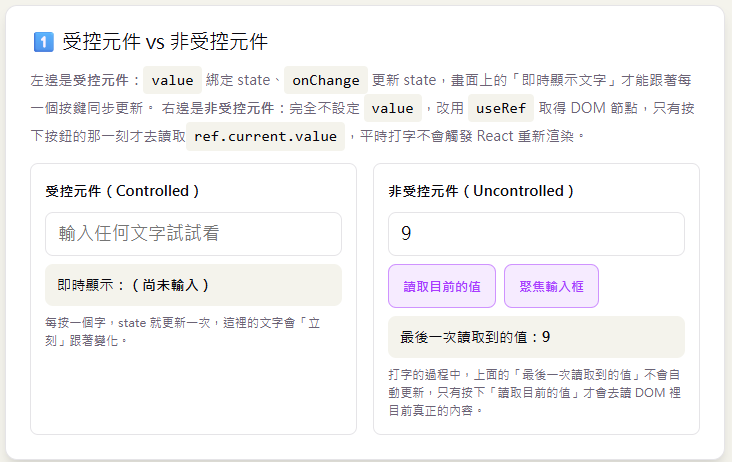
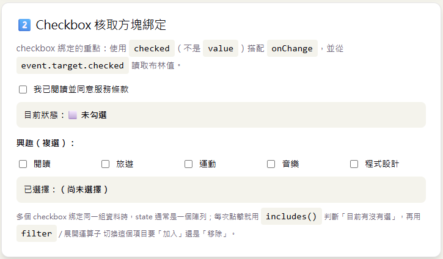
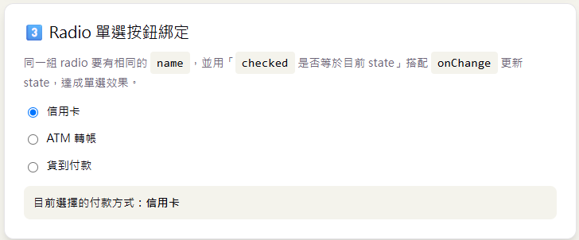
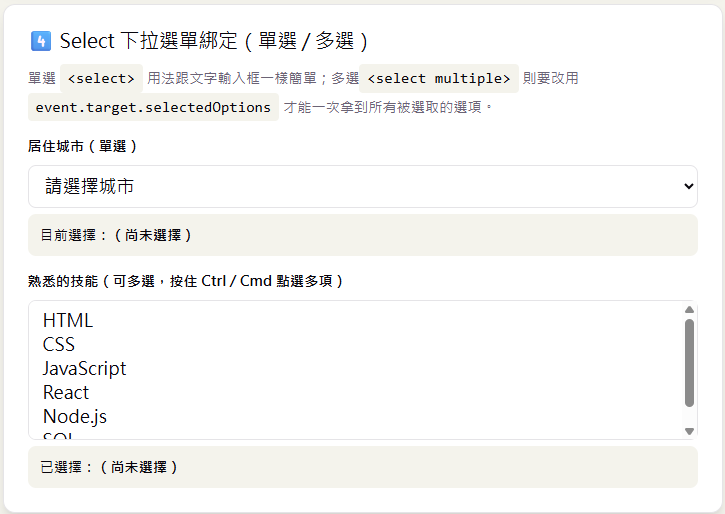
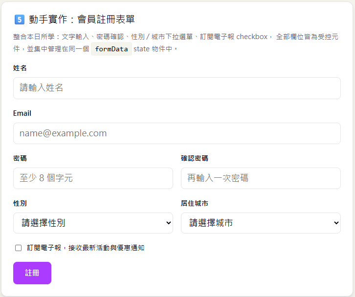

# Day 09｜表單處理進階

- 今日範例程式碼：[`Day09\examples\day09-form-lab`](https://github.com/ShaoYuKao/2026-ithome-ironman-react-v19-30days/tree/master/Day09/examples/day09-form-lab)

## 一、受控元件（Controlled Component）vs 非受控元件（Uncontrolled Component）

在瀏覽器原生的 HTML 世界裡，`<input>`、`<textarea>`、`<select>` 這類表單元素本來就有自己的「內部狀態」——你在輸入框打字，瀏覽器會自己記住目前輸入的內容，不需要 JavaScript 介入。但在 React 裡，我們通常希望「畫面上顯示的內容」跟「元件的 state」隨時保持一致，這樣才能：

- 在使用者打字的當下就即時做格式驗證、字數統計、連動其他欄位。
- 隨時用程式碼清空、預填、修改欄位內容（例如送出成功後清空表單）。
- 把「目前表單填了什麼」當成一般的 React state 來管理、傳遞、儲存。

這就衍生出兩種做法：

### 1. 受控元件（Controlled Component）

**表單元素的值完全由 React state 決定**，元素本身不再擁有自己的內部狀態，你透過 `value`（文字類）或 `checked`（勾選類）屬性把 state 的值「灌」進表單元素，並用 `onChange` 監聽使用者輸入，把新的值寫回 state：

```jsx
function ControlledInput() {
  const [text, setText] = useState('')

  return (
    <input
      type="text"
      value={text}                                      // state 決定畫面顯示什麼
      onChange={(event) => setText(event.target.value)} // 使用者輸入 -> 寫回 state
    />
  )
}
```

資料流向是這樣的單向循環：

```
state（目前的值）
   │  React 渲染，把 state 值放進 value
   ▼
畫面顯示 <input value={state}>
   │  使用者打字，觸發 onChange
   ▼
event.target.value（使用者剛輸入的最新內容）
   │  setState(新的值)
   ▼
state 更新 → 觸發重新渲染 → 畫面顯示最新的 state
```

雖然「畫面」跟「資料」看起來像是即時雙向同步，但骨子裡其實是**單向資料流**跑得很快而已：每一次按鍵都是「使用者輸入 => 更新 state => 重新渲染 => 畫面顯示最新 state」的完整循環，並不是真的有一條線把 DOM 和 state 綁死在一起。

### 2. 非受控元件（Uncontrolled Component）

**不設定 `value`（或只用 `defaultValue` 設定初始值），讓瀏覽器 DOM 自己管理輸入內容**，需要讀取值的時候，才透過 `useRef` 取得該 DOM 節點，讀取 `ref.current.value`：

```jsx
function UncontrolledInput() {
  const inputRef = useRef(null)

  function handleSubmit(event) {
    event.preventDefault()
    console.log('目前的值：', inputRef.current.value) // 送出當下才去讀 DOM
  }

  return (
    <form onSubmit={handleSubmit}>
      <input type="text" defaultValue="" ref={inputRef} />
      <button type="submit">送出</button>
    </form>
  )
}
```

打字的過程中，React **完全不知道**輸入框目前的內容是什麼（因為沒有任何 state 跟著更新），只有在真正呼叫 `inputRef.current.value` 的那一刻，才會去問 DOM「你現在的值是什麼」。

> 註 1：`value` 和 `defaultValue` 差異比較\
> 在 React 中，`value` 用於**受控組件（Controlled Component）**，由 React 的 State 完全掌控數值；而 `defaultValue` 用於**非受控組件（Uncontrolled Component）**，僅在畫面初次渲染（Mount）時設定初始值。
>
> 1. `value`（受控組件）
>   - **運作方式**：輸入框的值永遠與 React 的 State 同步。使用者每次打字，都會觸發 `onChange` 去更新 State，再由 State 把新的 `value` 渲染回畫面。
>   - **特性**：React 掌握了元件的每一個狀態，若沒有搭配 `onChange`，輸入框會變成唯獨（唯讀）無法修改。
>   - **程式碼範例**：
>       ```jsx
>       const [text, setText] = useState('');
>       <input value={text} onChange={(e) => setText(e.target.value)} />
>       ```
>
> 2. `defaultValue`（非受控組件）
>    - **運作方式**：僅在元件第一次載入時賦予一個預設起始值。之後使用者的輸入會直接由 DOM 元素自身管理，React 不會主動追蹤或介入每一次的數值變更。
>    - **特性**：後續若 State 改變，`defaultValue` 的數值也不會跟著變動。通常用於不想寫一堆 `onChange` 與 State、或是整合傳統表單庫（如 React Hook Form）的場景。
>    - **程式碼範例**：
>       ```jsx
>       <input defaultValue="初始文字" />
>       ```

> 註 2：\
> `useRef(null)` 是呼叫 React 的 `useRef` 這個 Hook，並傳入 `null` 作為**初始值**。
>
> 具體來說：
> - `useRef(initialValue)` 會回傳一個固定不變的物件，格式是 `{ current: initialValue }`。
> - 傳入 `null` 表示「一開始還沒有值」，等 React 把這個元件渲染到畫面上、並把 `ref` 屬性（`ref={inputRef}`）掛到某個 DOM 節點（這裡是 `<input>`）之後，React 會自動把該 DOM 節點賦值給 `inputRef.current`，讓 `null` 變成真正的 `<input>` DOM 元素。
> - 之所以用 `null` 而不是其他值，是因為在渲染完成、DOM 節點掛載之前，`inputRef.current` 本來就「還沒有東西可以指」，`null` 是一個語意上很自然的「空值」佔位。
>
> 這個物件有兩個重要特性：
> 1. **`current` 屬性可以自由讀寫**，且修改它**不會**觸發元件重新渲染（這跟 `useState` 不同）。
> 2. **這個物件本身在多次渲染之間保持同一個參照**，React 不會在每次 render 時重新建立它。
>
> 在範例裡，流程是：
> 
> ```
> 初始渲染: inputRef = { current: null }
>    ↓ React 把 <input ref={inputRef} /> 掛載到 DOM
> 掛載後:   inputRef.current = <input> 這個 DOM 節點
>    ↓ 使用者按下送出，呼叫 handleSubmit
> 讀取值:   inputRef.current.value  // 直接問 DOM 目前存的文字內容
> ```
>
> 也因此，如果在 DOM 尚未掛載前（例如元件第一次執行 function body 的當下）去讀取 `inputRef.current.value`，會因為 `inputRef.current` 還是 `null` 而拋出錯誤（`Cannot read properties of null`）——這也是為什麼實務上通常只在 `handleSubmit`、`useEffect` 等「確定 DOM 已存在」的時機才去存取 `ref.current`。

### 兩者對照

| 項目 | 受控元件 | 非受控元件 |
| --- | --- | --- |
| 資料來源 | React state（唯一真相來源） | DOM 自己的內部狀態 |
| 綁定方式 | `value` / `checked` + `onChange` | `defaultValue` / `defaultChecked` + `useRef` |
| 即時性 | 每次按鍵都會觸發重新渲染，可以即時驗證、連動 | 只有主動讀取（例如送出（submit）時）才能拿到目前的值 |
| 效能 | 欄位很多、打字非常頻繁時，重新渲染次數較多 | 打字不會觸發 React 重新渲染，效能上有優勢 |
| 適合情境 | 絕大多數表單（需要驗證、格式化、連動欄位） | 只需要在特定時機讀一次值、與第三方套件整合、`<input type="file">`（檔案輸入框本來就只能是非受控） |

> **實務建議**：預設請一律使用**受控元件**，這也是範例接下來所有表單練習的主要寫法；只有在真的有效能疑慮，或是像 `<input type="file">` 這種瀏覽器規定不能用程式碼設定值的情境，才考慮改用非受控元件搭配 `useRef`。今天範例裡的「受控 vs 非受控」示範，目的是讓你能清楚分辨兩者的差異，日後在別人的程式碼裡看到 `useRef` 操作表單時，能立刻認出這是非受控的寫法。

## 二、雙向綁定的實作模式：`value` / `checked` + `onChange`

不同種類的表單元素，綁定用的屬性、讀值的方式略有不同，但核心原則都一樣：**「畫面顯示什麼」交給 state 決定，「使用者做了什麼」透過 `onChange` 寫回 state**。以下逐一練習四種最常見的表單元素。

### 1. `<input type="text">` 文字輸入

已經在上一節示範過，重點回顧：`value={state}` 決定顯示內容，`onChange={(e) => setState(e.target.value)}` 寫回最新輸入。`type="password"`、`type="email"`、`<textarea>` 的綁定方式完全相同，差別只在瀏覽器呈現、鍵盤類型或是否換行。

### 2. `<input type="checkbox">` 核取方塊

checkbox 綁定的是**布林值**，屬性要用 `checked`（不是 `value`），從事件物件要讀 `event.target.checked`（不是 `event.target.value`）：

```jsx
function NewsletterCheckbox() {
  const [subscribed, setSubscribed] = useState(false)

  return (
    <label>
      <input
        type="checkbox"
        checked={subscribed}
        onChange={(event) => setSubscribed(event.target.checked)}
      />
      訂閱電子報
    </label>
  )
}
```

如果是「多個 checkbox 對應同一組資料」（例如興趣複選），state 通常改用**陣列**表示「目前選了哪些項目」，每次點擊都是「切換某個項目在不在陣列裡」：

```jsx
function InterestCheckboxGroup() {
  const [interests, setInterests] = useState([])

  function toggleInterest(interest) {
    setInterests((prev) =>
      prev.includes(interest)
        ? prev.filter((item) => item !== interest) // 已選 → 移除
        : [...prev, interest],                     // 未選 → 加入
    )
  }

  return ['閱讀', '旅遊', '運動'].map((interest) => (
    <label key={interest}>
      <input
        type="checkbox"
        checked={interests.includes(interest)}
        onChange={() => toggleInterest(interest)}
      />
      {interest}
    </label>
  ))
}
```

### 3. `<input type="radio">` 單選按鈕

同一組 radio 按鈕**必須共用同一個 `name`**，瀏覽器才知道它們互斥、同一時間只能選一個。React 端的綁定方式：每一顆的 `checked` 都跟「state 是否等於自己的 `value`」做比較，`onChange` 直接把 state 設成「被選到那顆」的 `value`：

```jsx
function PaymentRadioGroup() {
  const [method, setMethod] = useState('credit-card')

  const options = [
    { value: 'credit-card', label: '信用卡' },
    { value: 'atm', label: 'ATM 轉帳' },
    { value: 'cod', label: '貨到付款' },
  ]

  return options.map((option) => (
    <label key={option.value}>
      <input
        type="radio"
        name="payment-method"
        value={option.value}
        checked={method === option.value}
        onChange={(event) => setMethod(event.target.value)}
      />
      {option.label}
    </label>
  ))
}
```

不需要額外寫「取消勾選其他顆」的邏輯——因為 `checked` 是用「state 是否等於這顆的 value」動態算出來的，只要 state 一次只會是一個值，同一時間本來就只會有一顆的 `checked` 是 `true`。

### 4. `<select>` 下拉選單（單選 / 多選 `multiple`）

單選 `<select>` 的綁定方式跟文字輸入幾乎一樣：

```jsx
function CitySelect() {
  const [city, setCity] = useState('')

  return (
    <select value={city} onChange={(event) => setCity(event.target.value)}>
      <option value="">請選擇城市</option>
      <option value="taipei">臺北市</option>
      <option value="taichung">臺中市</option>
      <option value="kaohsiung">高雄市</option>
    </select>
  )
}
```

但如果加上 `multiple` 屬性變成多選下拉選單，`event.target.value` **只會拿到「第一個」被選到的值**，沒辦法得知全部選了什麼。這時要改讀 `event.target.selectedOptions`——它是一個 `HTMLOptionsCollection`（類陣列物件，不是真正的陣列），需要用 `Array.from()` 轉換成一般陣列才能使用 `.map()` 等陣列方法：

```jsx
function SkillsMultiSelect() {
  const [skills, setSkills] = useState([])

  function handleChange(event) {
    // event.target.selectedOptions 是「目前所有被選中的 <option>」節點集合，
    // 用 Array.from(collection, mapFn) 直接轉換成「值的陣列」。
    const selectedValues = Array.from(event.target.selectedOptions, (option) => option.value)
    setSkills(selectedValues)
  }

  return (
    <select multiple value={skills} onChange={handleChange}>
      <option value="html">HTML</option>
      <option value="css">CSS</option>
      <option value="react">React</option>
    </select>
  )
}
```

> 多選 `<select>` 的 `value` 屬性要傳入**陣列**（而不是字串），React 會自動把陣列裡有出現的值對應的 `<option>` 標記為選取狀態，這也是受控元件的精神：state（陣列）決定畫面上哪些選項被選取。

## 三、多欄位表單狀態管理（單一 state 物件 + 動態 key 更新）

前面的範例都是「一個欄位、一個獨立的 `useState`」，這在欄位很少時沒問題，但像會員註冊表單這種有 6～7 個欄位的情境，如果每個欄位都獨立宣告 state、獨立寫一個 `handleXxxChange`，會出現大量重複、難以維護的程式碼：

```jsx
// ❌ 欄位一多，這種寫法會變得非常冗長、重複
const [name, setName] = useState('')
const [email, setEmail] = useState('')
const [password, setPassword] = useState('')
// ……還有 confirmPassword、gender、city、subscribeNewsletter

function handleNameChange(event) { setName(event.target.value) }
function handleEmailChange(event) { setEmail(event.target.value) }
// ……每個欄位都要各寫一個 handler
```

更好的做法是**把所有欄位集中放進同一個 state 物件**，搭配 JavaScript 的**運算式屬性名稱（Computed Property Name）** `[key]`，寫出一個能處理「任何欄位」的通用 `handleChange`：

```jsx
const [formData, setFormData] = useState({
  name: '',
  email: '',
  password: '',
  confirmPassword: '',
  gender: '',
  city: '',
  subscribeNewsletter: false,
})

function handleChange(event) {
  const { name, value, type, checked } = event.target
  // checkbox 要讀 checked，其他欄位讀 value
  const nextValue = type === 'checkbox' ? checked : value

  setFormData((prev) => ({
    ...prev,        // 展開舊資料，保留其他欄位不動
    [name]: nextValue, // 只覆蓋這次改動的那個 key
  }))
}
```

搭配 JSX 端，每個表單元素只需要幫 `name` 屬性設成 state 物件裡對應的 key，就能共用同一個 `handleChange`：

```jsx
<input name="name" value={formData.name} onChange={handleChange} />
<input name="email" value={formData.email} onChange={handleChange} />
<input
  name="subscribeNewsletter"
  type="checkbox"
  checked={formData.subscribeNewsletter}
  onChange={handleChange}
/>
```

**這個模式的核心觀念**：HTML 表單元素的 `name` 屬性，剛好可以拿來當作 state 物件的 key，`event.target.name` 讓同一個函式知道「這次是哪個欄位在變動」，`{ ...prev, [name]: nextValue }` 則是「只更新這一個 key，其他 key 維持原樣」的展開寫法（Day04 學過的不可變更新原則，在物件上的實際應用）。

## 四、表單驗證基礎與 `onSubmit`

### 1. 為什麼要 `event.preventDefault()`

HTML 表單有一個瀏覽器原生行為：按下 `type="submit"` 的按鈕（或在輸入框按 Enter）時，瀏覽器預設會**重新整理整個頁面**並把表單資料帶到指定的網址（`action`）。在 SPA（Single Page Application）裡，我們幾乎不需要這種整頁刷新的行為，而是想「用 JavaScript 自己接手處理」，所以幾乎每一個 `onSubmit` 的第一行都會是：

```jsx
function handleSubmit(event) {
  event.preventDefault() // 阻止瀏覽器預設的整頁重新整理
  // 接下來才是我們自己寫的驗證、送出邏輯
}
```

> 註：`onSubmit` 是「表單提交」事件，React 19 開始也支援直接傳入非同步 Action 函式（這個新寫法會留到之後幾天再詳細介紹 `useActionState` ，今天先專注在傳統的 `event.preventDefault()` 寫法）。

### 2. 必填檢查與格式檢查

驗證邏輯建議獨立寫成一個「純函式」，輸入表單資料、輸出一份「欄位名稱 => 錯誤訊息」的物件，這樣元件本身不需要塞滿一堆 `if` 判斷，也方便日後寫測試：

```js
function validateRegisterForm(formData) {
  const errors = {}

  if (!formData.name.trim()) {
    errors.name = '請輸入姓名'
  }

  if (!formData.email.trim()) {
    errors.email = '請輸入 Email'
  } else if (!/^[^\s@]+@[^\s@]+\.[^\s@]+$/.test(formData.email.trim())) {
    errors.email = 'Email 格式不正確'
  }

  if (!formData.password) {
    errors.password = '請輸入密碼'
  } else if (formData.password.length < 8) {
    errors.password = '密碼長度至少需要 8 個字元'
  }

  if (formData.confirmPassword !== formData.password) {
    errors.confirmPassword = '兩次輸入的密碼不一致'
  }

  return errors
}
```

在元件裡，`onSubmit` 呼叫這個函式、把結果存進 `errors` state，並用 `Object.keys(errors).length === 0` 判斷「有沒有全部通過驗證」：

```jsx
const [errors, setErrors] = useState({})

function handleSubmit(event) {
  event.preventDefault()
  const validationErrors = validateRegisterForm(formData)
  setErrors(validationErrors)

  if (Object.keys(validationErrors).length === 0) {
    // 驗證通過，可以送出資料（呼叫 API、顯示成功訊息……）
  }
}
```

每個欄位下方，用 Day06 學過的條件渲染顯示對應的錯誤訊息：

```jsx
<input name="email" value={formData.email} onChange={handleChange} />
{errors.email && <p className="field-error">⚠️ {errors.email}</p>}
```

### 3. 送出後的「即時驗證」體驗優化

只在 `onSubmit` 驗證，使用者體驗上會有一個小問題：按下送出、看到一堆錯誤訊息後，接著一個一個欄位修正，但錯誤訊息要等到**下一次**按下送出才會消失，中間的過程沒有任何即時回饋。常見的優化做法是：**用一個 `hasSubmitted` 旗標記錄「使用者是否已經嘗試送出過至少一次」**，送出過之後，才在每次 `onChange` 時也重新驗證一次：

```jsx
const [hasSubmitted, setHasSubmitted] = useState(false)

function handleChange(event) {
  const { name, value } = event.target
  const nextFormData = { ...formData, [name]: value }
  setFormData(nextFormData)

  if (hasSubmitted) {
    setErrors(validateRegisterForm(nextFormData)) // 即時重新驗證，修正後錯誤訊息立刻消失
  }
}

function handleSubmit(event) {
  event.preventDefault()
  setErrors(validateRegisterForm(formData))
  setHasSubmitted(true)
  // ……
}
```

這樣一來，第一次送出前不會被「還沒填就顯示紅字」打擾；送出過一次之後，修正欄位會有即時回饋，是不少表單常見的驗證體驗設計。今天範例中的會員註冊表單就是採用這個模式。

## 五、今日範例：五個小實驗

本實作是一個用 Vite 建立的 React 19 專案，裡面有五張示範卡片，由淺入深，最後整合成一份完整的會員註冊表單。

### 實驗一：`ControlledVsUncontrolled.jsx` — 受控 vs 非受控元件並排比較



左邊是受控元件（`value` + `onChange`，即時顯示同步更新的文字）；右邊是非受控元件（`useRef` + `defaultValue`，只有按下「讀取目前的值」按鈕才會去讀 DOM），並排練習能最直接感受到「打字當下 state 有沒有跟著變」的差異，另外還附了一個「聚焦輸入框」按鈕，示範 `useRef` 操作 DOM 節點（呼叫 `inputRef.current.focus()`）的典型用法。

### 實驗二：`CheckboxDemo.jsx` — 單一 checkbox 與 checkbox 群組



第一部分是單一 checkbox（是否同意服務條款），示範 `checked` + `event.target.checked`；第二部分是多個 checkbox 組成的興趣複選，state 是一個字串陣列，點擊時用 `includes()` 判斷目前有沒有選、用 `filter()` / 展開運算子切換要「加入」還是「移除」這個項目。

### 實驗三：`RadioGroupDemo.jsx` — 付款方式單選



三個 radio 按鈕共用 `name="payment-method"`，`checked={paymentMethod === option.value}` 動態決定哪一顆被選取，`onChange` 直接把 `event.target.value` 寫回 state，體會「不用額外處理取消勾選其他顆」的原因。

### 實驗四：`SelectDemo.jsx` — 單選城市 + 多選技能



第一部分是單選 `<select>`（居住城市），寫法跟文字輸入完全一樣；第二部分是 `<select multiple>`（熟悉的技能，可按住 Ctrl / Cmd 多選），核心是 `handleSkillsChange` 這個函式：

```jsx
function handleSkillsChange(event) {
  const selectedValues = Array.from(event.target.selectedOptions, (option) => option.value)
  setSkills(selectedValues)
}
```

實際操作時，先試著只點一個選項（觀察跟一般 `<select>` 沒有差別），再按住 Ctrl（Mac 是 Cmd）點選多個選項，觀察畫面上「已選擇」的即時顯示如何一次列出所有被選取的項目。

### 實驗五：`RegisterForm.jsx` — 完整會員註冊表單（今日主練習）



整合前面四個實驗的所有觀念，欄位包含：姓名、Email、密碼、確認密碼、性別（下拉選單）、居住城市（下拉選單）、訂閱電子報（checkbox）。核心程式碼結構：

```jsx
const [formData, setFormData] = useState(initialRegisterFormData) // 單一 state 物件
const [errors, setErrors] = useState({})
const [hasSubmitted, setHasSubmitted] = useState(false)
const [submittedData, setSubmittedData] = useState(null)

function handleChange(event) {
  const { name, value, type, checked } = event.target
  const nextValue = type === 'checkbox' ? checked : value
  const nextFormData = { ...formData, [name]: nextValue } // 動態 key 更新

  setFormData(nextFormData)

  if (hasSubmitted) {
    setErrors(validateRegisterForm(nextFormData)) // 送出過一次後，即時重新驗證
  }
}

function handleSubmit(event) {
  event.preventDefault() // 阻止表單預設的整頁重新整理

  const validationErrors = validateRegisterForm(formData)
  setErrors(validationErrors)
  setHasSubmitted(true)

  if (Object.keys(validationErrors).length > 0) {
    setSubmittedData(null)
    return
  }

  // 驗證通過：模擬「註冊成功」，顯示送出的資料摘要，並清空表單
  setSubmittedData(formData)
  setFormData(initialRegisterFormData)
  setErrors({})
  setHasSubmitted(false)
}
```

驗證邏輯獨立寫在 `src/utils/validators.js` 的 `validateRegisterForm` 函式裡（必填檢查、Email 格式、密碼長度、兩次密碼是否一致），每個欄位下方都用共用的 `FieldError.jsx` 小元件顯示對應的錯誤訊息；全部驗證通過後，會顯示一個「🎉 註冊成功」的摘要卡片，列出剛剛送出的資料，並清空表單準備下一次填寫。

> 這裡沒有串接後端 API——今天的重點是「表單本身的狀態管理、綁定、驗證」，屬於純前端練習，不需要後端伺服器。串接真正的後端 API（例如把註冊資料送到伺服器、處理伺服器回傳的錯誤）會在之後幾天（資料請求與非同步處理實戰與 React 19 的 `useActionState` 表單 Action）更完整地練習。

## 六、常見陷阱整理

| 陷阱 | 說明 | 對策 |
| --- | --- | --- |
| checkbox 誤用 `value` + `onChange` 讀 `event.target.value` | `<input type="checkbox">` 的 `value` 屬性其實是「送出表單時的值」，不是「有沒有勾選」，用 `value` 綁定會導致 React 出現「你提供了 `value` 屬性卻沒有 `onChange`」的警告，且勾選狀態完全綁不對 | 一律用 `checked`（不是 `value`）+ `event.target.checked` |
| 多選 `<select multiple>` 用 `event.target.value` 取值 | `event.target.value` 只會回傳「第一個」被選中的值，其餘被選取的選項會直接遺失 | 改用 `Array.from(event.target.selectedOptions, option => option.value)` 取得完整陣列 |
| 只設定 `value` 卻忘記加 `onChange` | React 會把這個欄位視為「唯讀的受控元件」，畫面上完全打不進任何文字（因為 state 永遠不會被更新，每次 render 都把同一個值塞回去），並在 Console 顯示警告 | 受控元件的 `value` 與 `onChange` 必須成對出現；如果真的想要「唯讀」欄位，改用 `readOnly` 屬性，而不是省略 `onChange` |
| 表單裡忘記 `event.preventDefault()` | 按下送出按鈕後整頁重新整理，React state 全部重置，畫面上原本要顯示的驗證錯誤、成功訊息瞬間消失 | `onSubmit` 的第一行永遠先呼叫 `event.preventDefault()` |
| 密碼確認欄位只在 `onSubmit` 驗證一次 | 使用者修正密碼後，錯誤訊息不會即時消失，體驗不佳，容易誤以為程式故障 | 用 `hasSubmitted` 旗標，送出過一次後改成 `onChange` 也即時重新驗證 |
| 多欄位表單忘記用展開運算子完整保留其他欄位 | 寫成 `setFormData({ [name]: nextValue })` 而不是 `setFormData({ ...formData, [name]: nextValue })`，會導致每次只改一個欄位，其他欄位資料全部被清空 | 動態 key 更新時，永遠記得先展開舊的 state 物件，再覆蓋這次改動的 key |

## 執行方式

```bash
cd Day09/examples/day09-form-lab
npm install
npm run dev
```

打開瀏覽器輸入網址 `http://localhost:5173/`，就可看到你的 React 畫面進行操作確認。也可以執行 `npm run build` 打包成正式版本，或執行 `npm run lint` 確認程式碼沒有明顯的 Hook 使用錯誤。
