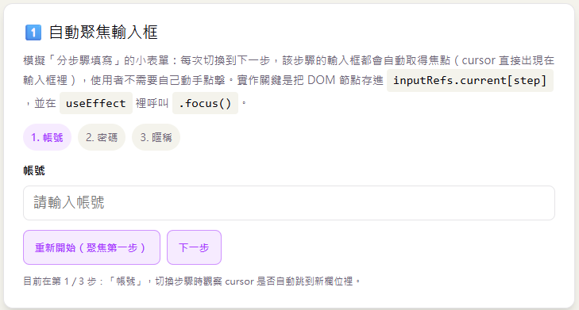
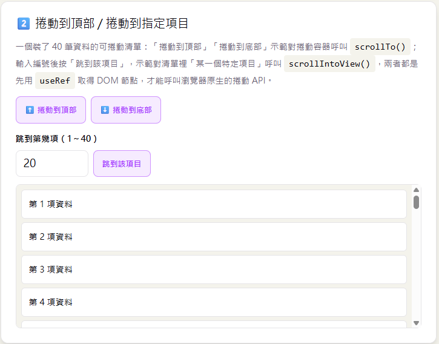
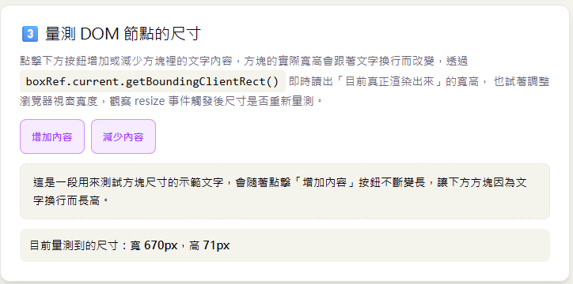
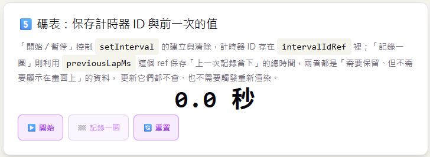

# Day 10｜`useRef` 與 DOM 操作

- 今日範例程式碼：[`Day10\examples\day10-ref-lab`](https://github.com/ShaoYuKao/2026-ithome-ironman-react-v19-30days/tree/master/Day10/examples/day10-ref-lab)

## 一、`useRef` 是什麼：跨渲染保持不變的容器

### 1. 從一個問題說起

Day04 學過，React 元件裡的資料如果用一般的 JavaScript 變數宣告，例如：

```jsx
function Counter() {
  let count = 0 // ❌ 一般變數：每次重新渲染，函式重新執行一次，count 都會被重設回 0

  function handleClick() {
    count = count + 1
    console.log(count) // 這裡印出來的值其實有在變化……
  }

  return <button onClick={handleClick}>目前次數：{count}</button> // ……但畫面上永遠顯示 0
}
```

這個 `count` 變數有兩個問題：一是它不會觸發重新渲染（改了也不會反應在畫面上），二是它**根本記不住上一次的值**——因為 React 元件本質上就是一個「每次渲染都重新執行一次」的函式，函式執行完，裡面宣告的一般變數就消失了，下一次渲染又是全新的一份。這也是為什麼 Day04 要改用 `useState`，`useState` 幫我們把資料存在「元件外部」（React 內部的記憶空間），讓資料能跨越一次又一次的重新渲染持續留存，並且在資料改變時主動觸發重新渲染。

但這也帶出另一個問題：**如果我就是不希望某個資料的改變觸發重新渲染呢？** 例如：

- 計時器（`setInterval`）回傳的 ID，只是之後要呼叫 `clearInterval()` 時拿來指定「清除哪一個」，跟畫面顯示完全無關。
- 想要記錄「使用者總共點擊過幾次某個按鈕」，但不需要每次點擊都重新渲染整個元件，只在某個特定時機才需要讀取這個總數。
- 想要「拿到」畫面上某個 `<input>` 或 `<div>` 的實際 DOM 節點，才能呼叫瀏覽器原生的 `.focus()`、`.scrollTo()` 等方法——但這個「DOM 節點本身」也不該是一個會觸發重新渲染的 state。

`useRef` 就是為了解決「需要跨渲染保存資料，但不需要（也不希望）觸發重新渲染」這個情境而生的 Hook。

### 2. `useRef` 的基本用法

```js
const ref = useRef(initialValue)
```

`useRef(initialValue)` 會回傳一個**物件**，這個物件只有一個屬性：`current`，初始值就是你傳進去的 `initialValue`：

```js
const countRef = useRef(0)
console.log(countRef) // { current: 0 }
```

之後想讀取或修改這個值，永遠透過 `.current`：

```js
countRef.current = countRef.current + 1 // 直接賦值即可，不像 useState 需要呼叫 setState 函式
console.log(countRef.current) // 1
```

**這個 `ref` 物件本身，在元件的整個生命週期中只會被建立一次**，React 會保證你每次渲染拿到的都是「同一個」物件（`current` 屬性可以任意改變，但物件的參照不會變），這就是「跨渲染保持不變」的意思。

### 3. `useRef` vs `useState`：關鍵差異對照表

| 項目 | `useState` | `useRef` |
| --- | --- | --- |
| 更新後是否觸發重新渲染 | ✅ 會，畫面立刻反應新的值 | ❌ 不會，畫面不會有任何反應 |
| 讀寫方式 | 呼叫 `setState(newValue)`，不可直接修改 state 變數 | 直接賦值 `ref.current = newValue`，可變（mutable） |
| 資料是否跨渲染保存 | ✅ 會 | ✅ 會 |
| 適合存放的資料 | 需要顯示在畫面上、或會影響畫面渲染結果的資料 | 不需要顯示在畫面上、只是內部記錄用的資料（DOM 節點、計時器 ID、前一次的值……） |
| 何時能讀到「最新」的值 | 該次渲染的 state 值（渲染當下就拿得到，是渲染那一刻的快照） | 隨時讀 `.current` 都是「目前最新」的值，即使還沒有觸發任何重新渲染 |

> **口訣**：**「要畫出來、用 `useState`；不用畫出來、用 `useRef`」**。今天範例裡的「render 次數比較」實驗，會用具體的按鈕操作，讓你親眼看到「更新 ref 不會觸發重新渲染」到底是什麼意思。

## 二、`useRef` 三大常見情境

### 情境一：取得並操作 DOM 節點

這是 `useRef` 最經典的用法。把 `useRef()` 建立的 ref 物件，透過 JSX 的 `ref` 屬性綁定到某個標籤上：

```jsx
function SearchBox() {
  const inputRef = useRef(null) // 初始值給 null，代表「還沒有拿到 DOM 節點」

  function handleFocusClick() {
    inputRef.current.focus() // 呼叫瀏覽器原生 DOM API：讓這個 input 取得焦點
  }

  return (
    <>
      <input ref={inputRef} type="text" />
      <button onClick={handleFocusClick}>點我聚焦輸入框</button>
    </>
  )
}
```

React 會在這個 `<input>` 真正掛載到瀏覽器 DOM 之後，自動把它的 DOM 節點存進 `inputRef.current`；元件卸載時，`inputRef.current` 會被自動設回 `null`。除了 `.focus()`，常見的 DOM 操作還有：

- **捲動**：`element.scrollTo({ top: 0, behavior: 'smooth' })`（捲動容器本身）、`element.scrollIntoView({ behavior: 'smooth', block: 'center' })`（讓某個節點自動捲進可視範圍）。
- **量測尺寸**：`element.getBoundingClientRect()`，回傳 `{ width, height, top, left, ... }`，是「目前實際渲染出來」的尺寸與位置，考慮了字型、換行、邊框等因素，JavaScript 沒辦法用算的，只能問瀏覽器。

> **重要的時機限制**：DOM 節點只有在「畫面真正掛載完成之後」才存在，所以 `inputRef.current` 在元件函式本體（渲染期間）執行的當下還是 `null`，一定要等到 `useEffect`（掛載完成後執行）或是使用者互動觸發的事件處理函式（例如 `onClick`，此時 DOM 必然早已掛載完成）裡，才能安全地呼叫 `.focus()`、`.scrollTo()` 這類方法。

### 情境二：保存不需要觸發重新渲染的可變資料

最常見的例子就是 `setInterval` / `setTimeout` 回傳的計時器 ID：

```jsx
function Timer() {
  const intervalIdRef = useRef(null)

  function handleStart() {
    intervalIdRef.current = setInterval(() => {
      console.log('tick')
    }, 1000)
  }

  function handleStop() {
    clearInterval(intervalIdRef.current) // 只在「需要清除」的那一刻才讀取這個 ID
  }

  // ……
}
```

這個 ID 本身不需要顯示在畫面上，改變它（重新賦值成新的計時器 ID）也完全不需要觸發重新渲染——如果誤用 `useState` 存放這個 ID，每一次重新建立計時器都會多觸發一次不必要的重新渲染，是常見的誤用情境。

### 情境三：保存「前一次的值」

有時候我們需要拿「這一次的值」跟「上一次的值」做比較或計算，例如今天範例裡的碼表：「記錄一圈」需要知道「上一次記錄當下」總共經過了多少時間，才能算出「這一圈」實際花了多久：

```jsx
function Stopwatch() {
  const [elapsedMs, setElapsedMs] = useState(0)
  const previousLapMs = useRef(0) // 保存「上一次記錄一圈時」的總經過時間

  function handleLap() {
    const lapDuration = elapsedMs - previousLapMs.current // 用「這一次」減去「上一次」
    console.log('這一圈花費：', lapDuration, 'ms')
    previousLapMs.current = elapsedMs // 更新成「這一次」，留給下一圈使用
  }

  // ……
}
```

`previousLapMs` 只是計算過程中的「中繼資料」，並不是要顯示在畫面上的最終結果（畫面顯示的是算好的「這一圈花費時間」），所以同樣適合用 `useRef` 保存，而不需要額外用一個 `useState`。

---

## 三、DOM 操作實戰：`ref` 屬性、ref callback 與陣列形式的 ref

### 1. 單一節點：直接把 `useRef()` 綁到 `ref` 屬性

前面範例已經示範過最基本的寫法：`const ref = useRef(null)`，然後 `<input ref={ref} />`。這是「一個元件對應一個固定 DOM 節點」時最簡單的寫法。

### 2. 多個節點：陣列形式的 ref + ref callback

如果畫面上有「一組數量固定、但每一個都需要各自操作」的節點（例如今天範例一「自動聚焦輸入框」的三個步驟欄位、範例二「捲動清單」裡的每一個項目），可以用一個**陣列**（或一般物件）搭配 **ref callback** 的寫法：

```jsx
const itemRefs = useRef([]) // 用一個陣列存放「所有項目」各自的 DOM 節點

return list.map((item, index) => (
  <div
    key={item.id}
    ref={(element) => {
      itemRefs.current[index] = element // React 掛載這個節點時，會把 DOM 節點傳進來
    }}
  >
    {item.label}
  </div>
))
```

`ref` 屬性除了可以綁定 `useRef()` 建立的物件，也可以直接傳入一個函式（稱為 **ref callback**），React 會在節點「建立」時呼叫這個函式並傳入 DOM 節點本身，節點「被移除」時再呼叫一次並傳入 `null`。這種寫法很適合「數量不固定、需要用 index 或 id 對應」的情境，之後只要讀取 `itemRefs.current[index]`，就能拿到對應那個項目的 DOM 節點，呼叫 `.scrollIntoView()`、`.focus()` 等方法。

### 3. `getBoundingClientRect()` 與 `window resize` 事件

量測尺寸的操作通常需要「掛載完成後量一次」，內容或視窗大小改變時「重新量一次」，寫法上會結合 Day08 學過的 `useEffect` 與清除函式：

```jsx
useEffect(() => {
  function measure() {
    if (!boxRef.current) return
    const rect = boxRef.current.getBoundingClientRect()
    setSize({ width: rect.width, height: rect.height })
  }

  measure() // 掛載完成、或依賴項改變時，先量一次

  window.addEventListener('resize', measure) // 視窗大小改變時，重新量一次

  return () => {
    window.removeEventListener('resize', measure) // cleanup：記得移除監聽，避免疊加（Day08 複習）
  }
}, [/* 會影響尺寸的依賴項，例如內容筆數 */])
```

這裡再次用到 Day08「依賴陣列」與「清除函式」的觀念：`useRef` 負責「拿到 DOM 節點」，`useEffect` 負責「決定什麼時機該去量測、以及何時該清掉監聽器」，兩者是分工合作的關係，並不是互相取代。

## 四、`useRef` 與 `useState` 的渲染時機差異：一個容易誤解的陷阱

初學者很容易好奇：「既然 `ref.current` 隨時可以改、又能跨渲染保存，那是不是乾脆什麼資料都用 `useRef` 就好，還可以少寫很多 `setState`？」——**千萬不要這麼做**，原因就在於「更新 `ref.current` 不會觸發重新渲染」這件事本身：

```jsx
function BadCounter() {
  const countRef = useRef(0)

  function handleClick() {
    countRef.current += 1 // 值確實變了……
  }

  return (
    <>
      <p>目前次數：{countRef.current}</p> {/* ……但畫面永遠不會更新，因為沒有任何東西觸發重新渲染 */}
      <button onClick={handleClick}>+1</button>
    </>
  )
}
```

點擊按鈕時，`countRef.current` 確實從 `0` 變成 `1`、`2`、`3`……但畫面上的數字**永遠停在初始值**，因為 React 完全不知道 `ref.current` 改變了，也就不會重新執行這個元件函式、不會重新渲染。這正是今天範例四「render 次數比較」要動手驗證的重點：**只有 `useState` 的更新才會通知 React「這裡需要重新渲染」；`useRef` 的更新只是單純改變一個物件的屬性，不會有任何「通知」的動作。**

反過來說，這也是為什麼 `useRef` 很適合拿來「悄悄記錄」一些不需要每次都重新渲染的內部資訊（像是 render 次數本身、前一次的值、計時器 ID）——這些資訊只要在下一次「因為其他原因」發生的渲染中被讀取、顯示出來就好，不需要為了它們專門多觸發一次渲染。

## 五、今日範例：五個小實驗

本實作是一個用 Vite 建立的 React 19 專案，裡面有五張示範卡片，分別對應今天學到的三大情境與 `useRef` / `useState` 的差異比較。

### 實驗一：`AutoFocusDemo.jsx` — 自動聚焦輸入框



模擬「分步驟填寫」的小表單（帳號 => 密碼 => 暱稱），三個輸入框其實同時存在於 DOM 裡，只用 CSS 把「非目前步驟」的欄位隱藏起來。核心寫法：

```jsx
const inputRefs = useRef([]) // 陣列形式的 ref，存放每一步驟輸入框各自的 DOM 節點

useEffect(() => {
  inputRefs.current[step]?.focus() // 每次切換步驟，讓目前這一步的輸入框自動取得焦點
}, [step])
```

每個 `<input>` 用 ref callback 把自己的 DOM 節點存進陣列對應的 index：`ref={(element) => { inputRefs.current[index] = element }}`。實際操作時，點擊「下一步」切換到下一個欄位，會發現 cursor 自動出現在新欄位裡，不需要自己動手點擊。

### 實驗二：`ScrollToTopDemo.jsx` — 捲動到頂部 / 捲動到指定項目



一個裝了 40 筆資料的可捲動清單，示範兩種捲動操作：

```jsx
// 對捲動容器本身呼叫 scrollTo()，捲到最頂端
scrollContainerRef.current?.scrollTo({ top: 0, behavior: 'smooth' })

// 對清單裡「某一個特定項目」呼叫 scrollIntoView()，瀏覽器自動計算要捲到哪裡
itemRefs.current[index]?.scrollIntoView({ behavior: 'smooth', block: 'center' })
```

「捲動到頂部」「捲動到底部」兩個按鈕操作的是**容器**本身；輸入編號、按下「跳到該項目」操作的則是清單裡**某一個特定項目**的 DOM 節點（用陣列形式的 ref，以項目編號為 key）。兩者都會有平滑（`smooth`）的捲動動畫，而不是瞬間跳過去。

### 實驗三：`MeasureSizeDemo.jsx` — 量測 DOM 節點的尺寸



一個文字方塊，點擊「增加內容 / 減少內容」讓文字換行、方塊變高變矮，核心邏輯：

```jsx
useEffect(() => {
  function measure() {
    const rect = boxRef.current.getBoundingClientRect()
    setSize({ width: Math.round(rect.width), height: Math.round(rect.height) })
  }

  measure()
  window.addEventListener('resize', measure)
  return () => window.removeEventListener('resize', measure)
}, [repeatCount])
```

實際操作時，點擊按鈕改變內容筆數，觀察下方顯示的「寬 / 高」數字即時更新；也可以試著縮放瀏覽器視窗寬度，觀察 `resize` 事件觸發後尺寸重新量測的結果。

### 實驗四：`RenderCountDemo.jsx` — `useRef` 記錄 render 次數，與 `useState` 的差異


三個並排的數字，具體示範第四節談到的觀念：

```jsx
const renderCountRef = useRef(0)
renderCountRef.current += 1 // 元件函式主體每執行一次（每次渲染）就 +1，直接在渲染期間讀取、顯示

const silentCounterRef = useRef(0) // 故意示範「只更新 ref、不觸發渲染」的按鈕
```

畫面上會看到「元件目前渲染次數（`useRef`）」「強制重新渲染按鈕點擊次數（`useState`）」「背後偷偷累加的 `silentCounterRef`」三個數字。實際操作建議：連續點擊「只更新 ref」按鈕 5 次（畫面上 `silentCounterRef` 的數字完全不會動），接著在輸入框打一個字（觸發一次真正的重新渲染），會發現這個數字瞬間跳成 5，而不是慢慢數上去——因為前面 5 次更新其實早就生效了，只是沒有觸發重新渲染，畫面「來不及」顯示最新的值，直到下一次真正發生的渲染，才把最新的 ref 值一次顯示出來。

### 實驗五：`StopwatchDemo.jsx` — 碼表：保存計時器 ID 與前一次的值



一個具備「開始 / 暫停」「記錄一圈」「重置」的碼表，同時示範情境二與情境三：

```jsx
const intervalIdRef = useRef(null) // 情境二：保存計時器 ID，不需要顯示、不該觸發渲染
const previousLapMs = useRef(0)   // 情境三：保存前一次記錄一圈時的總經過時間

useEffect(() => {
  if (!running) return undefined
  intervalIdRef.current = setInterval(() => setElapsedMs((prev) => prev + 100), 100)
  return () => clearInterval(intervalIdRef.current) // cleanup：暫停或卸載時清除計時器（Day08 複習）
}, [running])

function handleLap() {
  const lapDuration = elapsedMs - previousLapMs.current // 這一次減去上一次，算出這一圈花了多久
  setLastLapMs(lapDuration)
  previousLapMs.current = elapsedMs // 更新成這一次的值，留給下一圈使用
}
```

實際操作時，點擊「開始」讓碼表跑起來，過程中點擊「記錄一圈」幾次，觀察「上一圈花費時間」是否正確反映每兩次記錄之間的間隔；點擊「暫停」再「開始」，確認計時器能正確恢復（沒有因為忘記清除舊的計時器而越跑越快）。

## 六、常見陷阱整理

| 陷阱 | 說明 | 對策 |
| --- | --- | --- |
| 用 `useRef` 存放「要顯示在畫面上」的資料 | 更新 `ref.current` 不會觸發重新渲染，畫面會停留在舊的值，看起來像是「資料沒有更新」的 Bug | 只要資料需要顯示在畫面上、或會影響渲染結果，一律改用 `useState` |
| 在渲染期間讀取 `ref.current` 卻拿到 `null` | DOM 節點的 ref 只有在「掛載完成之後」才會被賦值，元件函式本體第一次執行（渲染期間）時，`ref.current` 還是初始值（通常是 `null`） | 需要操作 DOM 節點的程式碼，一律寫在 `useEffect` 或事件處理函式裡，不要寫在元件函式最外層 |
| 忘記 DOM 節點可能是 `null` 就直接呼叫方法 | 條件渲染讓某個節點暫時不存在、或元件正在卸載時，對應的 `ref.current` 會是 `null`，直接呼叫 `.focus()` 等方法會噴出 `Cannot read properties of null` 的錯誤 | 呼叫前先用 `?.`（optional chaining）或 `if (ref.current)` 判斷再操作，例如 `inputRef.current?.focus()` |
| 把 `setInterval` / `setTimeout` 的 ID 存進 `useState` | 每次重新建立計時器都會多觸發一次不必要的重新渲染，而 ID 本身根本不需要顯示在畫面上 | 計時器 ID 這類「內部記錄用」的資料，改用 `useRef` 保存 |
| 忘記在 `useEffect` 的清除函式裡清除計時器 | 計時器持續在背景疊加執行，造成時間越跑越快或記憶體洩漏（Day08 學過的清除函式觀念，在 `useRef` 保存 ID 時同樣適用） | `useEffect` 只要建立了計時器，就要在清除函式裡呼叫對應的 `clearInterval` / `clearTimeout` |
| 對還沒有任何子元件的容器呼叫 `getBoundingClientRect()` 卻拿到 `{ width: 0, height: 0 }` | 內容還沒渲染完成、或節點本身還沒掛載時就量測，會拿到不正確（全部是 0）的尺寸 | 量測邏輯放進 `useEffect`（確保掛載完成後才執行），必要時搭配依賴項在內容變化後重新量測一次 |

> **延伸提醒**：如果想讓「父元件」透過 ref 呼叫「子元件」內部自訂的方法（例如子元件暴露一個 `focus()` 方法給父層呼叫，而不是直接暴露整個 DOM 節點），需要搭配 `forwardRef` 與 `useImperativeHandle`，這個進階技巧會留到 之後幾天詳細介紹；React 19 也已經能把 `ref` 當成一般 prop 直接傳給函式元件（不再強制要求外層一定要包一層 `forwardRef`），但子元件內部仍然需要自行決定要把這個 `ref` 轉交給哪一個 DOM 節點，才拿得到東西。

## 執行方式

```bash
cd Day10/examples/day10-ref-lab
npm install
npm run dev
```

打開瀏覽器輸入網址 `http://localhost:5173/`，就可看到你的 React 畫面進行操作確認。也可以執行 `npm run build` 打包成正式版本，或執行 `npm run lint` 確認程式碼沒有明顯的 Hook 使用錯誤。
