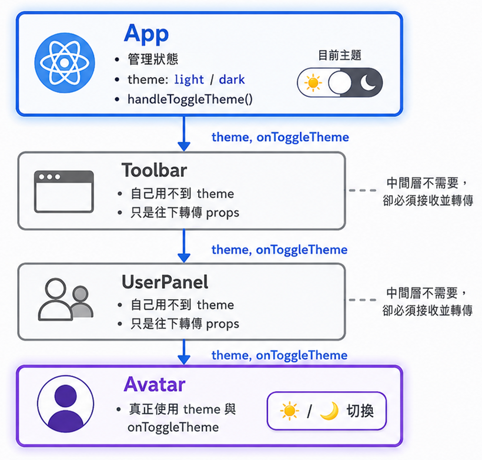
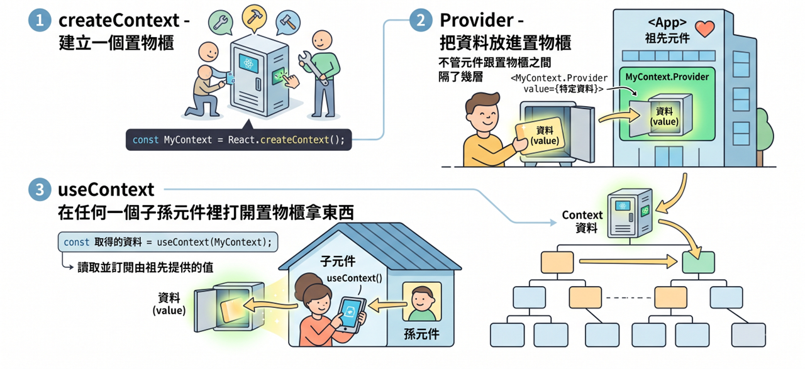
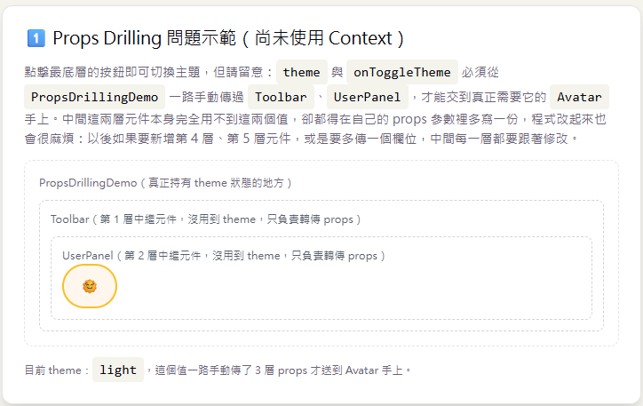

# Day 11｜`useContext` 與跨層級資料傳遞

- 今日範例程式碼：[`Day11\examples\day11-context-lab`](https://github.com/ShaoYuKao/2026-ithome-ironman-react-v19-30days/tree/master/Day11/examples/day11-context-lab)

## 一、Props Drilling 問題：為什麼需要 Context

### 1. 從一個常見情境說起

假設我們要做一個支援深色模式的網站：`theme`（目前是 `light` 還是 `dark`）這個狀態，通常會放在整個 App 比較外層的地方管理；但實際上「顯示切換按鈕」或「需要依照 theme 改變外觀」的元件，卻可能散落在頁面樹很深的角落——例如某個巢狀選單裡的一顆小圖示。如果不使用 Context，能想到的做法只有：把 `theme` 跟切換方法一路當成 props，經過中間每一層元件，往下傳給真正需要它的元件：



```jsx
function Avatar({ theme, onToggleTheme }) {
  // 只有 Avatar 真正用到 theme 與 onToggleTheme
  return (
    <button onClick={onToggleTheme}>{theme === 'light' ? '🌞' : '🌙'}</button>
  )
}

function UserPanel({ theme, onToggleTheme }) {
  // UserPanel 自己完全用不到 theme，純粹只是幫忙轉傳給更底層的 Avatar
  return <Avatar theme={theme} onToggleTheme={onToggleTheme} />
}

function Toolbar({ theme, onToggleTheme }) {
  // Toolbar 同樣用不到 theme，卻也得多接收這兩個參數才能繼續往下傳
  return <UserPanel theme={theme} onToggleTheme={onToggleTheme} />
}

function App() {
  const [theme, setTheme] = useState('light')
  function handleToggleTheme() {
    setTheme((prev) => (prev === 'light' ? 'dark' : 'light'))
  }
  return <Toolbar theme={theme} onToggleTheme={handleToggleTheme} />
}
```

這種「資料要流動的路徑，跟『真正需要這份資料的元件』的位置對不上，只能一層層手動轉傳」的現象，就叫做 **Props Drilling**。今天範例的第一張卡片 `PropsDrillingDemo.jsx` 就是這段程式碼的完整版本，可以實際打開來操作、觀察。

### 2. Props Drilling 到底「痛」在哪裡

- **中間元件被迫增加跟自己職責無關的 props**：`Toolbar`、`UserPanel` 本身根本不關心 theme，卻都得在自己的參數列裡多寫一份，程式碼讀起來會誤以為「這個元件跟 theme 有關係」。
- **新增或修改欄位，要牽動路徑上的每一層**：如果之後想再多傳一個 `fontSize` 設定，路徑上每一個中繼元件的 props、呼叫方式都要跟著修改。
- **元件難以重複使用**：`UserPanel` 被綁死了「一定要收到 `theme`、`onToggleTheme` 才能運作」，如果想在另一個沒有主題功能的頁面重複使用它，還得額外處理這兩個不相關的參數。
- **重構困難**：如果把 `Avatar` 搬到元件樹的其他分支底下，很可能得重新規劃一整串的傳遞鏈，才能讓它繼續拿到 `theme`。

### 3. 什麼時候才需要 Context？——不是任何 props 傳遞都叫 Props Drilling

這裡要先建立一個重要的判斷原則：**如果資料只需要往下傳 1～2 層，直接用 props 傳遞通常更簡單、更容易追蹤資料流向，不需要為了「怕以後變複雜」而過早引入 Context。** Context 比較適合「很多層」、「很多個元件」都需要同一份資料的情境，例如：目前主題、目前登入的使用者資訊、目前的語言、購物車內容……這類具有「全域」或「跨頁面」性質的資料。

也要提醒：Context **不是**用來取代所有跨元件溝通方式的萬用解法。兄弟元件之間互相溝通、單純把狀態「提升」到共同的父層（Lifting State Up，這是 Day04、Day07 一路以來的做法）仍然是優先該考慮的選項；只有當「提升到共同父層」之後，還是得經過一長串跟這份資料無關的中繼元件，Props Drilling 的痛苦大於直接用 props 傳遞的簡單直覺時，才是 Context 真正該出場的時機。

## 二、Context 三件套：`createContext` + `Provider` + `useContext`

「讀取並訂閱由祖先 `<Context.Provider>` 提供的值，讓元件不需透過 props 逐層傳遞即可取得資料」——完整流程可以用「置物櫃」來比喻：`createContext` 建立一個置物櫃、`Provider` 把資料放進置物櫃、`useContext` 則是在任何一個子孫元件裡打開置物櫃拿東西，不管這個元件跟置物櫃之間隔了幾層。



### 1. `createContext(defaultValue)`：建立置物櫃

```js
import { createContext } from 'react'

const ThemeContext = createContext(null)
```

`createContext` 回傳一個 Context 物件。傳入的 `defaultValue`（這裡是 `null`）只有在「元件樹上完全找不到任何對應的 `Provider`」時才會被用到——正常使用時，我們一定會在外層包一個 `<ThemeContext.Provider>`，所以幾乎不會真的讀到這個預設值；等一下會示範如何利用這個特性，加上一個「有沒有忘記包 Provider」的防呆檢查。

### 2. `<Context.Provider value={...}>`：把資料放進置物櫃

```jsx
function ThemeProvider({ children }) {
  const [theme, setTheme] = useState('light')

  function toggleTheme() {
    setTheme((prev) => (prev === 'light' ? 'dark' : 'light'))
  }

  return (
    <ThemeContext.Provider value={{ theme, toggleTheme }}>
      {children}
    </ThemeContext.Provider>
  )
}
```

`Provider` 是一個特殊的元件，`value` prop 就是「放進置物櫃的東西」。凡是被包在 `<ThemeContext.Provider>` 裡面的子孫元件（不管中間隔了多少層），都能透過 `useContext(ThemeContext)` 拿到這個 `value`。像這樣把「持有狀態」與「提供 Context」包裝成一個獨立的 `XxxProvider` 元件，是實務上最常見的寫法，好處是使用端只要 `import { ThemeProvider } from './contexts/ThemeContext.jsx'`，把想要共用主題的範圍包起來就好，完全不需要知道內部是怎麼實作的。

> 這裡的 `value={{ theme, toggleTheme }}` 每次 `ThemeProvider` 重新渲染都會建立一個新的物件，這在效能上其實有可以優化的空間；但這屬於過幾天才會學到的效能優化技巧（`useMemo`），現階段只要先看懂「`value` 就是放進置物櫃的東西」這件事即可，不需要現在就處理這個細節。

### 3. `useContext(Context)`：打開置物櫃拿資料

```jsx
function DeepButton() {
  const { theme, toggleTheme } = useContext(ThemeContext)
  return <button onClick={toggleTheme}>{theme === 'light' ? '🌞' : '🌙'}</button>
}
```

只要元件被包在對應的 `Provider` 範圍內，呼叫 `useContext(ThemeContext)` 就能直接拿到 `value`，**完全不需要透過 props 傳遞，也不需要知道自己跟 `Provider`之間隔了幾層元件**。當 `Provider` 的 `value` 改變時，所有正在使用 `useContext` 讀取這個 Context 的元件都會自動重新渲染，拿到最新的值——這也是為什麼說 Context 讓元件「訂閱」了 Provider 提供的資料。

### 4. 包裝成自訂 Hook：`useTheme()`

實務上很少直接在元件裡寫 `useContext(ThemeContext)`，而是會多包一層自訂 Hook：

```jsx
function useTheme() {
  const context = useContext(ThemeContext)
  if (context === null) {
    throw new Error('useTheme 必須在 <ThemeProvider> 內使用')
  }
  return context
}
```

這麼做有兩個明顯的好處：

1. **使用端更方便**：元件只需要 `import { useTheme } from './contexts/ThemeContext.jsx'`，完全不需要知道 `ThemeContext` 這個變數本身的存在，也不會不小心把 `useContext` 用在錯誤的 Context 上。
2. **可以順手加上防呆檢查**：因為 `createContext(null)` 的預設值是 `null`，如果有人不小心在 `<ThemeProvider>` 範圍之外呼叫 `useTheme()`，`context` 就會是 `null`。與其讓程式在後面某個地方因為「讀不到 `theme` 屬性」而噴出一個難以理解的錯誤，不如在這裡就直接丟出一個清楚的錯誤訊息，讓開發時期能及早發現「忘記包 Provider」這個問題。

這其實也是之後過幾天即將學到的「自訂 Hook」的一個典型應用：把「Context + 防呆檢查」包裝成一個語意清楚、隨處可 import 使用的 `useXxx()` 函式。

## 三、今日範例

### 情境一：Props Drilling 問題示範



打開 `PropsDrillingDemo.jsx` 程式碼，完整重現了第一節的四層元件結構：`PropsDrillingDemo`（持有 `theme` 狀態）=> `Toolbar` => `UserPanel` => `Avatar`。點擊最底層 Avatar 的太陽 / 月亮按鈕，可以正常切換主題，畫面上也會提示每一層元件目前扮演的角色。實際操作、閱讀程式碼時，請特別留意：

- `Toolbar`、`UserPanel` 的程式碼裡完全沒有用到 `theme` 或 `onToggleTheme`，純粹只是把收到的 props 原封不動往下一層轉交。
- 如果之後想在 `Avatar` 與 `PropsDrillingDemo` 之間再插入第 5 層、第 6 層元件，或是想再多傳一個欄位（例如 `fontSize`），中間每一層都得跟著修改。

這正是下一個情境二要解決的問題。

### 情境二：Context 解法──深色 / 淺色主題切換

`ThemeToggleDemo.jsx` 用**完全相同的四層結構**，改用 Context 重新實作一次，方便直接對照：

```jsx
// src/contexts/ThemeContext.jsx
import { createContext, useContext, useState } from 'react'

// 1. 建立一個「置物櫃」
const ThemeContext = createContext(null)

// 2. 把資料「放進置物櫃」；把「持有狀態」與「提供 Context」包裝成一個獨立的 Provider 元件
function ThemeProvider({ children }) {
  const [theme, setTheme] = useState('light')
  function toggleTheme() {
    setTheme((prev) => (prev === 'light' ? 'dark' : 'light'))
  }
  const value = { theme, toggleTheme }
  return <ThemeContext.Provider value={value}>{children}</ThemeContext.Provider>
}

// 3. 包裝成一個自訂 Hook
function useTheme() {
  const context = useContext(ThemeContext)
  if (context === null) throw new Error('useTheme 必須在 <ThemeProvider> 內使用')
  return context
}

export { ThemeProvider, useTheme }
```

```jsx
// src/components/ThemeToggleDemo.jsx
import { ThemeProvider, useTheme } from '../contexts/ThemeContext.jsx'

function DeepButton() {
  const { theme, toggleTheme } = useTheme() // 直接跟 Context 要資料
  return <button onClick={toggleTheme}>{theme === 'light' ? '🌞' : '🌙'}</button>
}

function DeepCard() {
  const { theme } = useTheme() // 第 3 層，同樣直接讀取，沒有任何 props 傳進來
  return (
    <div className={`context-demo-card context-demo-card--${theme}`}>
      <DeepButton />
    </div>
  )
}

function DeepSidebar() {
  // 第 2 層：完全沒有 import useTheme，也不需要接收任何跟 theme 有關的 props
  return <DeepCard />
}

function DeepPage() {
  const { theme } = useTheme() // 第 1 層，也直接讀取
  return <div className={`context-demo-page context-demo-page--${theme}`}><DeepSidebar /></div>
}

function ThemeToggleDemo() {
  return (
    <ThemeProvider>
      <DeepPage />
    </ThemeProvider>
  )
}
```

對照第三節的 `PropsDrillingDemo`，這裡最關鍵的差異在 `DeepSidebar`：它跟 `PropsDrillingDemo` 裡的 `Toolbar`、`UserPanel` 處在同樣的「中繼層」位置，但因為改用 Context，`DeepSidebar` 完全不需要知道 `theme` 這件事的存在，連 `useTheme` 都不用 import。而 `DeepPage`、`DeepCard`、`DeepButton` 不管彼此隔了幾層，都可以各自獨立呼叫 `useTheme()` 拿到當下最新的值。實際操作時，點擊按鈕切換主題，會看到三層元件（`DeepPage` 的整體背景、`DeepCard` 的卡片背景、`DeepButton` 的按鈕樣式）**同步**跟著改變顏色——因為它們訂閱的是同一個 Context，`theme` 一改變，所有訂閱者都會收到通知並重新渲染。

這就是今天的主練習：一個由 `createContext` + `Provider` + `useContext` 撐起來的深色 / 淺色主題切換功能，不管子元件藏得多深、有多少個，都能直接取得並切換主題，不需要任何中間層幫忙轉傳。

## 四、Context 不是只能做主題：多個獨立 Context 並存（語言切換）

為了證明「Context 這套模式不是 theme 專屬」，第三張卡片 `LanguageSwitchDemo.jsx` 刻意用一個跟主題完全無關的情境——**語言切換（中文 / English）**——重新走一次一模一樣的三件套：

```jsx
// src/contexts/LanguageContext.jsx
import { createContext, useContext, useState } from 'react'

const translations = {
  zh: { greeting: '你好！這段文字是透過 LanguageContext 從最上層傳下來的。', /* ... */ },
  en: { greeting: 'Hello! This text is provided top-down via LanguageContext.', /* ... */ },
}

const LanguageContext = createContext(null)

function LanguageProvider({ children }) {
  const [language, setLanguage] = useState('zh')
  function toggleLanguage() {
    setLanguage((prev) => (prev === 'zh' ? 'en' : 'zh'))
  }
  function t(key) {
    return translations[language][key] // 依照目前語言查表回傳對應文字
  }
  const value = { language, toggleLanguage, t }
  return <LanguageContext.Provider value={value}>{children}</LanguageContext.Provider>
}

function useLanguage() {
  const context = useContext(LanguageContext)
  if (context === null) throw new Error('useLanguage 必須在 <LanguageProvider> 內使用')
  return context
}

export { LanguageProvider, useLanguage } 
```

`Greeting`、`FooterNote`、`LanguageSwitcherButton` 三個元件分別呼叫 `useLanguage()` 取得 `t()`（翻譯查表函式）與 `toggleLanguage()`，點擊切換按鈕，畫面上的問候語與頁尾文字會同步在中 / 英文之間切換。

這裡想強調一個很重要的觀念：**一個專案裡同時存在多個彼此獨立的 Context 是非常常見、也通常是比較好的作法**，不需要把「主題」「語言」「登入使用者」「購物車」全部硬塞進同一個巨大的 `AppContext`。把資料按照「關注點（concern）」拆成幾個獨立的 Context（`ThemeContext`、`LanguageContext`……），有兩個好處：

1. **語意清楚**：元件只需要 import 它真正需要的那個 `useXxx()`，不需要面對一整包「什麼都有」的資料。
2. **效能更好**：如果所有資料都塞在同一個 Context 裡，任何一小部分改變（例如只是切換語言），都會導致所有讀取這個 Context 的元件重新渲染，即使它們只關心「主題」這一塊、跟語言完全無關。拆成獨立的 Context，就能讓「只關心主題的元件」不會因為語言改變而被迫重新渲染。

> **小提醒（效能優化先按下不表）**：眼尖的話可能會注意到，`ThemeProvider`、`LanguageProvider` 每次重新渲染時，`value = { theme, toggleTheme }` 都會建立一個全新的物件，這其實有可以優化的空間（避免沒必要的子孫元件重新渲染）。這個優化技巧要用到 `useMemo` 搭配 `React.memo`，屬於過幾天要學習「效能優化」的內容，目前這個階段只要先把心力放在「Context 怎麼用、能解決什麼問題」上就好，等學完 `useMemo` 之後，會再回頭示範如何優化今天寫的 `ThemeContext.jsx`、`LanguageContext.jsx`。
>
> 另外還有一個跟「拆分」有關的小預告：像今天的 `value` 把「資料（`theme`）」跟「操作方法（`toggleTheme`）」包在同一個物件裡，其實還有另一種做法——把它們拆成**兩個獨立的 Context**（一個只放資料、一個只放操作方法）。等 Day12 學到 `useReducer` 之後，會用「全域計數器」示範這個拆分技巧，屆時會看到它能帶來的好處，不需要現在先弄懂。

## 五、常見陷阱整理

| 陷阱 | 說明 | 對策 |
| --- | --- | --- |
| 忘記包 `Provider`，卻沒有防呆檢查 | `useContext` 讀到 `createContext` 的預設值（例如 `null`），後續程式碼嘗試讀取 `null.theme` 之類的屬性，會噴出難以理解的錯誤 | 把 `useContext` 包裝成自訂 Hook（如 `useTheme()`），在裡面檢查是否為預設值，是的話直接 `throw` 一個清楚的錯誤訊息 |
| 把整個 App 的資料全部塞進同一個巨大 Context | 任何一小部分資料改變（例如只是切換語言），都會導致所有讀取這個 Context 的元件重新渲染，即使它們關心的是完全不相關的另一部分資料 | 按照關注點拆成多個獨立的 Context（`ThemeContext`、`LanguageContext`……），需要哪個就 import 哪個 |
| 資料只需要往下傳 1～2 層，卻硬要導入 Context | Context 會讓資料流向變得比較不直覺（不像 props 那樣一眼就能從呼叫端看出資料從哪裡來），過早使用反而增加理解成本 | 層級不深、元件數量不多時，直接用 props 傳遞（必要時搭配 Lifting State Up）通常更簡單易懂 |
| 誤以為「用了 Context 子元件就不會重新渲染」 | Context 只是「取得資料的方式」不同，跟一般 React 的重新渲染規則（父層重新渲染，預設子層也會跟著重新渲染）並沒有互斥；子元件一樣會因為父層重新渲染而重新渲染 | 現階段不需要處理這件事；如果之後真的遇到效能問題，之後會學到用 `useMemo` 快取 Context 的 `value`、搭配 `React.memo` 包裝子元件來解決 |

## 執行方式

```bash
cd Day11/examples/day11-context-lab
npm install
npm run dev
```

打開瀏覽器輸入網址 `http://localhost:5173/`，就可看到你的 React 畫面進行操作確認。也可以執行 `npm run build` 打包成正式版本，或執行 `npm run lint` 確認程式碼沒有明顯的 Hook 使用錯誤。
