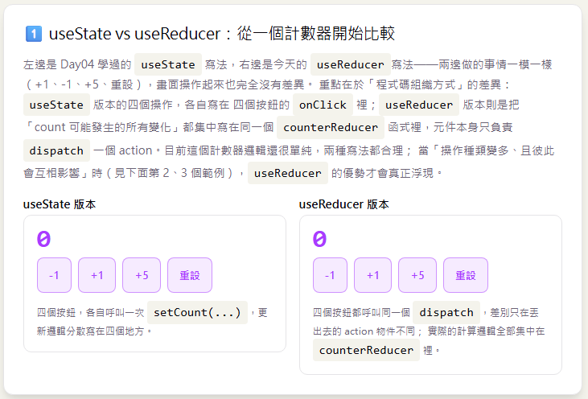
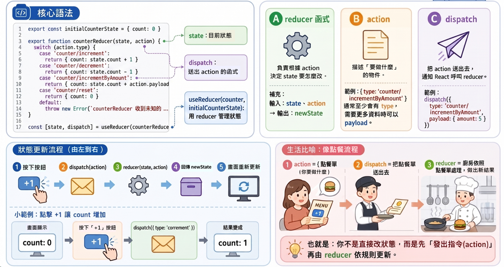
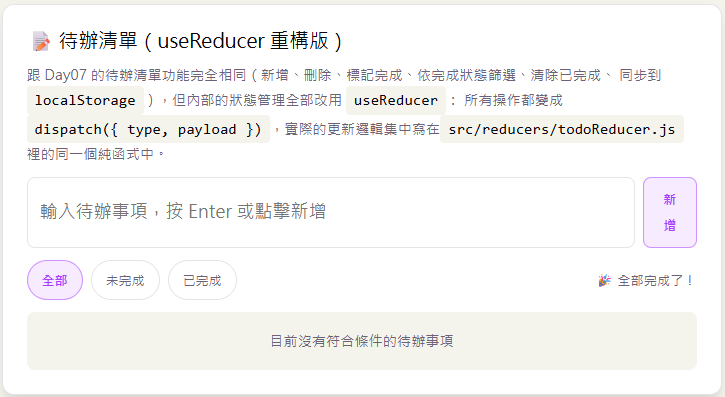
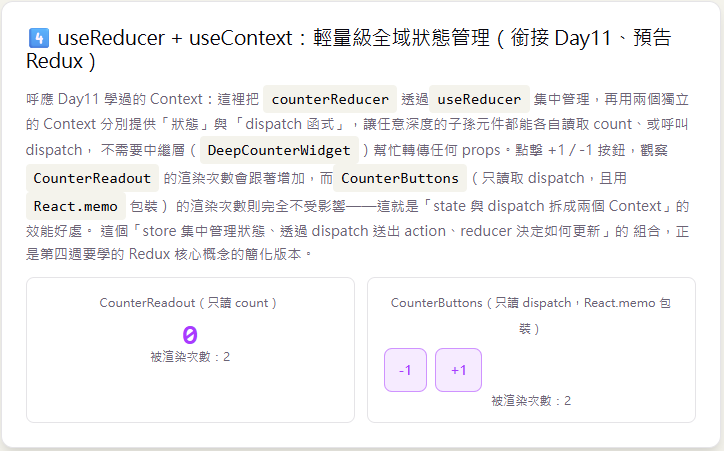

# Day 12｜`useReducer` 複雜狀態管理

- 今日範例程式碼：[`Day12\examples\day12-reducer-lab`](https://github.com/ShaoYuKao/2026-ithome-ironman-react-v19-30days/tree/master/Day12/examples/day12-reducer-lab)

## 一、為什麼需要 `useReducer`：從多個 `useState` 談起

### 1. 先回顧 `useState` 能做到什麼

Day04 學過，`useState` 讓我們在元件裡宣告一個狀態變數，呼叫對應的 `setState` 就能更新它、觸發重新渲染。像 Day07 的待辦清單，一開始只有兩個獨立的 state：

```jsx
const [todos, setTodos] = useState(loadTodos)
const [filter, setFilter] = useState('all')
```

每一種操作（新增、切換完成、刪除、清除已完成、切換篩選）各自寫成一個 `handleXxx` 函式，函式裡面呼叫 `setTodos` 或 `setFilter`。當狀態種類不多、更新邏輯彼此獨立時，這樣的寫法非常直覺，Day07 也確實用得很順手。

### 2. 狀態變複雜時，`useState` 會遇到什麼麻煩

> `useReducer`：以 `reducer` 函式集中管理較複雜的狀態更新邏輯，適合狀態轉換規則多、彼此關聯的情境。

具體來說，當專案往下面幾個方向發展，單純疊加 `useState` 會越來越吃力：

- **更新邏輯散落各處**：每多一種操作，就要多寫一個 `handleXxx` 函式，這些函式雖然都在操作同一份資料，卻分散在元件的各個角落，很難一眼看出「這份資料到底有哪幾種合法的變化方式」。
- **多個狀態需要同時、一致地更新**：比如今天第二個範例「購物車」——套用優惠碼時，`couponCode` 跟 `discountRate` 兩個欄位必須同時更新；清空購物車時，`items`、`couponCode`、`discountRate` 三個欄位都要一起重設。如果分別用三個 `useState`，很容易在某次改動時漏更新其中一個，讓幾個 state 之間出現「兜不起來」的不一致狀態。
- **下一個 state 的值，取決於好幾個目前的 state**：當更新邏輯需要同時參考好幾個現有欄位才能算出下一份完整資料時，寫法會變得又長又難讀，也容易在多處重複同一段計算邏輯。
- **測試與除錯困難**：`useState` 的更新邏輯是寫在元件內部的事件處理函式裡，要單獨測試「新增一筆待辦事項後，資料應該長什麼樣子」，得連同整個元件一起渲染、模擬使用者互動才能驗證。

`useReducer` 的解法是：**把「狀態目前長怎樣」跟「狀態該如何變化」這兩件事分開**——狀態的值繼續留在元件裡（透過 `useReducer` 取得），但「如何變化」的規則，全部集中寫成一個獨立、純粹的 `reducer` 函式，元件本身只需要「描述發生了什麼事」（也就是 `dispatch` 一個 `action`），不需要自己動手計算下一份 state 該長怎樣。

### 3. 什麼時候該用 `useReducer`，什麼時候 `useState` 就夠了

跟 Day11 提過「不要為了怕以後變複雜而過早引入 Context」的原則類似，`useReducer` 也不是任何情境都該優先選擇：

- 狀態單純（例如一個布林值的顯示/隱藏、一個數字的計數器只有加一減一），`useState` 已經很清楚易懂，沒有必要為了「以後可能變複雜」就先套上 `useReducer`——今天第一個範例 `CounterCompareDemo` 會用「加一、減一、加五、重設」這個仍然算簡單的計數器實際比較兩種寫法，你會發現兩邊在這個規模下都合理。
- 當一個元件裡**多個狀態需要同步更新**、**下一個 state 依賴好幾個既有欄位**、或是**操作種類多到讓 `handleXxx` 函式散落一地**時，`useReducer` 能把這些邏輯收斂到同一個地方，是更好的選擇。

## 二、`useReducer` 核心語法：`reducer` 函式、`action`、`dispatch`

### 1. 基本語法

```js
const [state, dispatch] = useReducer(reducer, initialArg, init?)
```

`useReducer` 回傳一個陣列，解構出兩個東西：

- `state`：目前的狀態值（可以是任何型別，實務上通常是一個物件）。
- `dispatch`：一個函式，呼叫它並傳入一個 `action` 物件，就能觸發狀態更新——**這是元件唯一可以用來「請求變更狀態」的方式，元件本身完全不會直接計算下一份 state 長怎樣**。

`useReducer` 接受三個參數：

- `reducer`：一個純函式 `(state, action) => newState`，描述「收到某個 action 時，該如何從目前的 state 算出下一份 state」。
- `initialArg`：初始狀態（或是要傳給第三個參數 `init` 的原始值）。
- `init`（可選）：Lazy Initializer，如果有傳，React 只會在元件掛載的第一次渲染呼叫 `init(initialArg)`，用它的回傳值當作真正的初始狀態；這個概念跟 Day04 `useState(initializerFn)` 完全相同，都是「只在掛載時執行一次、用來計算比較貴的初始值」。

### 2. `reducer` 函式的兩條鐵則

```js
function todoReducer(state, action) {
  switch (action.type) {
    case 'todos/add': {
      // 讀取 state、action，計算出一份「新的」state 並回傳
      return { ...state, todos: [...state.todos, newTodo] }
    }
    // ...其他 case
    default:
      throw new Error(`未知的 action type：${action.type}`)
  }
}
```

- **必須是純函式**：輸入同樣的 `(state, action)`，永遠要算出同樣的結果；函式內部不能有 `fetch`、`localStorage.setItem`（存取瀏覽器儲存屬於副作用）之類的副作用，也不能修改（mutate）傳進來的 `state` 本身。
- **必須回傳一份新的 state**：延續 Day04 學過的不可變更新（Immutability）——即使只改一個欄位，也要用展開運算符（`...`）建立新的物件或陣列，不能寫 `state.todos.push(newTodo)` 這種直接修改原陣列的寫法。原因跟 `useState` 一樣：React 是用「這次的 state 跟上一次是不是同一個參照」來判斷要不要重新渲染，直接修改原本的物件不會產生新的參照，畫面很可能不會更新。

`default` 分支刻意寫成 `throw new Error(...)` 而不是靜靜回傳原本的 `state`：如果 `dispatch` 時 `action.type` 打錯字，比起讓程式毫無反應、難以察覺，不如讓它在開發時期就明確地噴出錯誤。

### 3. `action`：描述「發生了什麼事」

`action` 是一個普通物件，慣例上至少要有一個 `type` 欄位（字串），描述這次操作是什麼；如果還需要額外資料，通常放在 `payload` 欄位裡（這個 `type` / `payload` 的命名慣例源自 Flux / Redux，之後會再深入介紹）：

```js
dispatch({ type: 'todos/add', payload: { text: '買牛奶' } })
dispatch({ type: 'todos/toggle', payload: { id: 'abc-123' } })
dispatch({ type: 'counter/incrementByAmount', payload: { amount: 5 } })
```

`type` 常見的命名習慣是 `領域/動作`（例如 `todos/add`、`filter/change`），讓不同 reducer 的 action 即使混在一起，也能一眼看出「這是哪個領域的操作」——這同樣是為 Redux Toolkit 的 `createSlice` 產生的 action type 預先鋪路。

### 4. `dispatch`：元件唯一能做的事

元件裡的事件處理函式，職責從「自己計算下一份 state」簡化成「呼叫 `dispatch`，描述使用者做了什麼」：

```jsx
// ❌ useState 版本：元件自己要知道怎麼從 todos 算出下一份陣列
function handleToggle(id) {
  setTodos(todos.map((todo) => (todo.id === id ? { ...todo, completed: !todo.completed } : todo)))
}

// ✅ useReducer 版本：元件只需要描述「哪一筆待辦事項被切換了」
function handleToggle(id) {
  dispatch({ type: 'todos/toggle', payload: { id } })
}
```

`todos.map(...)` 這段實際的計算邏輯，搬到 `todoReducer` 裡面，元件不再需要關心它。這正是 `useReducer` 的核心價值：**把「發生了什麼事」（action）跟「該怎麼處理」（reducer）分開，元件只負責前者。**

## 三、今日範例

### 情境一：`useState` vs `useReducer` 計數器對照



在 `CounterCompareDemo.jsx` 程式碼裡，左右並排放了兩個功能完全相同的計數器（+1、-1、+5、重設）：

```jsx
// useState 版本：四個按鈕，各自呼叫一次 setCount
function StateCounter() {
  const [count, setCount] = useState(0)
  // ...
  onClick={() => setCount((prev) => prev + 1)}
  onClick={() => setCount((prev) => prev + 5)}
  onClick={() => setCount(0)}
}
```

```jsx
// useReducer 版本：四個按鈕都呼叫同一個 dispatch，差別只在 action 不同
function ReducerCounter() {
  const [state, dispatch] = useReducer(counterReducer, initialCounterState)
  // ...
  onClick={() => dispatch({ type: 'counter/increment' })}
  onClick={() => dispatch({ type: 'counter/incrementByAmount', payload: { amount: 5 } })}
  onClick={() => dispatch({ type: 'counter/reset' })}
}
```

對應的 `counterReducer`：

```js
// src/reducers/counterReducer.js
export const initialCounterState = { count: 0 }

export function counterReducer(state, action) {
  switch (action.type) {
    case 'counter/increment':
      return { count: state.count + 1 }
    case 'counter/decrement':
      return { count: state.count - 1 }
    case 'counter/incrementByAmount':
      return { count: state.count + action.payload.amount }
    case 'counter/reset':
      return { count: 0 }
    default:
      throw new Error(`counterReducer 收到未知的 action type：${action.type}`)
  }
}
```

實際操作兩邊的按鈕，畫面行為完全一樣。重點在於程式碼組織方式的差異：`useState` 版本的四種操作，各自寫在四個按鈕的 `onClick` 裡；`useReducer` 版本則是把「count 可能發生的所有變化」，集中寫在 `counterReducer` 這一個跟 React 完全無關、可以獨立測試的純函式裡。這個計數器邏輯還很單純，兩種寫法目前都合理——`useReducer` 的優勢，會在接下來兩個「狀態更複雜」的範例裡更明顯地展現出來。



### 情境二：`useReducer` 管理彼此關聯的複雜狀態──購物車


第二張卡片 `ShoppingCartDemo.jsx` 示範一個「好幾個狀態欄位彼此關聯」的情境：購物車的 `items`（品項清單）、`couponCode`（優惠碼）、`discountRate`（折扣比例）三者互相牽動——套用優惠碼要同時更新 `couponCode` 與 `discountRate`；清空購物車要同時重設這三個欄位。如果分別用三個 `useState` 管理，很容易在某次更新時漏改其中一個，讓三個欄位的內容兜不起來。

#### 1. `initCartState`：useReducer 的 Lazy Initializer

```js
// src/reducers/cartReducer.js
export function initCartState(initialItems) {
  return {
    items: initialItems, // [{ id, name, price, qty }]
    couponCode: '',
    discountRate: 0,
  }
}
```

元件呼叫時：

```jsx
const [state, dispatch] = useReducer(cartReducer, [], initCartState)
```

這裡故意示範第三個參數 `init` 完整的用法：`useReducer` 會呼叫 `initCartState(initialArg)`（也就是 `initCartState([])`），把回傳值當作初始 `state`。跟 Day04 的 `useState(loadTodos)`、下一節 `initTodoState` 的用法一樣，`init` 函式只會在元件掛載時被呼叫一次。

#### 2. `cartReducer`：一次改好幾個彼此關聯的欄位

```js
export function cartReducer(state, action) {
  switch (action.type) {
    case 'cart/addItem': {
      const { id, name, price } = action.payload
      const existing = state.items.find((item) => item.id === id)
      const items = existing
        ? state.items.map((item) => (item.id === id ? { ...item, qty: item.qty + 1 } : item))
        : [...state.items, { id, name, price, qty: 1 }]
      return { ...state, items }
    }

    case 'cart/applyCoupon': {
      const code = action.payload.code.trim().toUpperCase()
      const rate = COUPONS[code]
      // 同一個 case 裡，一次把 couponCode 與 discountRate 兩個欄位一起更新，
      // 不會有「couponCode 更新了，discountRate 卻忘記跟著改」的風險。
      return { ...state, couponCode: code, discountRate: rate ?? 0 }
    }

    case 'cart/reset':
      // 一次重設三個欄位，保證重設後彼此狀態一致。
      return { items: [], couponCode: '', discountRate: 0 }

    // ...cart/removeItem、cart/changeQty 略
  }
}
```

實際操作範例：加入幾樣商品、輸入優惠碼 `SAVE10`（9 折）或 `SAVE20`（8 折）套用折扣、調整數量、清空購物車——每一次 `dispatch` 之後，畫面上的「小計 / 折扣 / 應付金額」永遠是根據同一份、內部彼此一致的 `state` 計算出來，不需要擔心某個欄位漏更新。


### 情境三（今日主練習）：把 Day07 待辦清單重構成 `useReducer` 版本



這是今天最重要的練習：對照 Day07 的 `todo-list-app`，把 `TodoApp` 內部的狀態管理，從兩個 `useState` 改成一個 `useReducer`。

#### 1. Day07 版本回顧

```jsx
// Day07：兩個獨立的 useState，五個各自呼叫 setTodos / setFilter 的 handleXxx 函式
const [todos, setTodos] = useState(loadTodos)
const [filter, setFilter] = useState('all')

function updateTodos(nextTodos) {
  setTodos(nextTodos)
  saveTodos(nextTodos) // 手動同步寫入 localStorage
}

function handleAdd(text) { /* ... */ updateTodos([...todos, newTodo]) }
function handleToggle(id) { /* ... */ }
function handleDelete(id) { /* ... */ }
function handleClearCompleted() { /* ... */ }
```

#### 2. 今天的 `useReducer` 版本

先把 `todos` 與 `filter` 合併成同一份 state 物件，並集中寫成一個 `todoReducer`（`src/reducers/todoReducer.js`）：

```js
export const FILTERS = {
  all: () => true,
  active: (todo) => !todo.completed,
  completed: (todo) => todo.completed,
}

// Lazy Initializer：只在元件掛載時執行一次，讀取並解析 localStorage
export function initTodoState() {
  return {
    todos: loadTodos(),
    filter: 'all',
  }
}

export function todoReducer(state, action) {
  switch (action.type) {
    case 'todos/add': {
      const text = action.payload.text.trim()
      if (text === '') return state // 提早 return（Day06）：空白輸入不新增
      const newTodo = { id: crypto.randomUUID(), text, completed: false }
      return { ...state, todos: [...state.todos, newTodo] }
    }
    case 'todos/toggle': {
      const { id } = action.payload
      return {
        ...state,
        todos: state.todos.map((todo) => (todo.id === id ? { ...todo, completed: !todo.completed } : todo)),
      }
    }
    case 'todos/delete':
      return { ...state, todos: state.todos.filter((todo) => todo.id !== action.payload.id) }
    case 'todos/clearCompleted':
      return { ...state, todos: state.todos.filter((todo) => !todo.completed) }
    case 'filter/change':
      return { ...state, filter: action.payload.filter }
    default:
      throw new Error(`todoReducer 收到未知的 action type：${action.type}`)
  }
}
```

元件 `TodoApp.jsx` 改寫後：

```jsx
import { useEffect, useReducer } from 'react'
import { FILTERS, initTodoState, todoReducer } from '../reducers/todoReducer.js'
import { saveTodos } from '../utils/storage.js'

function TodoApp() {
  const [state, dispatch] = useReducer(todoReducer, undefined, initTodoState)
  const { todos, filter } = state

  // Day08 學過的 useEffect：只要 todos 改變，就自動同步寫入 localStorage，
  // 不需要每個 dispatch 呼叫端「手動記得」呼叫 saveTodos。
  useEffect(() => {
    saveTodos(todos)
  }, [todos])

  const visibleTodos = todos.filter(FILTERS[filter])
  // ...

  return (
    <>
      <TodoInput onAdd={(text) => dispatch({ type: 'todos/add', payload: { text } })} />
      <FilterBar
        filter={filter}
        onChangeFilter={(next) => dispatch({ type: 'filter/change', payload: { filter: next } })}
        onClearCompleted={() => dispatch({ type: 'todos/clearCompleted' })}
        // ...
      />
      <TodoList
        todos={visibleTodos}
        onToggle={(id) => dispatch({ type: 'todos/toggle', payload: { id } })}
        onDelete={(id) => dispatch({ type: 'todos/delete', payload: { id } })}
      />
    </>
  )
}
```

#### 3. 逐項對照：這次重構到底改善了什麼

| 項目 | Day07（`useState`） | Day12（`useReducer`） |
| --- | --- | --- |
| state 宣告 | 兩個獨立的 `useState`（`todos`、`filter`） | 一個 `useReducer`，`state` 內部同時包含 `{ todos, filter }` |
| 初始值計算 | `useState(loadTodos)`（Lazy Initializer） | `useReducer(todoReducer, undefined, initTodoState)`（第三個參數，同樣是 Lazy Initializer） |
| 更新邏輯位置 | 分散在 `handleAdd`、`handleToggle`、`handleDelete`、`handleClearCompleted`、`setFilter` 五個地方 | 集中在 `todoReducer` 這一個純函式的五個 `case` 裡 |
| 元件的職責 | 計算下一份 `todos` / `filter`，再呼叫 `setTodos` / `setFilter` | 只需要 `dispatch` 一個描述「發生了什麼事」的 action 物件 |
| 寫入 `localStorage` | 手動包成 `updateTodos`，呼叫端要記得用它而不是直接呼叫 `setTodos` | 改用 `useEffect` 監看 `state.todos`，自動同步，不倚賴呼叫端自律 |
| 想知道「todos 有哪些合法的變化方式」 | 要翻遍整個檔案，找出所有呼叫 `setTodos` 的地方 | 只需要看 `todoReducer` 這一個檔案的 `switch` 結構 |

實際操作 `examples/day12-reducer-lab` 裡的「待辦清單（useReducer 重構版）」卡片：新增、勾選完成、刪除、切換篩選、清除已完成、重新整理頁面資料仍然保留——行為跟 Day07 完全一樣，但這次每一個操作都是先組成一個 action 物件，再交給 `dispatch`，實際的資料計算全部發生在 `todoReducer` 裡。

> 💡 **提醒**：這裡刻意保留 `default: throw new Error(...)`。試著在瀏覽器 DevTools 主控台裡手動呼叫一個沒有對應 `case` 的 `dispatch({ type: 'todos/oops' })`（可以透過 React DevTools 或直接在程式碼裡暫時打錯字測試），會看到程式立刻噴出清楚的錯誤，而不是安靜地什麼事都沒發生——這是刻意設計的「早期發現錯誤」機制。

## 四、`useReducer` 與 Redux 概念的相似之處（為過幾天學習鋪路）

這一段的用意是「與 Redux 概念的相似之處」，這裡直接把兩者並排對照：

| 概念 | `useReducer`（React 內建） | Redux (react-redux library)  |
| --- | --- | --- |
| 存放狀態的地方 | 元件內部的 `state`（由 `useReducer` 管理） | 整個 App 共用的 `store` |
| 描述「發生了什麼事」 | `action` 物件（`{ type, payload }`） | 同樣是 `action` 物件（`{ type, payload }`），命名慣例幾乎一致 |
| 決定「如何更新」的純函式 | `reducer`：`(state, action) => newState` | 同樣是 `reducer`：`(state, action) => newState`，一樣要求純函式、不可變更新 |
| 觸發更新的方式 | 呼叫 `dispatch(action)` | 呼叫 `store.dispatch(action)` |
| 適用範圍 | 通常管理**單一元件**（或一小塊子樹）的狀態 | 管理**整個 App** 共用的全域狀態 |
| 需不需要額外套件 | 不需要，`react` 內建 | 需要安裝 `redux` / `@reduxjs/toolkit`、`react-redux` |

也就是說，`useReducer` 幾乎就是 Redux 核心概念（`reducer` + `action` + `dispatch`）的「單一元件版」縮小版本。今天先把這套 `reducer` / `action` / `dispatch` 的思維方式練熟，到接觸 `redux-toolkit`、`react-redux` 時，會發現大部分的心智模型都已經在今天建立好了，只是把「狀態放在哪裡」從單一元件換成整個 App 共用的 `store`。

## 五、`useReducer` + `useContext`：輕量級全域狀態管理（銜接 Day11）



回顧 Day11 結尾提過的小預告：

> 像 `theme` 的 `value` 把「資料」跟「操作方法」包在同一個物件裡，其實還有另一種做法——把它們拆成兩個獨立的 Context（一個只放資料、一個只放操作方法）。等 Day12 學到 `useReducer` 之後，會用「全域計數器」示範這個拆分技巧。

今天第四張卡片 `GlobalCounterDemo.jsx` 正是這個預告的完整實作。

### 1. 拆成兩個 Context：狀態 Context 與 dispatch Context

```jsx
// src/contexts/GlobalCounterContext.jsx
const CounterStateContext = createContext(null)
const CounterDispatchContext = createContext(null)

function GlobalCounterProvider({ children }) {
  const [state, dispatch] = useReducer(counterReducer, initialCounterState)

  return (
    <CounterStateContext.Provider value={state}>
      <CounterDispatchContext.Provider value={dispatch}>
        {children}
      </CounterDispatchContext.Provider>
    </CounterStateContext.Provider>
  )
}

function useCounterState() {
  const state = useContext(CounterStateContext)
  if (state === null) throw new Error('useCounterState 必須在 <GlobalCounterProvider> 內使用')
  return state
}

function useCounterDispatch() {
  const dispatch = useContext(CounterDispatchContext)
  if (dispatch === null) throw new Error('useCounterDispatch 必須在 <GlobalCounterProvider> 內使用')
  return dispatch
}
```

跟 Day11 的 `useTheme()` 一樣的防呆手法：包裝成自訂 Hook，讀到預設值 `null` 時直接丟出清楚的錯誤訊息。這裡刻意把「狀態」跟「dispatch」拆成**兩個獨立的 Context**，而不是塞進同一個 `{ state, dispatch }` 物件裡，原因是：

- `useReducer` 回傳的 `dispatch` 函式，**參照永遠保持穩定**（不會因為 `state` 改變而變成一個新的函式）。
- 如果把 `state` 跟 `dispatch` 包在同一個物件裡當作 `value`，只要 `state` 改變，這個物件就得跟著重新建立（`{ state, dispatch }` 每次都是新的物件字面值）——所有讀取這個 Context 的子孫元件都會重新渲染，即使有些元件根本只關心 `dispatch`、完全不需要知道目前的 `count` 是多少。
- 拆成兩個 Context 之後，**只讀取 `useCounterDispatch()` 的元件，不會因為 `count` 改變而被迫重新渲染**——因為它訂閱的 `CounterDispatchContext`，其 `value`（也就是 `dispatch` 本身）從頭到尾都是同一個函式參照。

### 2. 深層元件各自讀取需要的部分

```jsx
function CounterReadout() {
  const state = useCounterState() // 只關心 count
  // ...
}

const CounterButtons = memo(function CounterButtonsInner() {
  const dispatch = useCounterDispatch() // 只關心 dispatch，完全不讀取 count
  // ...
})

function DeepCounterWidget() {
  // 中繼層：跟 Day11 的 DeepSidebar 一樣，完全不 import 任何跟計數器有關的 Hook
  return (
    <div className="render-count-grid">
      <CounterReadout />
      <CounterButtons />
    </div>
  )
}
```

實際操作範例裡的「useReducer + useContext」卡片：點擊 +1 / -1，會看到 `CounterReadout` 的渲染次數跟著增加，而 `CounterButtons`（用 `React.memo` 包裝、只讀取 `dispatch`）的渲染次數完全不受影響——這就是「狀態與 dispatch 拆成兩個 Context」帶來的效能好處，也是 Redux 系生態（`react-redux` 的 `useSelector` / `useDispatch` 分開設計）背後的同一套思路。

這個 `GlobalCounterProvider` + `useCounterState` + `useCounterDispatch` 的組合，就是「不需要引入額外套件、單靠 React 內建 Hook」就能做到的**輕量級全域狀態管理**：`useReducer` 集中管理更新邏輯（對應 Redux 的 `reducer`）、`useContext` 讓任意深度的子孫元件都能存取（對應 Redux 透過 `Provider` 讓整個 App 都能存取 `store`）。之後會看到，Redux／Redux Toolkit 其實就是把這套模式進一步標準化、加上更多開發工具（如 Redux DevTools）與慣例後的產物。

## 六、常見陷阱整理

| 陷阱 | 說明 | 對策 |
| --- | --- | --- |
| 在 `reducer` 裡直接修改（mutate）`state` | 例如 `state.todos.push(newTodo)` 後直接 `return state`，物件參照沒變，React 可能判斷不出狀態已改變，畫面不更新 | 一律用展開運算符（`...`）建立新的物件 / 陣列後再回傳，延續 Day04 的不可變更新原則 |
| `reducer` 裡混入副作用（如 `fetch`、`localStorage.setItem`） | `reducer` 必須是純函式，混入副作用會讓它在 React 未來的並行渲染機制下可能被重複呼叫，產生難以預期的結果 | 把副作用移到元件裡的 `useEffect`（例如今天用 `useEffect` 同步 `localStorage`，而不是寫在 `todoReducer` 裡） |
| 忘記寫 `default` 分支，或 `default` 靜靜回傳原本的 `state` | `action.type` 打錯字時，程式不會報錯，只會讓畫面「看起來毫無反應」，難以察覺 | `default` 分支主動 `throw new Error(...)`，讓拼字錯誤在開發時期就明確曝露 |
| 把好幾個彼此無關的狀態硬塞進同一個 `reducer` | 例如把「待辦清單」跟「使用者登入資訊」全部塞進同一個巨大 `reducer`，會讓 `switch` 陳述式又長又難懂 | 只把「彼此關聯、需要一起變化」的狀態放進同一個 `reducer`；彼此獨立的狀態拆成不同的 `useReducer`（或不同的 Context） |
| 過早把單純的狀態也改成 `useReducer` | 一個布林值、一個簡單數字，改成 `useReducer` 反而要多寫 `reducer`、`action type` 等樣板程式碼，沒有帶來實際好處 | 狀態邏輯單純、只有一兩種變化時，`useState` 已經足夠清楚 |
| `useReducer` + `useContext` 時，把 `state` 跟 `dispatch` 包成同一個物件當作 Context `value` | `dispatch` 參照原本永遠穩定，但跟 `state` 包在一起後，只要 `state` 改變就會建立新物件，所有只關心 `dispatch` 的子孫元件也會被迫重新渲染 | 拆成兩個獨立 Context（狀態 Context、dispatch Context），如第七節 `GlobalCounterContext.jsx` 的做法 |

## 執行方式

```bash
cd Day12/examples/day12-reducer-lab
npm install
npm run dev
```

打開瀏覽器輸入網址 `http://localhost:5173/`，就可看到你的 React 畫面進行操作確認。也可以執行 `npm run build` 打包成正式版本，或執行 `npm run lint` 確認程式碼沒有明顯的 Hook 使用錯誤。
