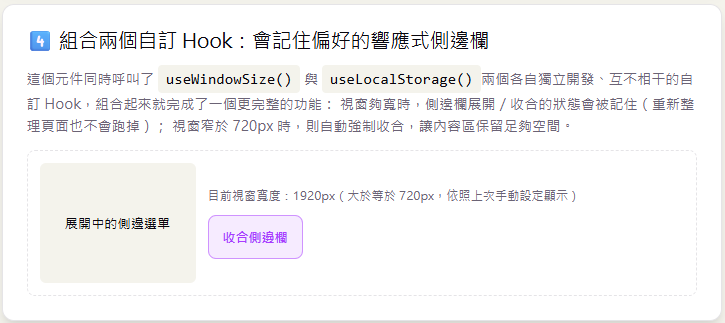

# Day 13｜自訂 Hook（Custom Hook）入門

- 今日範例程式碼：[`Day13\examples\day13-custom-hook-lab`](https://github.com/ShaoYuKao/2026-ithome-ironman-react-v19-30days/tree/master/Day13/examples/day13-custom-hook-lab)

## 一、為什麼要抽出自訂 Hook？

### 1. 從「同一段邏輯，複製貼上兩次」開始講起

想像一下：你已經在 Day08 學會用 `useEffect` 監聽瀏覽器的 `resize` 事件，取得目前的視窗尺寸。現在專案裡有兩個完全不同的元件，都需要知道「目前視窗有多寬」——一個是頁首的版面切換器，另一個是內容區的響應式格線。如果沒有自訂 Hook，你可能會在**兩個元件裡**各自寫一次幾乎一模一樣的程式碼：

```jsx
// HeaderLayoutSwitch.jsx
function HeaderLayoutSwitch() {
  const [width, setWidth] = useState(window.innerWidth)

  useEffect(() => {
    function handleResize() {
      setWidth(window.innerWidth)
    }
    window.addEventListener('resize', handleResize)
    return () => window.removeEventListener('resize', handleResize)
  }, [])

  // ...根據 width 決定要顯示漢堡選單還是完整導覽列
}
```

```jsx
// ResponsiveGrid.jsx
function ResponsiveGrid() {
  // 跟上面幾乎一模一樣的四行 state + 十行 effect，只是變數名稱換了一下
  const [width, setWidth] = useState(window.innerWidth)

  useEffect(() => {
    function handleResize() {
      setWidth(window.innerWidth)
    }
    window.addEventListener('resize', handleResize)
    return () => window.removeEventListener('resize', handleResize)
  }, [])

  // ...根據 width 決定要顯示幾欄格線
}
```

這種「複製貼上同一段狀態邏輯」的做法，會帶來幾個實際的麻煩：

- **改一次要改兩次（甚至更多次）**：如果日後發現這段邏輯有 Bug（例如忘記處理 `devicePixelRatio`、或想改成用 `ResizeObserver` 取代 `resize` 事件），得回頭找出所有複製過的地方逐一修改，很容易漏掉某一處。
- **元件的程式碼被「狀態邏輯」淹沒**：`HeaderLayoutSwitch` 跟 `ResponsiveGrid` 這兩個元件真正關心的是「畫面該怎麼呈現」，但程式碼裡卻要花好幾行處理「怎麼取得視窗尺寸」這件跟畫面呈現無關的細節，兩件事混在一起，讓元件變得又長又難讀。
- **測試「取得視窗尺寸」這件事，得連同整個元件一起測**：這段邏輯本身其實跟 `HeaderLayoutSwitch` 或 `ResponsiveGrid` 是誰完全無關，理想上應該可以被獨立驗證。

### 2. 自訂 Hook 的解法：把「狀態邏輯」抽出來，「畫面」留在元件裡

**自訂 Hook 是 React 生態系裡一個被廣泛使用**，它讓你可以把「一段可能包含 `useState`、`useEffect` 等內建 Hook 的狀態邏輯」抽成一個獨立的函式，之後任何元件只要呼叫這個函式，就能重複使用同一套邏輯：

```jsx
// hooks/useWindowSize.js —— 抽出來的「狀態邏輯」
function useWindowSize() {
  const [size, setSize] = useState(() => ({
    width: window.innerWidth,
    height: window.innerHeight,
  }))

  useEffect(() => {
    function handleResize() {
      setSize({ width: window.innerWidth, height: window.innerHeight })
    }
    window.addEventListener('resize', handleResize)
    return () => window.removeEventListener('resize', handleResize)
  }, [])

  return size
}
```

```jsx
// HeaderLayoutSwitch.jsx —— 只剩下「畫面呈現」該關心的事
function HeaderLayoutSwitch() {
  const { width } = useWindowSize()
  // ...根據 width 決定要顯示漢堡選單還是完整導覽列
}
```

```jsx
// ResponsiveGrid.jsx —— 同樣只剩下「畫面呈現」該關心的事
function ResponsiveGrid() {
  const { width } = useWindowSize()
  // ...根據 width 決定要顯示幾欄格線
}
```

這正是自訂 Hook 帶來的兩個核心價值：

- **邏輯複用（Reuse Stateful Logic）**：「監聽 `resize`、記錄尺寸、卸載時取消監聽」這一整套邏輯只需要寫一次，之後想在第三個、第四個元件用，直接呼叫 `useWindowSize()` 即可，不需要再複製貼上。
- **關注點分離（Separation of Concerns）**：`HeaderLayoutSwitch`、`ResponsiveGrid` 這些元件的程式碼，現在只剩下「畫面該怎麼呈現」的邏輯，讀起來更專注、更清楚；「怎麼取得視窗尺寸」這個跟畫面呈現無關的細節，被獨立封裝在 `useWindowSize` 這個一看名字就懂的函式裡。

> ⚠️ **重要觀念澄清**：自訂 Hook 複用的是「**狀態邏輯**」，不是「**state 本身**」。`HeaderLayoutSwitch` 跟 `ResponsiveGrid` 各自呼叫 `useWindowSize()` 時，會各自拿到一份獨立的 `size` state——兩者互不相干，並不是共享同一份資料。

## 二、自訂 Hook 的本質與命名規則

### 1. 自訂 Hook 其實就是一個「普通的 JavaScript 函式」

拿掉「Hook」這個名詞帶來的神秘感，自訂 Hook 說穿了就是：

> **一個內部呼叫了一個或多個 Hook（`useState`、`useEffect`、`useContext`、`useReducer`……或其他自訂 Hook）的普通 JavaScript 函式。**

它沒有任何特殊語法、不需要額外的 API 註冊、也不是 React 元件（不會回傳 JSX，雖然回傳 JSX 在技術上也是可行的，但那樣通常代表你要抽的其實是一個元件，而不是 Hook）。上一節的 `useWindowSize` 就是一個最簡單的例子：它只是一個名叫 `useWindowSize` 的函式，裡面呼叫了 `useState` 跟 `useEffect`。

### 2. 命名規則 `useXxx`：不只是慣例，是工具依賴的識別依據

自訂 Hook 的名稱**必須**以小寫的 `use` 開頭，後面接大寫字母開頭的名詞（`useWindowSize`、`useLocalStorage`、`useDebounce`……）。這個規則不是單純為了可讀性而存在的建議，而是有實際的技術理由：

- **React 本身**：React 在執行渲染時，需要知道「這次呼叫是不是一個 Hook」，才能正確地在多次渲染之間，把同一個 Hook 呼叫對應到同一份內部狀態（這也是為什麼 Hook 呼叫順序不能變動的原因，下一節會再細談）。`use` 開頭的命名，是 React 生態系統一致遵守的識別依據。
- **ESLint 的 `react-hooks` 套件**：這個檢查工具會**根據函式名稱是否以 `use` 開頭**，決定要不要對這個函式套用「Hook 規則」的檢查（例如「不能在條件式或迴圈裡呼叫 Hook」「依賴陣列要包含用到的所有變數」）。

    - 如果你寫了一個內部呼叫 `useState` 的函式，卻沒有用 `use` 開頭命名（例如取名 `getWindowSize`），檢查工具會**誤判它只是一個普通函式**，不會對它套用 Hook 規則檢查——這代表你如果不小心把 `useState` 包在 `if` 判斷式裡，工具不會提醒你，Bug 可能在執行階段才會發作。
    - 反過來，如果你寫了一個**沒有**呼叫任何 Hook 的普通函式，卻取了一個 `useXxx` 的名字，檢查工具會誤以為它是 Hook，進而對呼叫它的地方套用不必要、甚至錯誤的 Hook 規則檢查。

    > 換句話說：**`useXxx` 這個命名規則，是你與檢查工具之間的一份「約定」**——你承諾這個函式內部呼叫了 Hook，工具才會據此提供正確的保護。

## 三、Hook 規則（Rules of Hooks）回顧，以及「每次呼叫都獨立一份」的重要觀念

### 1. 兩條核心規則

Day04 到 Day12 陸續使用過 `useState`、`useEffect`、`useRef`、`useContext`、`useReducer`，其實它們全部都遵守同一套規則，自訂 Hook 當然也不例外：

1. **只能在函式的最上層呼叫 Hook**：不能寫在 `if`、`for`、巢狀函式裡面，也不能在提早 `return` 之後才呼叫。原因是 React 是依照「Hook 被呼叫的順序」來對應到內部各自獨立的儲存格（state），如果某次渲染因為條件判斷跳過了某個 Hook 呼叫，順序就會錯亂，導致其他 Hook 對應到錯誤的資料。
2. **只能在 React 函式元件、或另一個自訂 Hook 裡呼叫 Hook**：不能在一般的 JavaScript 函式、class 方法、或事件處理函式內部直接呼叫（例如不能寫在 `onClick={() => useState(...)}` 裡面）。

這兩條規則對「自訂 Hook」本身，以及「呼叫自訂 Hook 的元件」都同樣適用——`useWindowSize()`、`useLocalStorage()` 內部的 `useState`、`useEffect` 呼叫要遵守，元件呼叫 `useWindowSize()` 這件事本身也要遵守（也就是不能寫在 `if` 裡面）。

### 2. 容易搞混的觀念：自訂 Hook 不會「共用」state

初學者常有的誤解是：「`useWindowSize` 裡面的 `size` state，是不是全部呼叫它的元件共用同一份？」——**答案是不會**。每一個元件呼叫 `useWindowSize()`，React 都會替**這個元件**建立並保管一份完全獨立的 `size` state，即使程式碼看起來是「呼叫同一個函式」，實際執行起來，就像是把 `useWindowSize` 函式裡的程式碼，原封不動地「貼」進呼叫它的元件內部一樣——每個元件各自擁有自己的一份狀態，彼此互不影響。

在範例會用兩個完全獨立的元件（`ViewportReadout`、`ResponsiveLayoutPreview`）同時呼叫 `useWindowSize()`，你會看到兩邊確實會各自更新、互不干擾，但因為它們監聽的都是同一個瀏覽器視窗，數值看起來才會一致——這是巧合（監聽的是同一個外部事件來源），不是「共用同一份 state」。

## 四、今日範例

### 情境一：`useWindowSize()` —— 兩個元件共用同一套邏輯


打開 `examples/day13-custom-hook-lab` 的第一張卡片，先看 Hook 本身的實作（`src/hooks/useWindowSize.js`）：

```js
import { useEffect, useState } from 'react'

function getSize() {
  return {
    width: window.innerWidth,
    height: window.innerHeight,
  }
}

export function useWindowSize() {
  const [size, setSize] = useState(getSize)

  useEffect(() => {
    function handleResize() {
      setSize(getSize())
    }

    window.addEventListener('resize', handleResize)

    // 清除函式（Day08 學過的觀念）：元件卸載時，一定要移除監聽器，
    // 否則即使元件已經從畫面上消失，這個事件處理函式仍然會繼續被觸發。
    return () => window.removeEventListener('resize', handleResize)
  }, [])

  return size
}
```

這裡完整重用了 Day08 學過的兩個觀念：`useState(getSize)` 是 Lazy Initializer（只在掛載時執行一次，取得目前的視窗尺寸當初始值）；`useEffect` 的依賴陣列是空陣列 `[]`（只在掛載時訂閱一次事件），並且回傳一個清除函式，在元件卸載時移除監聽器，避免 Day08 提過的「忘記清除副作用」問題。**這整段程式碼，跟你原本會直接寫在元件內部的程式碼一模一樣，唯一的差別是把它包進一個獨立的函式、用 `useXxx`命名、並且回傳需要的值。**

接著看兩個各自獨立呼叫這個 Hook 的元件：

```jsx
// src/components/WindowSizeDemo.jsx
// 只關心「數字」，即時顯示目前視窗的寬 / 高
function ViewportReadout() {
  const { width, height } = useWindowSize()
  return (
    <div className="counter-box">
      <p className="counter-value">{width} × {height}</p>
    </div>
  )
}

// 跟 ViewportReadout 完全獨立、互不認識，卻共用同一套「訂閱 resize 事件」的邏輯
function ResponsiveLayoutPreview() {
  const { width } = useWindowSize()
  const { label, columns } = getBreakpoint(width)
  // ...根據 columns 顯示 1～3 欄的格線預覽
}
```

實際操作範例：調整瀏覽器視窗大小（或是用瀏覽器開發者工具切換裝置模擬尺寸），會看到 `ViewportReadout` 的數字，跟 `ResponsiveLayoutPreview` 判斷出的「手機／平板／桌面」版型同時更新——**兩個元件各自呼叫了一次 `useWindowSize()`，卻完全不需要知道對方的存在，也不需要透過 props 互相傳遞任何資料**，因為「監聽視窗尺寸」這件事，本來就是每個元件各自跟瀏覽器打交道，不需要共享。

### 情境二（今日主練習）：把 Day08 的 `useEffect` 同步邏輯抽成 `useLocalStorage(key, initialValue)`


#### 1. 回顧 Day08 的寫法

Day08 的待辦清單 `TodoApp.jsx`，是這樣讀取、同步 `localStorage` 的：

```jsx
// Day08：utils/storage.js 裡手寫的兩個函式，各自處理讀取、寫入
export function loadTodos() {
  try {
    const raw = localStorage.getItem(STORAGE_KEY)
    return raw ? JSON.parse(raw) : []
  } catch (error) {
    console.error('讀取 localStorage 失敗，改用空清單啟動：', error)
    return []
  }
}

export function saveTodos(todos) {
  try {
    localStorage.setItem(STORAGE_KEY, JSON.stringify(todos))
  } catch (error) {
    console.error('寫入 localStorage 失敗：', error)
  }
}
```

```jsx
// Day08：TodoApp.jsx 元件裡，還要另外呼叫 useEffect 手動同步
const [todos, setTodos] = useState(loadTodos)

useEffect(() => {
  saveTodos(todos)
}, [todos])
```

這套寫法完全正確，也是 Day08 想教的「用 `useEffect` 處理副作用」的重點。但如果今天**另一個元件**也想要「一個會自動同步到 `localStorage` 的 state」（例如接下來要做的偏好設定面板），照 Day08 的做法，你得**再寫一次**幾乎一模一樣的 `loadXxx` / `saveXxx` 函式，還要在新元件裡**再寫一次**那段 `useEffect`——這正是第一節談過的「複製貼上」問題。

#### 2. 把它抽成一個通用的自訂 Hook

觀察 Day08 那套邏輯，會發現它其實跟「儲存的 key 是哪一個字串」「初始值退回值是什麼」這兩件事以外，其他程式碼都是通用的。把這兩個變動的部分改成參數，就能抽成一個放諸四海皆準的自訂 Hook（完整檔案：`src/hooks/useLocalStorage.js`）：

```js
import { useEffect, useState } from 'react'

function readStoredValue(key, initialValue) {
  try {
    const raw = localStorage.getItem(key)
    return raw !== null ? JSON.parse(raw) : initialValue
  } catch (error) {
    console.error(`讀取 localStorage key="${key}" 失敗，改用預設值啟動：`, error)
    return initialValue
  }
}

export function useLocalStorage(key, initialValue) {
  // Lazy Initializer（Day04）：只有元件掛載的第一次渲染，才會真的讀一次 localStorage
  const [value, setValue] = useState(() => readStoredValue(key, initialValue))

  // 對照 Day08：把「只要 value 改變，就自動同步寫回 localStorage」的 useEffect，
  // 從個別元件裡搬進這個 Hook 內部，呼叫端不需要再自己寫一次
  useEffect(() => {
    try {
      localStorage.setItem(key, JSON.stringify(value))
    } catch (error) {
      console.error(`寫入 localStorage key="${key}" 失敗：`, error)
    }
  }, [key, value])

  return [value, setValue]
}
```

#### 3. 刻意設計：回傳值形狀跟 `useState` 一模一樣

注意這個 Hook 回傳的是 `[value, setValue]`——跟 `useState` 的回傳值形狀完全相同。這是刻意的設計，帶來一個很實用的好處：**呼叫端幾乎可以把 `useState(initialValue)` 直接換成 `useLocalStorage(key, initialValue)`，不需要修改其他任何程式碼**，因為 `setValue` 本身就是 `useState` 回傳的更新函式，天生就支援函式式更新（`setValue(prev => ...)`）與直接賦值兩種寫法。

#### 4. 重構後的 `TodoApp.jsx`

對照 `src/components/TodoApp.jsx`：

```jsx
import { useState } from 'react'
import { useLocalStorage } from '../hooks/useLocalStorage.js'

function TodoApp() {
  // Day08 原本要寫：
  //   const [todos, setTodos] = useState(loadTodos)
  //   useEffect(() => { saveTodos(todos) }, [todos])
  // 現在只需要這一行，「讀取初始值 + 自動同步寫回 localStorage」都交給 Hook 處理
  const [todos, setTodos] = useLocalStorage('day13-todo-list', [])
  const [filter, setFilter] = useState('all')

  function handleAdd(text) {
    const newTodo = { id: crypto.randomUUID(), text, completed: false }
    setTodos((prev) => [...prev, newTodo])
  }

  // handleToggle、handleDelete、handleClearCompleted 都跟 Day08 完全一樣，
  // 因為 setTodos 的使用方式沒有任何改變
  // ...
}
```

#### 5. 逐項對照：這次重構到底改善了什麼

| 項目 | Day08（手動 `useState` + `useEffect`） | Day13（`useLocalStorage`） |
| --- | --- | --- |
| 元件裡看不看得到 `localStorage` 這幾個字 | 看得到（`loadTodos`、`saveTodos` 直接操作 `localStorage`） | 看不到，`TodoApp` 元件完全不知道資料被存在哪裡 |
| 元件裡看不看得到 `useEffect` | 看得到，需要自己寫依賴陣列 `[todos]` | 看不到，同步邏輯被封裝進 Hook 內部 |
| 想在第二個元件也做一份「自動同步的 state」 | 得複製 `loadXxx` / `saveXxx` 兩個函式，再複製一次 `useEffect` | 只需要呼叫 `useLocalStorage(另一個 key, 另一個初始值)` |
| 元件的職責 | 「畫面呈現」與「怎麼持久化資料」混在一起 | 只剩下「畫面呈現」，持久化交給 Hook |

實際操作範例的「useLocalStorage 主練習」卡片：新增、勾選完成、刪除、篩選、清除已完成，畫面行為跟 Day08 一模一樣，重新整理頁面資料依然保留——**行為沒有改變，改變的是程式碼組織方式**。

### 情境三：`useLocalStorage` 的第二次重複使用 —— 偏好設定面板


光是「把 Day08 的邏輯抽出來、用在同一個待辦清單上」還不足以證明這個 Hook 真的可以「複用」。第三張卡片 `PreferencesPanel.jsx` 刻意做了一個**跟待辦清單完全無關**的表單：一個顯示名稱輸入框、一個主題下拉選單、一個 Email 通知 checkbox——資料形狀從陣列變成物件，儲存的 `key` 也換了一個：

```jsx
import { useLocalStorage } from '../hooks/useLocalStorage.js'

const DEFAULT_PREFERENCES = {
  displayName: '',
  theme: 'system',
  notifyByEmail: true,
}

function PreferencesPanel() {
  // 不同的 key、不同的資料形狀（這裡是物件，待辦清單是陣列），
  // 卻同樣只用一行 useLocalStorage(...) 就搞定
  const [preferences, setPreferences] = useLocalStorage('day13-preferences', DEFAULT_PREFERENCES)

  function updateField(key, value) {
    setPreferences((prev) => ({ ...prev, [key]: value }))
  }

  // ...渲染表單欄位，onChange 呼叫 updateField
}
```

實際操作範例：修改顯示名稱、切換主題、勾選/取消 Email 通知，畫面上「目前儲存的內容」會即時顯示這個物件目前的 JSON 內容；重新整理頁面，剛剛填寫的資料依然還在。**同一個 `useLocalStorage` 實作，服務了兩個完全不同的元件、不同的資料形狀、不同的儲存 key**——這就是自訂 Hook 「邏輯複用」最直接的證明：需要修改的只有呼叫時傳入的參數，Hook 本身的程式碼一個字都不用改。

### 情境四：組合兩個自訂 Hook —— 會記住偏好的響應式側邊欄



回到第二節「自訂 Hook 只是一個會呼叫其他 Hook 的普通函式」這個本質——既然是普通函式，一個元件（或另一個自訂 Hook）當然可以**同時呼叫好幾個自訂 Hook**，把彼此獨立開發的邏輯組合成更完整的功能。第四張卡片 `SidebarLayoutDemo.jsx` 同時使用了今天做的兩個 Hook：

```jsx
import { useLocalStorage } from '../hooks/useLocalStorage.js'
import { useWindowSize } from '../hooks/useWindowSize.js'

const NARROW_BREAKPOINT = 720

function SidebarLayoutDemo() {
  const { width } = useWindowSize() // 判斷「視窗是否過窄，需要強制收合」
  const [collapsed, setCollapsed] = useLocalStorage('day13-sidebar-collapsed', false) // 記住使用者上次手動的選擇

  const isNarrowScreen = width < NARROW_BREAKPOINT
  // 視窗夠窄時強制收合；視窗夠寬時，尊重使用者上次手動設定、且已持久化的狀態
  const effectiveCollapsed = isNarrowScreen ? true : collapsed

  // ...渲染側邊欄，按鈕在視窗過窄時停用（disabled={isNarrowScreen}）
}
```

實際操作範例：把瀏覽器視窗縮到比較窄的寬度，側邊欄會自動強制收合，展開/收合按鈕也會被停用；把視窗拉寬後，按鈕恢復可操作，點擊展開/收合，重新整理頁面後，剛剛選擇的狀態依然會被記住。**`useWindowSize` 跟 `useLocalStorage` 是兩個各自獨立開發、互不知道對方存在的 Hook**，`SidebarLayoutDemo` 這個元件把它們兩個「組合」起來，就完成了一個更完整、更貼近真實產品需求的功能——這正是自訂 Hook 生態系統的威力：小型、專注的 Hook 可以像積木一樣互相搭配。

> 💡 這裡的「組合」是直接在元件裡呼叫兩個 Hook；如果這個「響應式側邊欄」邏輯未來也要在別的元件重複使用，也可以進一步把這兩個 Hook 的組合再包成第三個自訂 Hook（例如 `useResponsiveSidebar()`），內部呼叫 `useWindowSize()` 跟 `useLocalStorage()`，對外只回傳 `{ collapsed, setCollapsed, isNarrowScreen }`——這就是「自訂 Hook 呼叫另一個自訂 Hook」的實際應用，遞迴下去理論上可以疊很多層，只要每一層都遵守第三節的 Hook 規則即可。

## 五、設計自訂 Hook 時的兩個小提醒

### 1. 回傳值：陣列 `[value, setValue]` 或是物件 `{ value, setValue }`？

`useLocalStorage` 回傳陣列（跟 `useState` 對齊），`useWindowSize` 回傳物件（`{ width, height }`）。兩者都合理，選擇的依據是：

- **回傳陣列**：適合「呼叫端通常只需要其中一兩個值，而且想自訂變數名稱」的情境，例如 `const [todos, setTodos] = useLocalStorage(...)`、`const [count, setCount] = useState(...)`——陣列解構時可以自由命名，`useState`、`useReducer` 都是這樣設計的。
- **回傳物件**：適合「欄位數量比較多、或呼叫端通常需要好幾個欄位，直接用有意義的欄位名稱比較清楚」的情境，例如 `const { width, height } = useWindowSize()`——用物件解構時欄位名稱是固定的，不用像陣列一樣擔心順序對不對。

沒有絕對的對錯，重點是**保持整個專案裡類似情境的一致性**，讓使用你 Hook 的人可以「望文生義」猜到怎麼用。

### 2. 小心「看似簡單」卻藏著陷阱的細節

`useLocalStorage` 目前的實作假設呼叫端傳入的 `key` 在同一個元件的生命週期裡**不會改變**（就像 Day08 的 `STORAGE_KEY` 是寫死的常數一樣）。如果 `key` 是動態變化的（例如依照使用者 ID 產生不同的 key），因為 Lazy Initializer 只在掛載時執行一次，`key` 改變並不會自動重新讀取新 key 對應的資料——這是設計這個 Hook 時刻意先簡化、留給未來延伸的部分，實務上如果真的需要支援動態 key，可以額外加一個 `useEffect(() => { setValue(readStoredValue(key, initialValue)) }, [key])` 來處理，但要小心避免跟原本同步寫入的 `useEffect` 互相觸發成無窮迴圈。

## 六、常見陷阱整理

| 陷阱 | 說明 | 對策 |
| --- | --- | --- |
| 把不呼叫任何 Hook 的普通函式也取名叫 `useXxx` | 會讓 ESLint / `oxlint` 的 `react-hooks` 規則誤判、對呼叫它的地方套用不必要甚至錯誤的檢查 | 只有內部真的呼叫了 Hook（`useState`、`useEffect`、其他自訂 Hook 等）的函式，才用 `use` 開頭命名 |
| 自訂 Hook 內部呼叫 Hook，卻沒有用 `use` 開頭命名 | ESLint 認不出這是 Hook，不會套用「不能在條件式裡呼叫 Hook」等保護規則，Bug 可能要到執行階段才會發作 | 只要函式內部呼叫了任何 Hook，一律以 `useXxx` 命名，讓檢查工具能正確識別 |
| 誤以為多個元件呼叫同一個自訂 Hook 會共用同一份 state | 例如以為兩個元件呼叫 `useWindowSize()` 會互相同步某個「額外加上去的計數器」state，但其實每個元件各自擁有獨立的一份 | 記得：自訂 Hook 只是把程式碼「原封不動地貼進」每個呼叫它的元件裡，state 永遠是各自獨立的（除非額外透過 Context / 全域變數等方式共享） |
| 在 `useLocalStorage` 這類 Hook 裡，把「讀取」跟「寫入」的錯誤處理都省略 | `localStorage` 在無痕模式、儲存空間已滿、或使用者關閉相關瀏覽器功能時可能會拋出例外，沒有 `try/catch` 會讓整個 App 直接掛掉 | 讀取與寫入都包一層 `try/catch`，失敗時記錄錯誤並退回安全的預設值（見 `useLocalStorage.js` 的 `readStoredValue`） |
| 自訂 Hook 內的 `useEffect` 忘記處理依賴陣列 | 例如 `useLocalStorage` 的同步 `useEffect` 如果漏寫 `key` 依賴，日後 `key` 真的改成動態值時，可能會有依賴沒被追蹤到的問題 | 讓 `oxlint`（或 ESLint）的 `react-hooks/exhaustive-deps` 規則持續檢查，依它的建議把用到的變數都放進依賴陣列 |
| 把跟畫面高度相關的邏輯，也一股腦全塞進同一個自訂 Hook | 例如把「視窗尺寸」跟「使用者登入狀態」兜在同一個 `useAppState()` 巨無霸 Hook 裡，違反關注點分離的初衷 | 每個自訂 Hook 只專注解決一個獨立、明確的問題，需要多個功能組合時，像第七節一樣在元件裡分別呼叫多個小型 Hook |

## 執行方式

```bash
cd Day13/examples/day13-custom-hook-lab
npm install
npm run dev
```

打開瀏覽器輸入網址 `http://localhost:5173/`，就可看到你的 React 畫面進行操作確認。也可以執行 `npm run build` 打包成正式版本，或執行 `npm run lint` 確認程式碼沒有明顯的 Hook 使用錯誤。
