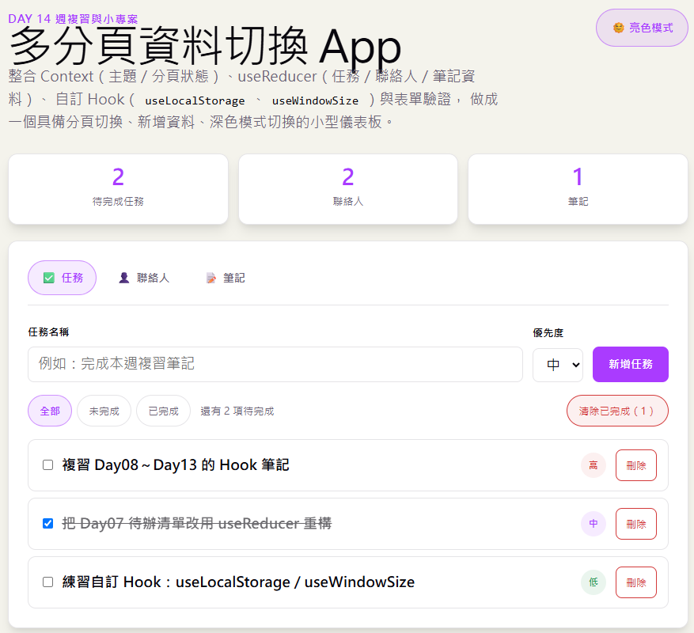

# Day 14｜週複習與小專案：多分頁資料切換 App

- 今日範例程式碼：[`Day14\examples\day14-dashboard-app`](https://github.com/ShaoYuKao/2026-ithome-ironman-react-v19-30days/tree/master/Day14/examples/day14-dashboard-app)

## 一、本週學習地圖回顧

在動手做小專案之前，先快速複習一次第二週每天學了什麼、對應到今天小專案的哪個部分：

| Day | 主題 | 在今天小專案裡對應到的部分 |
| --- | --- | --- |
| Day08 | `useEffect` 副作用處理、依賴陣列、cleanup 函式 | `DashboardApp.jsx` 裡用 `useEffect` 監看 reducer 的 `state`，自動同步寫回 `localStorage`；`useWindowSize`／`useLocalStorage` 內部也都用到 `useEffect` |
| Day09 | 受控元件、多欄位表單狀態管理、表單驗證 | `TaskForm`、`ContactForm`、`NoteForm` 三個新增表單，欄位都是受控元件，送出前先呼叫 `validateXxxForm` 驗證 |
| Day10 | `useRef` 與 DOM 操作 | 今天的專案沒有直接用到 `useRef`（沒有需要手動操作 DOM 或保存跨渲染值的情境），但在「衡量狀態該放哪裡」時，`useRef`「更新不觸發重新渲染」的特性，是本節架構討論時的重要參考點 |
| Day11 | Props Drilling 問題、`createContext` + `Provider` + `useContext` | `ThemeContext`（深色模式）與新增的 `TabContext`（目前分頁），解決 Header／TabBar／TabPanel 分散在元件樹不同分支，卻都需要同一份「全域 UI 狀態」的問題 |
| Day12 | `useReducer` 複雜狀態管理、reducer / action / dispatch 設計模式 | `dashboardReducer.js`：用一個 reducer 集中管理 `tasks`／`contacts`／`notes` 三種資料的所有變化 |
| Day13 | 自訂 Hook：邏輯複用、`useXxx` 命名規則 | 直接重複使用 Day13 做好的 `useLocalStorage`（主題、分頁、儀表板資料持久化）與 `useWindowSize`（分頁列的響應式行為） |

再往前追溯，今天也會用到第一週的基礎能力：Day03 元件拆分與 Props、Day05 事件處理、Day06 條件渲染與列表渲染、Day07 狀態提升與「資料往下傳、事件往上回報」的溝通模式。

**今天不會有任何全新的 API**，重點是把這兩週學過的東西，用「一個真實一點的小型 App 該怎麼設計」的角度重新組裝一次。

## 二、專案總覽與元件樹

### 1. 這個小專案長什麼樣子



打開 App 之後會看到：

- 頁首（Header）：標題說明 + 一顆「🌞 亮色模式 / 🌙 暗色模式」切換按鈕。
- 摘要列（SummaryStats）：三張小卡片，顯示「待完成任務數」「聯絡人數」「筆記數」。
- 分頁列（TabBar）：「✅ 任務」「👤 聯絡人」「📝 筆記」三個分頁按鈕，點擊切換。
- 分頁內容（TabPanel）：依照目前選取的分頁，顯示對應的新增表單與清單。

### 2. 元件樹

```
App
├── ThemeProvider（提供 theme、toggleTheme）
└── TabProvider（提供 activeTab、setActiveTab）
    └── DashboardApp（狀態集中管理：useReducer 管理 tasks / contacts / notes）
        ├── Header
        │   └── ThemeToggleButton（讀取 useTheme()）
        ├── SummaryStats（純顯示，靠 props 拿到三份資料算數量）
        └── section.dashboard-panel
            ├── TabBar（讀取 useTab()、useWindowSize()）
            └── TabPanel（讀取 useTab()，依 activeTab 決定渲染哪個面板）
                ├── TasksPanel（tasks、dispatch 由 props 傳入）
                │   ├── TaskForm（受控表單 + 驗證）
                │   ├── TaskFilterBar（全部／未完成／已完成）
                │   └── TaskList => TaskItem（checkbox 切換完成、刪除、優先度徽章）
                ├── ContactsPanel（contacts、dispatch 由 props 傳入）
                │   ├── ContactForm（受控表單 + Email／電話格式驗證）
                │   └── ContactList（直接在 .map() 裡渲染，不拆 Item 元件）
                └── NotesPanel（notes、dispatch 由 props 傳入）
                    ├── NoteForm（受控表單，含 textarea）
                    └── NoteList（直接在 .map() 裡渲染，附格式化時間）
```

觀察這棵樹會發現兩件事，也是今天架構設計的核心：

1. **`ThemeProvider` 與 `TabProvider` 包在最外層**，代表底下**任何深度**的元件，都能直接呼叫 `useTheme()` / `useTab()`，不需要一層層往下傳 props——這是 Day11 學過的 Context 用法。
2. **`tasks`／`contacts`／`notes` 這三份「真正的資料」完全沒有放進 Context**，而是由 `DashboardApp` 用 `useReducer` 管理，再透過 props 往下傳給 `TabPanel`、繼續往下傳給三個面板元件——這是 Day07 學過的「狀態提升 + 資料往下傳、事件往上回報」。

為什麼「主題／分頁」用 Context，「任務／聯絡人／筆記資料」卻不用？下一節會詳細說明判斷依據。

## 三、三種狀態，各自放在哪裡？（今日最重要的設計決策）

做一個中型 App 時，「這份 state 該宣告在哪裡、用哪一種工具管理」往往比「怎麼寫 JSX」更需要練習判斷力。今天的專案裡，總共出現三種不同層級的狀態，處理方式各不相同：

| 狀態類型 | 範例 | 使用的工具 | 為什麼這樣選 |
| --- | --- | --- | --- |
| **全域 UI 狀態** | 目前主題（亮/暗）、目前分頁 | `useContext`（`ThemeContext`、`TabContext`），內部用 `useLocalStorage` 持久化 | 好幾個「分散在元件樹不同分支」的元件都需要讀取或修改（Header 要切主題、TabBar 要切分頁、TabPanel 要讀分頁），用 Props 逐層傳遞會經過很多完全不關心這件事的中間元件（Props Drilling，Day11 談過的問題） |
| **核心資料狀態** | 任務清單、聯絡人清單、筆記清單 | `useReducer`（`dashboardReducer`），放在 `DashboardApp` 一個地方，往下用 props 傳 | 資料的變化方式很多種（新增／刪除／切換完成／清除已完成……），彼此邏輯相關，用 `useReducer` 集中在一個純函式裡管理；同時只有 `TabPanel` 以下的元件需要，不需要為了兩三層的傳遞就升級成 Context |
| **畫面本地狀態** | 任務篩選條件（全部/未完成/已完成）、每個表單目前輸入的內容、驗證錯誤訊息 | 各自元件內部的 `useState` | 只有宣告它的那個元件（或它自己）在乎，其他任何元件都不需要知道；不需要persist、也不需要跨元件共享，維持最單純的區域狀態就好 |

**判斷原則整理成一句話：** 先問「有多少元件需要它、彼此距離多遠」，再決定要不要跨過 Props、升級成 Context；再問「這份資料的變化方式，是不是彼此關聯、種類很多」，決定要不要用 `useReducer` 取代單一 `useState`。不需要一開始就把所有 state 都塞進 Context 或 Reducer——今天的 `filter`、表單暫存內容，就是刻意留在區域 `useState` 的例子。

## 四、複習並整合 Context：主題與分頁狀態

### 1. `ThemeContext`：跟 Day11 幾乎一樣，只多了「persist」

對照 `src/contexts/ThemeContext.jsx`：

```jsx
import { createContext, useContext } from 'react'
import { useLocalStorage } from '../hooks/useLocalStorage.js'

const ThemeContext = createContext(null)

function ThemeProvider({ children }) {
  const [theme, setTheme] = useLocalStorage('day14-theme', 'light')

  function toggleTheme() {
    setTheme((prev) => (prev === 'light' ? 'dark' : 'light'))
  }

  const value = { theme, toggleTheme }

  return <ThemeContext.Provider value={value}>{children}</ThemeContext.Provider>
}

function useTheme() {
  const context = useContext(ThemeContext)
  if (context === null) {
    throw new Error('useTheme 必須在 <ThemeProvider> 內使用')
  }
  return context
}

export { ThemeProvider, useTheme }
```

跟 Day11 的 `ThemeContext` 對照，差異只有一行：Day11 用 `useState('light')`，今天改用 Day13 做好的 `useLocalStorage('day14-theme', 'light')`。因為 `useLocalStorage` 回傳的形狀跟 `useState`完全一樣（`[value, setValue]`），**這一行替換不需要改動 `toggleTheme` 或其他任何程式碼**——這正是 Day13 特別強調過的「刻意設計成跟 `useState` 一樣的回傳形狀」帶來的好處。

### 2. `TabContext`：今天新增的第二個 Context

對照 `src/contexts/TabContext.jsx`：

```jsx
import { createContext, useContext } from 'react'
import { useLocalStorage } from '../hooks/useLocalStorage.js'
import { TABS } from '../constants/tabs.js'

const TabContext = createContext(null)

function TabProvider({ children }) {
  const [activeTab, setActiveTab] = useLocalStorage('day14-active-tab', TABS[0].id)
  const value = { activeTab, setActiveTab }
  return <TabContext.Provider value={value}>{children}</TabContext.Provider>
}

function useTab() {
  const context = useContext(TabContext)
  if (context === null) {
    throw new Error('useTab 必須在 <TabProvider> 內使用')
  }
  return context
}

export { TabProvider, useTab }
```

寫法跟 `ThemeContext` 幾乎一模一樣——這也說明了為什麼要把 `createContext` + `Provider` + 對應的 `useXxx` Hook 這一整套組合抽出來當成一個「樣板（pattern）」：一旦熟悉這個樣板，遇到任何「需要跨元件共享的全域 UI 狀態」，都可以照抄同一套結構，只需要換掉狀態本身的名稱與初始值。

### 3. 為什麼兩個 Context 分開寫，而不是合併成一個？

也許你會想：「主題」跟「分頁」都是全域 UI 狀態，可以合併成一個 `AppUIContext` 嗎？技術上可以，但拆成兩個獨立 Context 有一個實際好處：**元件只需要訂閱它真正關心的那一個 Context**。例如只有 `ThemeToggleButton` 需要 `theme`，只有 `TabBar` 和 `TabPanel` 需要 `activeTab`，把兩者分開之後，職責更清楚，也是實務上常見的做法（等學到 `React.memo` 與渲染優化時，也會知道拆分 Context 還有「避免不相關的更新互相拖累重新渲染」的效能考量，現階段先建立「先拆開、職責單一」的習慣即可）。

## 五、複習並整合自訂 Hook：`useLocalStorage`、`useWindowSize`

今天的專案**直接複製 Day13 寫好的兩個自訂 Hook**，完全沒有修改內部邏輯，只是換了呼叫端與 key：

### 1. `useLocalStorage`：用在兩個 Context 裡

`src/hooks/useLocalStorage.js` 跟 Day13 的實作完全相同。今天用它持久化兩份「使用者操作 UI 就會改變、但重新整理希望被記住」的狀態：

```jsx
// ThemeContext.jsx
const [theme, setTheme] = useLocalStorage('day14-theme', 'light')

// TabContext.jsx
const [activeTab, setActiveTab] = useLocalStorage('day14-active-tab', TABS[0].id)
```

這正是 Day13 想驗證的「同一個自訂 Hook，可以在完全不同的元件、不同的資料形狀上重複使用」——這裡甚至用在兩個不同的 Context 裡，而不只是兩個獨立元件。

### 2. `useWindowSize`：讓分頁列變得「響應式」

對照 `src/components/TabBar.jsx`：

```jsx
import { useTab } from '../contexts/TabContext.jsx'
import { useWindowSize } from '../hooks/useWindowSize.js'
import { TABS } from '../constants/tabs.js'

function TabBar() {
  const { activeTab, setActiveTab } = useTab()
  const { width } = useWindowSize()
  const isCompact = width < 480

  return (
    <div className="tab-bar" role="tablist" aria-label="儀表板分頁">
      {TABS.map((tab) => (
        <button
          key={tab.id}
          type="button"
          role="tab"
          aria-selected={activeTab === tab.id}
          className={activeTab === tab.id ? 'tab-btn tab-btn--active' : 'tab-btn'}
          onClick={() => setActiveTab(tab.id)}
        >
          <span aria-hidden="true">{tab.icon}</span>
          {!isCompact && <span>{tab.label}</span>}
        </button>
      ))}
    </div>
  )
}
```

視窗夠寬時，分頁按鈕同時顯示圖示與文字；縮小瀏覽器視窗到 480px 以下（模擬手機直式畫面）時，`isCompact` 變成 `true`，文字部分（`{!isCompact && <span>{tab.label}</span>}`，Day06 學過的 `&&` 條件渲染）就不會渲染，只留下圖示，避免分頁列在小螢幕被文字撐得太寬。

**這個元件同時呼叫了 `useTab()`（Context）與 `useWindowSize()`（自訂 Hook）**，正好呼應 Day13 最後一節「組合多個自訂 Hook / Context 完成更完整功能」的觀念——一個元件可以同時依賴好幾個獨立開發的邏輯來源。

## 六、複習並整合 `useReducer`：儀表板資料狀態

### 1. 一個 reducer，管理三種不同形狀的資料

對照 Day12 的 `todoReducer` 只管理一種資料（todos），今天的 `src/reducers/dashboardReducer.js` 要同時管理 `tasks`、`contacts`、`notes` 三種**形狀完全不同**的資料：

```js
export function dashboardReducer(state, action) {
  switch (action.type) {
    // ------- 任務（tasks）-------
    case 'tasks/add': {
      const title = action.payload.title.trim()
      if (title === '') {
        return state
      }
      const newTask = {
        id: crypto.randomUUID(),
        title,
        priority: action.payload.priority,
        completed: false,
      }
      return { ...state, tasks: [...state.tasks, newTask] }
    }

    case 'tasks/toggle': {
      const { id } = action.payload
      return {
        ...state,
        tasks: state.tasks.map((task) =>
          task.id === id ? { ...task, completed: !task.completed } : task,
        ),
      }
    }

    case 'tasks/delete': {
      const { id } = action.payload
      return { ...state, tasks: state.tasks.filter((task) => task.id !== id) }
    }

    case 'tasks/clearCompleted':
      return { ...state, tasks: state.tasks.filter((task) => !task.completed) }

    // ------- 聯絡人（contacts）、筆記（notes）也是同樣的模式 -------
    // ……（完整內容請見原始檔案）

    default:
      throw new Error(`dashboardReducer 收到未知的 action type：${action.type}`)
  }
}
```

重點觀察：

- **action type 用 `領域/動作` 的命名慣例**（`'tasks/add'`、`'contacts/delete'`、`'notes/add'`……），跟 Day12 的 `'todos/add'`、`'filter/change'` 一致。這種命名方式讓人一眼就能看出「這個 action 影響的是哪一種資料」，reducer 種類變多時特別有幫助。
- 每個 `case` 都是**回傳一份全新的 state 物件**（用展開運算符 `{ ...state, tasks: ... }`），沒有任何一行直接修改 `state.tasks` 或陣列內的物件——延續 Day04 學過的**不可變性（Immutability）**原則。
- `tasks/add`、`contacts/add`、`notes/add` 都在真正新增前，**先檢查必要欄位 trim 後是否為空字串**，是空的就直接 `return state`（Day06 提早 return 的複習），避免送出空白資料。

### 2. Lazy Initializer + `useEffect` 持久化：

對照 `src/components/DashboardApp.jsx`：

```jsx
function DashboardApp() {
  const { theme } = useTheme()
  const [state, dispatch] = useReducer(dashboardReducer, undefined, initDashboardState)

  useEffect(() => {
    saveDashboardState(state)
  }, [state])

  return (
    <div className="dashboard-page" data-theme={theme}>
      <Header />
      <main className="dashboard-main">
        <SummaryStats tasks={state.tasks} contacts={state.contacts} notes={state.notes} />
        <section className="dashboard-panel card">
          <TabBar />
          <TabPanel state={state} dispatch={dispatch} />
        </section>
      </main>
    </div>
  )
}
```

這跟 Day12 `TodoApp.jsx` 的寫法幾乎一模一樣：

1. `useReducer(dashboardReducer, undefined, initDashboardState)`——第三個參數 `initDashboardState` 是 Lazy Initializer（Day04、Day12 都學過），只在元件掛載時執行一次，內部呼叫 `loadDashboardState()` 從 `localStorage` 讀取資料（讀不到就用預設的示範資料）。
2. 一個 `useEffect(() => { saveDashboardState(state) }, [state])`（Day08 複習）：只要 `state` 改變（不管是新增任務、刪除聯絡人、或任何一種 dispatch），就自動同步寫回 `localStorage`，呼叫端（三個表單、清單元件）完全不需要知道「資料要存起來」這件事，只管呼叫 `dispatch` 就好。

### 3. 資料狀態不放 Context，而是用 props 往下傳

`state`、`dispatch` 從 `DashboardApp` 一路往下傳給 `TabPanel`，`TabPanel` 再依照 `activeTab` 把對應的那一小份資料（例如只給 `TasksPanel` 傳 `state.tasks`）連同 `dispatch` 繼續往下傳：

```jsx
// TabPanel.jsx
function TabPanel({ state, dispatch }) {
  const { activeTab } = useTab()

  switch (activeTab) {
    case 'tasks':
      return <TasksPanel tasks={state.tasks} dispatch={dispatch} />
    case 'contacts':
      return <ContactsPanel contacts={state.contacts} dispatch={dispatch} />
    case 'notes':
      return <NotesPanel notes={state.notes} dispatch={dispatch} />
    default:
      return null
  }
}
```

只經過 `DashboardApp => TabPanel => TasksPanel` 短短兩層，用 props 傳遞完全不構成負擔，所以不需要為此升級成 Context（呼應第三節的判斷原則）。`TasksPanel` 再把 `dispatch` 包裝成語意清楚的 callback 往下傳給 `TaskForm`、`TaskFilterBar`、`TaskList`：

```jsx
// TasksPanel.jsx
<TaskForm onAdd={(title, priority) => dispatch({ type: 'tasks/add', payload: { title, priority } })} />
<TaskFilterBar
  onClearCompleted={() => dispatch({ type: 'tasks/clearCompleted' })}
  // ……
/>
<TaskList
  onToggle={(id) => dispatch({ type: 'tasks/toggle', payload: { id } })}
  onDelete={(id) => dispatch({ type: 'tasks/delete', payload: { id } })}
/>
```

`TaskForm`、`TaskList` 自己完全不知道 `dispatch` 或 `dashboardReducer` 的存在，只知道呼叫 `onAdd(title, priority)`、`onToggle(id)` 這些語意清楚的函式——這就是 Day07 學過的「資料往下傳、事件往上回報」在更多層元件之間的延伸應用。

## 七、複習並整合表單：新增任務／聯絡人／筆記（複習 Day05、Day06、Day09）

三個新增表單（`TaskForm`、`ContactForm`、`NoteForm`）用的是同一套模式，這裡以 `src/components/tasks/TaskForm.jsx` 為例：

```jsx
function TaskForm({ onAdd }) {
  const [formData, setFormData] = useState(initialTaskFormData)
  const [errors, setErrors] = useState({})

  function handleChange(event) {
    const { name, value } = event.target
    setFormData((prev) => ({ ...prev, [name]: value }))
  }

  function handleSubmit(event) {
    event.preventDefault()

    const validationErrors = validateTaskForm(formData)
    setErrors(validationErrors)

    if (Object.keys(validationErrors).length > 0) {
      return
    }

    onAdd(formData.title, formData.priority)
    setFormData(initialTaskFormData)
    setErrors({})
  }

  return (
    <form className="inline-form" onSubmit={handleSubmit} noValidate>
      <input name="title" value={formData.title} onChange={handleChange} /* ... */ />
      <select name="priority" value={formData.priority} onChange={handleChange}>
        {/* ... */}
      </select>
      <button type="submit">新增任務</button>
    </form>
  )
}
```

重點複習：

1. **受控元件**：`title`、`priority` 都是 `value` + `onChange` 綁定，state 是畫面上顯示內容的唯一真相來源（Single Source of Truth）。
2. **動態 key 更新**：`handleChange` 用 `event.target.name` 當作 `formData` 物件的 key，一個函式處理表單裡所有欄位，`ContactForm`（`name`／`email`／`phone` 三個欄位）也是用同一招。
3. **`onSubmit` + `preventDefault()`**：阻止表單預設的「整頁刷新並帶上表單資料」行為，改由 JavaScript 決定要驗證、還是要送出。
4. **送出前驗證**：呼叫 [`src/utils/validators.js`](examples/day14-dashboard-app/src/utils/validators.js) 裡對應的 `validateTaskForm` / `validateContactForm` / `validateNoteForm`，回傳「欄位名稱 => 錯誤訊息」的物件，搭配 `FieldError` 元件（Day06 條件渲染複習：沒有錯誤訊息就回傳 `null`，什麼都不顯示）顯示在欄位下方。
5. **驗證通過才呼叫 `onAdd`**：驗證失敗時直接 `return`，不會呼叫 `dispatch`，也不會清空表單（讓使用者可以看到剛剛打的內容、修正錯誤再送出一次）。

`ContactForm` 額外練習了 Email 格式與電話格式的正規表達式驗證，`NoteForm` 則練習了 `<textarea>` 的受控寫法（跟 `<input>` 完全一樣，一樣是 `value` + `onChange`）。

### 何時該拆出獨立的 Item 元件？

比較 `TaskList` 跟 `ContactList`／`NoteList` 的寫法會發現一個刻意的差異：

- `TaskList` 把單一列拆成獨立的 `TaskItem` 元件——因為每一列除了顯示，還有 checkbox 切換完成、優先度徽章，JSX 稍微複雜一點。
- `ContactList`、`NoteList` **沒有**拆出 `ContactItem`／`NoteItem`，直接在 `.map()` 裡把 JSX 寫完：

```jsx
// ContactList.jsx
{contacts.map((contact) => (
  <li key={contact.id} className="item-row">
    <div className="item-title-group">
      <span className="item-title">{contact.name}</span>
      <span className="item-subtitle">
        {contact.email}
        {contact.phone && ` · ${contact.phone}`}
      </span>
    </div>
    <button type="button" onClick={() => onDelete(contact.id)}>刪除</button>
  </li>
))}
```

這呼應 Day03 談過的「元件拆分原則」：**只有畫面邏輯變複雜、有獨立狀態、或需要在多處重複使用時，才值得拆成子元件**；單純顯示幾個欄位加一個按鈕，直接寫在 `.map()` 裡反而更容易一眼看懂，不需要為了「風格統一」而強迫每個列表都拆出 Item 元件。

## 八、完整資料流走一遍：以「新增一筆任務」為例

把前面幾節串起來，實際跟著一次「使用者在任務分頁輸入標題、選擇優先度、按下『新增任務』」的完整過程：

1. 使用者在 `TaskForm` 的輸入框打字 => 觸發 `onChange` => `handleChange` 用 `event.target.name`（`'title'`）當 key，更新 `TaskForm` 內部的 `formData` state => 輸入框顯示的文字跟著更新（受控元件）。
2. 使用者按下「新增任務」按鈕（`type="submit"`）=> 觸發 `<form>` 的 `onSubmit` => `handleSubmit` 先呼叫 `event.preventDefault()` 擋掉整頁刷新。
3. 呼叫 `validateTaskForm(formData)`：如果標題是空字串，回傳 `{ title: '請輸入任務名稱' }`，`setErrors` 更新後 `FieldError` 顯示錯誤、`handleSubmit` 提早 `return`，不會有下一步。
4. 驗證通過：`TaskForm` 呼叫從 `props` 拿到的 `onAdd(formData.title, formData.priority)`。
5. 這個 `onAdd` 其實是 `TasksPanel` 傳下來的一個箭頭函式：`(title, priority) => dispatch({ type: 'tasks/add', payload: { title, priority } })`，於是呼叫 `dispatch`，把 action 送進 `DashboardApp` 裡的 `useReducer`。
6. `dashboardReducer` 收到 `'tasks/add'`，算出新的 `state.tasks`（原本的清單 + 一筆新任務），回傳一份全新的 `state` 物件。
7. React 偵測到 `useReducer` 回傳的 `state` 改變，觸發 `DashboardApp` 重新渲染；`useEffect` 偵測到依賴陣列裡的 `state` 改變，呼叫 `saveDashboardState(state)` 把最新資料同步寫回 `localStorage`。
8. 新的 `state.tasks` 透過 props 一路傳到 `TaskList`，`.map()` 渲染出多一筆的 `TaskItem`；`SummaryStats` 也因為拿到新的 `tasks` 陣列，重新算出「待完成任務數」並顯示最新數字。
9. `TaskForm` 這邊，`handleSubmit` 最後呼叫 `setFormData(initialTaskFormData)` 把表單清空，準備接受下一筆輸入。

整個過程完全沒有任何元件「偷偷」直接修改別人的 state——資料的**唯一**修改入口就是 `dispatch`，這正是 `useReducer` 帶來的「所有變化都收斂在一個地方」的好處，也是為什麼即使今天要同時管理三種資料，程式碼仍然容易追蹤的原因。

## 九、常見陷阱整理

| 陷阱 | 說明 | 對策 |
| --- | --- | --- |
| 把所有狀態都塞進 Context，覺得「反正比較方便」 | 任何一個 Context 的 `value` 改變，都會讓所有訂閱它的元件重新渲染，資料狀態通常變化更頻繁、影響範圍更廣，過度使用 Context 容易讓渲染難以追蹤 | 依第三節的判斷原則：只有「跨越很多層、彼此距離很遠」的全域 UI 狀態，才升級成 Context；資料狀態優先用 `useReducer` + props |
| `dashboardReducer` 裡的某個 `case` 忘記回傳全新物件，直接改了 `state.tasks.push(...)` | 違反不可變性，React 可能偵測不到 state 真的改變，畫面不會更新，或者更新時機不可預期 | 每個 `case` 都用展開運算符 `{ ...state, tasks: [...] }` 建立全新物件與陣列，絕不直接修改既有的 `state` 或內部陣列 |
| 表單驗證失敗後，仍然呼叫了 `onAdd` 或清空表單 | 使用者會以為資料送出成功，但清單裡其實沒有新增；或是打到一半的內容無故消失 | 驗證有錯誤時提早 `return`，只有 `Object.keys(validationErrors).length === 0` 才繼續呼叫 `onAdd` 並清空表單 |
| `TabBar`／`TabPanel` 各自用自己的 `useState` 管理「目前分頁」，沒有透過 `TabContext` 共享 | 會出現「點擊 TabBar 的按鈕，TabPanel 卻沒有跟著切換」的 Bug，因為兩邊其實是各自獨立的 state（複習 Day13「自訂 Hook／state 不會共用」的觀念，Context 則是刻意設計成共用同一份） | 只有需要共享同一份資料時才使用 Context；`activeTab` 只由 `TabProvider` 持有一份，任何元件都透過 `useTab()` 讀寫**同一份** |
| 忘記在 `useEffect` 的依賴陣列放入 `state`，或漏寫依賴陣列 | 資料改變後沒有同步寫回 `localStorage`，或者每次渲染都重複寫入，浪費效能 | 讓 `oxlint` 的 `react-hooks/exhaustive-deps` 規則持續檢查，依建議把用到的變數放進依賴陣列 |
| 忘記給列表加上穩定的 `key`，或用陣列索引當 `key` | 新增/刪除項目時，React 可能認錯元素、造成 checkbox 狀態或輸入框內容錯位 | 統一用 `crypto.randomUUID()` 產生的 `id` 當 `key`，不使用陣列索引 |

## 執行方式

```bash
cd examples/day14-dashboard-app
npm install
npm run dev
```

打開瀏覽器輸入網址 `http://localhost:5173/`，就可看到你的 React 畫面進行操作確認。也可以執行 `npm run build` 打包成正式版本，或執行 `npm run lint` 確認程式碼沒有明顯的 Hook 使用錯誤。打開瀏覽器開發者工具的 Application（或 Storage）分頁，可以觀察 `day14-theme`、`day14-active-tab`、`day14-dashboard-data` 三個 `localStorage` key，隨著操作即時更新。
