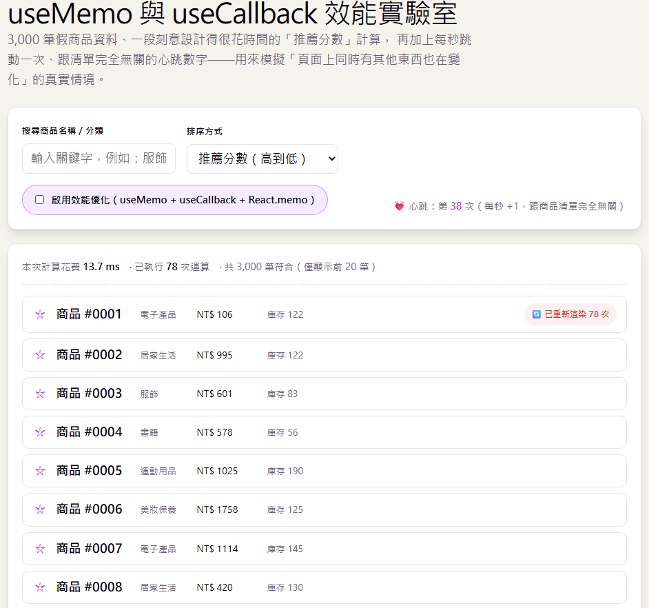

# Day 15｜`useMemo` 與 `useCallback`

- 今日範例程式碼：[`Day15\examples\day15-memo-callback-lab`](https://github.com/ShaoYuKao/2026-ithome-ironman-react-v19-30days/tree/master/Day15/examples/day15-memo-callback-lab)

## 一、為什麼會需要 `useMemo` / `useCallback`：先搞懂「重新渲染」這件事

### 1. React 的預設行為：父層重新渲染，子層預設全部跟著渲染

在深入 API 之前，必須先建立一個關鍵觀念：**只要一個元件重新渲染，React 預設會把它底下所有的子元件都重新渲染一次**，即使那個子元件收到的 props 內容根本沒有改變。

```jsx
function Parent() {
  const [count, setCount] = useState(0)

  return (
    <div>
      <button onClick={() => setCount(count + 1)}>目前計數：{count}</button>
      {/* 即使 ExpensiveChild 沒有拿到任何跟 count 有關的 props，
          每次點擊按鈕，ExpensiveChild 依然會被重新渲染一次 */}
      <ExpensiveChild />
    </div>
  )
}
```

這是 React 刻意選擇的預設行為，而不是 Bug；React 認為「重新執行一次元件函式、比對前後兩次渲染結果」的成本，在絕大多數情況下都低到可以忽略，所以**預設選擇最簡單、最不容易出錯的做法——重新渲染整棵子樹**，而不是要求開發者每次都手動判斷「這個子元件到底要不要更新」。

但「絕大多數情況下成本低到可以忽略」不代表「所有情況都可以忽略」。如果：

- 子元件底下有**成千上萬筆資料要渲染**（例如今天範例的 3,000 筆商品清單）。
- 元件內部有一段**計算量很大**的邏輯（例如排序、篩選、統計一份龐大的資料）。
- 這個重新渲染**頻繁發生**（例如每秒觸發一次的計時器、使用者快速輸入時的每一個按鍵）。

……這時候「重新渲染的成本」就會變得看得見、感覺得到——畫面卡頓、輸入延遲、風扇狂轉。`useMemo`、`useCallback`、`React.memo` 這三個工具，就是 React 提供給開發者「在真的需要的時候，手動告訴 React：這裡可以跳過」的機制。

### 2. 「渲染」不等於「更新畫面上的 DOM」，但仍然有成本

先釐清一個常見的誤解：元件重新渲染，**不代表瀏覽器畫面上的 DOM 一定會跟著改變**。React 的整體流程大致分成兩個階段：

1. **Render Phase（渲染階段）**：重新執行元件函式本身，計算出「這次應該長什麼樣子」的結果（一份新的 React 元素樹）。
2. **Commit Phase（提交階段）**：React 拿新的結果跟上一次的結果做 Diff（比對），只有真的不一樣的地方，才會實際去操作瀏覽器的 DOM。

也就是說，就算 `ExpensiveChild` 因為父層重新渲染而被迫「重新執行一次」，只要它最後產生出來的 JSX 內容跟上次一模一樣，瀏覽器的 DOM 其實不會有任何變動。**但問題在於：「重新執行元件函式本身」這件事，永遠都要付出成本**——如果函式裡面剛好有一段昂貴的計算（像今天範例裡的排序邏輯），這段計算「本身」就會被重複執行一次，跟最後 DOM 有沒有變動完全無關。這正是今天要優化的目標：**避免不必要的「重新執行」，而不只是避免不必要的「DOM 更新」**。

### 3. Referential Equality（參照相等）：今天所有優化技巧的地基

React（以及今天要學的三個 Hook）判斷「東西是否改變了」的方式，幾乎都是用 JavaScript 的 `===`（或等價的 `Object.is`）做比較，而不是去比較物件內容。這帶來一個對初學者來說很反直覺的結果：

```js
const a = { name: '小明' }
const b = { name: '小明' }

console.log(a === b) // false！即使兩個物件內容一模一樣，也是「不同的物件」
console.log(a === a) // true，只有「同一個」物件參照（Reference），才會是 true
```

函式也是一樣的道理：

```jsx
function Parent() {
  // 每次 Parent 重新渲染，這裡都會建立一個「全新的」箭頭函式，
  // 即使程式碼寫起來一模一樣，它跟上次那一個函式，在記憶體裡是兩個不同的東西。
  function handleClick() {
    console.log('clicked')
  }

  return <Child onClick={handleClick} />
}
```

這件事之所以重要，是因為：

- `React.memo` 判斷「子元件是否可以跳過重新渲染」，用的正是「新的 props 物件裡每一個屬性，是否都跟上一次的 `===` 相等」（Shallow Compare）。
- `useEffect`、`useMemo`、`useCallback` 的**依賴陣列**，判斷「依賴項是否改變」，用的也是同一套 `===` 比較。

所以，如果一個函式或物件**每次渲染都被重新建立**，即使邏輯上「根本沒有變」，只要它被傳給 `React.memo` 元件當 props、或被放進某個依賴陣列，**永遠都會被判定成「變了」**。`useMemo` 與 `useCallback` 存在的目的，正是讓你可以「手動保留住上一次的參照（Reference）」，讓這些比較在邏輯上真的沒變的時候，也能得到 `true` 的結果。

## 二、`useMemo`：快取「計算結果」

### 1. 基本語法

```js
const cached = useMemo(() => computeExpensiveValue(a, b), [a, b]);
```

> 快取一段計算的結果，只有在依賴項改變時才重新計算，避免每次渲染都重複執行昂貴運算。

拆解這個語法：

- 第一個參數是一個**沒有參數的函式**（習慣上稱為 create function 或工廠函式），React 只會在**必要的時候**才呼叫它、拿到回傳值。
- 第二個參數是**依賴陣列**，寫法、規則都跟 Day08 學過的 `useEffect` 一模一樣：陣列裡任何一個值，跟上一次渲染時的值用 `Object.is` 比較起來不同，`useMemo` 才會重新呼叫第一個參數的函式，計算出新的值；否則直接回傳「上一次快取住的值」，**完全不會呼叫**第一個參數的函式。

```jsx
function ProductBoard({ products, keyword, sortKey }) {
  // 只有 products、keyword、sortKey 這三個依賴項「其中之一」改變時，
  // 才會重新呼叫 filterAndSortProducts；其餘原因造成的重新渲染，
  // 都會直接拿到上一次算好的 { list, duration }，不會重新執行這段昂貴計算。
  const { list, duration } = useMemo(
    () => filterAndSortProducts(products, keyword, sortKey),
    [products, keyword, sortKey],
  )

  // ...
}
```

### 2. 什麼時候該用 `useMemo`？

`useMemo` 主要解決兩類問題，今天的範例剛好各示範一種：

1. **快取「計算量真的很大」的結果**：像是排序、篩選數千筆資料，或是任何一段執行時間明顯（幾十毫秒以上）的運算。這是最常被提到的用法，也是今天範例的第一個示範（`filterAndSortProducts`）。
2. **維持「物件 / 陣列」的參照（Reference）穩定**：即使計算本身很便宜（例如只是 `array.slice(0, 20)`），只要這個回傳值會被當成 props 傳給一個用 `React.memo` 包過的子元件、或放進另一個 Hook 的依賴陣列，用 `useMemo` 包住它，可以避免每次渲染都產生一個「內容相同、但參照（Reference）不同」的新陣列，讓後面的 Shallow Compare 白白判定失敗。今天範例中 `pageItems = useMemo(() => list.slice(0, PAGE_SIZE), [list])` 就是這個用法。

### 3. 依賴陣列的規則跟 `useEffect` 一樣

`useMemo` 的依賴陣列判斷邏輯，完全比照 Day08 學過的 `useEffect`：陣列裡應該列出「這段計算過程中，讀取到的每一個、會隨渲染改變的外部變數」。少列了依賴，會導致快取住「過期的值」（Stale Value）；多列了不必要的依賴，則會讓快取形同虛設，起不了優化效果。

> ⚠️ **重要觀念**：`useMemo` 是效能優化工具，**不是語意保證**。React 官方文件明確提醒：未來版本可能因為記憶體考量等原因，選擇「丟棄」某個已經快取住的值，並在下一次渲染時重新計算——即使依賴項根本沒有改變。也就是說，你可以依賴 `useMemo` 讓 App **跑得更快**，但不能依賴它讓某段程式碼**只執行一次**（如果需要「只執行一次」這種語意保證，應該用 `useRef` 或 `useEffect`，而不是 `useMemo`）。

## 三、`useCallback`：快取「函式參照（Function Reference）」

### 1. 基本語法：讓函式在重新渲染之間保持穩定

`useCallback` 的基本語法如下：

```jsx
const cachedFn = useCallback(() => {
  // 要執行的程式碼
}, [dependencies])
```

可以先把 `useCallback` 記成一句話：**`useCallback` 不是快取函式的執行結果，而是保留「函式本身」。**

這點和前面的 `useMemo` 很不一樣：

```jsx
const result = useMemo(() => expensiveCalculation(), [])
```

`useMemo` 快取的是：`計算後的結果`

而：

```jsx
const handleClick = useCallback(() => {
  console.log('clicked')
}, [])
```

`useCallback` 快取的是：`函式本身`

可以用下面這張簡單的對照來記：

| Hook          | 快取什麼？                     |
|---------------|--------------------------------|
| `useMemo`     | 計算結果                       |
| `useCallback` | 函式參照（Function Reference） |

#### 為什麼函式需要被快取？

先看一個沒有使用 `useCallback` 的例子：

```jsx
function Parent() {
  const [count, setCount] = useState(0)

  function handleClick() {
    console.log('clicked')
  }

  return (
    <>
      <button onClick={() => setCount(count + 1)}>
        count：{count}
      </button>

      <Child onClick={handleClick} />
    </>
  )
}
```

表面上看起來：

```jsx
function handleClick() {
  console.log('clicked')
}
```

每次內容都完全一樣。

但是只要 `Parent` 重新渲染，這個函式就會被**重新建立一次**。

可以把它想像成：

```text
第一次渲染
handleClick => 函式 A

count 改變

第二次渲染
handleClick => 函式 B

count 再改變

第三次渲染
handleClick => 函式 C
```

雖然 A、B、C 裡面的程式碼完全相同，但是對 JavaScript 來說，它們仍然是不同的函式。

例如：

```jsx
const fn1 = () => console.log('hello')
const fn2 = () => console.log('hello')

console.log(fn1 === fn2) // false
```

原因很簡單：

```text
fn1 => 函式 A
fn2 => 函式 B
```

兩個函式的內容雖然一樣，但並不是「同一個函式」。

前面已經學過，物件（Object）、陣列（Array）、函式（Function）都是參照型別（Reference Type）；即使內容看起來一樣，只要是重新建立出來的，就會是不同的參照。

#### 加上 `useCallback` 之後

改成：

```jsx
function Parent() {
  const [count, setCount] = useState(0)

  const handleClick = useCallback(() => {
    console.log('clicked')
  }, [])

  return (
    <>
      <button onClick={() => setCount(count + 1)}>
        count：{count}
      </button>

      <Child onClick={handleClick} />
    </>
  )
}
```

因為依賴陣列是：`[]`。所以在一般重新渲染的情況下，React 可以繼續提供先前保存的函式參照（Function Reference）。

概念上可以想成：

```text
第一次渲染
handleClick => 函式 A

count 改變
     ↓
第二次渲染
handleClick => 函式 A

count 再改變
     ↓
第三次渲染
handleClick => 函式 A
```

因此：

```text
沒有 useCallback

第 1 次 render => 函式 A
第 2 次 render => 函式 B
第 3 次 render => 函式 C
```

而：

```text
使用 useCallback

第 1 次 render => 函式 A
第 2 次 render => 函式 A
第 3 次 render => 函式 A
```

這就是所謂的：**維持函式參照穩定。**

#### `useCallback` 的依賴陣列

`useCallback` 的第二個參數也是依賴陣列：

```jsx
useCallback(callback, dependencies)
```

例如：

```jsx
const handleSearch = useCallback(() => {
  console.log(keyword)
}, [keyword])
```

這裡的意思是：

```text
keyword 沒有改變 => 繼續使用原本的 handleSearch 函式參照（Function Reference）

keyword 改變 => 建立新的 handleSearch 函式
```

可以想成：

```text
keyword = "React"
     │
     ▼
handleSearch => 函式 A

其他 state 改變
     │
     ▼
handleSearch => 函式 A
                ↑
            繼續沿用

keyword = "Vue"
     │
     ▼
handleSearch => 函式 B
                ↑
            依賴改變
```

所以 `useCallback` 並不是保證「這個函式永遠不變」。而是**只要依賴項沒有改變，就盡量維持同一個函式參照（Function Reference）；依賴改變時，再提供新的函式。**

#### `useCallback` 和 `useMemo` 到底有什麼關係？

初學階段不用研究 React 內部原始碼，只需要記住：`useMemo` 是在說：「幫我記住這次算出來的結果。」

例如：

```jsx
const total = useMemo(() => {
  return calculateTotal(products)
}, [products])
```

快取的是：`total 的計算結果`。而 `useCallback` 是在說：「幫我記住這個函式。」

例如：

```jsx
const handleClick = useCallback(() => {
  console.log('clicked')
}, [])
```

快取的是：`handleClick 這個函式的參照`。因此在概念上，可以把：

```jsx
useCallback(fn, deps)
```

理解成類似：

```jsx
useMemo(() => fn, deps)
```

也就是：

```text
useMemo
└─ 可以保存各種「值」
   ├─ 數字
   ├─ 字串
   ├─ 物件
   ├─ 陣列
   └─ 函式

useCallback
└─ 專門用來保存「函式」
```

所以 `useCallback` 可以看成是專門針對「函式參照（Function Reference）」這個常見需求所提供的 Hook。

不過實際開發時：

```jsx
// ✅ 函式
const handleClick = useCallback(() => {
  // ...
}, [])
```

直接使用 `useCallback` 即可，不需要刻意改寫成：

```jsx
// ❌ 沒必要這樣寫
const handleClick = useMemo(() => {
  return () => {
    // ...
  }
}, [])
```

前者的意圖會清楚很多。

#### 初學者先記這三件事就好

```text
  元件重新渲染
      ↓
  一般函式可能重新建立

  useCallback
      ↓
  讓函式參照在依賴不變時保持穩定

  為什麼需要穩定？
      ↓
  因為之後搭配 React.memo 時，
  可以避免子元件因為收到「新的函式 prop」
  而產生不必要的重新渲染
```

下一節再進一步看看：**為什麼 `useCallback` 通常要和 `React.memo` 搭配使用？**

### 2. 為什麼要快取函式？—— 沒有 `React.memo` 搭配，`useCallback` 通常沒有意義

單獨使用 `useCallback`，如果這個函式沒有被傳給任何用 `React.memo` 包過的子元件、也沒有被放進其他 Hook 的依賴陣列，其實**幾乎不會帶來任何效能上的好處**，還會多一次 Hook 呼叫與依賴比較的成本。

```jsx
// ❌ 沒有意義的用法：這個函式只在自己元件內部使用，沒有傳給任何子元件、
// 也沒有放進任何依賴陣列，用不用 useCallback 完全不影響效能。
const handleClick = useCallback(() => {
  console.log('clicked')
}, [])
```

```jsx
// ✅ 有意義的用法：handleToggleSelect 被傳給了用 React.memo 包過的 MemoProductRow，
// 如果沒有 useCallback，每次 OptimizedProductBoard 重新渲染，
// handleToggleSelect 都會是一個新的函式參照，MemoProductRow 的 Shallow Compare
// 永遠會判定「onToggleSelect 這個 prop 變了」，於是 React.memo 完全發揮不了作用。
const handleToggleSelect = useCallback((id) => {
  setSelectedIds((prev) => {
    const next = new Set(prev)
    next.has(id) ? next.delete(id) : next.add(id)
    return next
  })
}, [])
```

這也是為什麼本節標題會強調「`useCallback` 常搭配 `React.memo` 使用」——這兩者幾乎是綁在一起討論的組合技，下一節就來介紹 `React.memo`。

## 四、`React.memo`：讓子元件「有資格」跳過重新渲染

前面已經知道 React 有一個重要的預設行為：

> **父元件重新渲染時，底下的子元件預設也會跟著重新渲染。**

先看一個簡單的範例：

```jsx
function ProductRow({ name }) {
  console.log(`ProductRow 重新渲染：${name}`)

  return <li>{name}</li>
}

function App() {
  const [count, setCount] = useState(0)

  return (
    <>
      <button onClick={() => setCount((prev) => prev + 1)}>
        count：{count}
      </button>

      <ProductRow name="React 入門" />
    </>
  )
}
```

畫面上有兩個部分：

```text
App
├─ count 按鈕
└─ ProductRow
   └─ React 入門
```

注意：

```jsx
<ProductRow name="React 入門" />
```

傳給 `ProductRow` 的 `name` 從頭到尾都沒有改變。

但是每次點擊：

```text
count：0
count：1
count：2
count：3
```

`App` 都會重新渲染。而因為 `ProductRow` 是 `App` 的子元件，所以它預設也會跟著重新渲染：

```text
App 重新渲染
      ↓
ProductRow 也重新渲染
```

即使：

```jsx
name="React 入門"
```

完全沒有改變。這不一定是問題。如果 `ProductRow` 很簡單，重新執行一次幾乎沒有什麼成本。但假設這是一個商品清單：

```text
ProductBoard
├─ ProductRow
├─ ProductRow
├─ ProductRow
├─ ProductRow
├─ ProductRow
├─ ...
└─ ProductRow × 3000
```

如果父元件因為某個完全不相關的 state 改變，而讓 3,000 個 `ProductRow` 全部重新渲染，就可能產生不必要的效能成本。

這時候就可以考慮使用 `React.memo`。

### 1. 使用 `React.memo`

React 提供 `memo()`：

```jsx
import { memo } from 'react'
```

可以把原本的元件：

```jsx
function ProductRow({ name }) {
  console.log(`ProductRow 重新渲染：${name}`)

  return <li>{name}</li>
}
```

包起來：

```jsx
const MemoProductRow = memo(ProductRow)
```

完整寫法：

```jsx
import { memo, useState } from 'react'

function ProductRow({ name }) {
  console.log(`ProductRow 重新渲染：${name}`)

  return <li>{name}</li>
}

const MemoProductRow = memo(ProductRow)

function App() {
  const [count, setCount] = useState(0)

  return (
    <>
      <button onClick={() => setCount((prev) => prev + 1)}>
        count：{count}
      </button>

      <MemoProductRow name="React 入門" />
    </>
  )
}
```

這時候可以把 `memo()` 想成在 `ProductRow` 前面多加了一個「檢查關卡」。

原本：

```text
App 重新渲染
      ↓
ProductRow 重新渲染
```

使用 `memo()`：

```text
App 重新渲染
      ↓
檢查 ProductRow 的 props
      ↓
props 有改變嗎？
   ↙        ↘
 有          沒有
 ↓            ↓
重新渲染     跳過重新渲染
```

所以：

```jsx
const MemoProductRow = memo(ProductRow)
```

可以先把它理解成：**如果父元件重新渲染，但是這個子元件收到的 props 沒有改變，就可以跳過這次不必要的重新渲染。** 這就是 `React.memo` 最核心的用途。


### 2. `memo` 不是讓元件「永遠不重新渲染」

這是一個很重要的觀念。

`memo()` 並不是：

```text
加上 memo
    ↓
這個元件以後都不會重新渲染
```

而是：

```text
父元件重新渲染
      ↓
先看看 props 有沒有改變
      ↓
沒有改變 → 可以跳過
有改變   → 正常重新渲染
```

例如：

```jsx
function App() {
  const [count, setCount] = useState(0)
  const [productName, setProductName] = useState('React 入門')

  return (
    <>
      <button onClick={() => setCount((prev) => prev + 1)}>
        count：{count}
      </button>

      <button onClick={() => setProductName('React 進階')}>
        修改商品名稱
      </button>

      <MemoProductRow name={productName} />
    </>
  )
}
```

如果只是修改：

```text
count：0
   ↓
count：1
```

`ProductRow` 收到的：

```jsx
name="React 入門"
```

沒有改變，因此可以跳過重新渲染。

但是如果：

```text
React 入門
   ↓
React 進階
```

傳給子元件的 `name` 已經改變：

```jsx
name="React 入門"
```

變成：

```jsx
name="React 進階"
```

這時候 `ProductRow` 當然還是必須重新渲染，否則畫面就不會更新。

因此可以記成：

```text
React.memo
     │
     ▼
父層重新渲染
     │
     ▼
props 有沒有改變？
   ┌─┴─┐
   │   │
 沒有  有
   │   │
   ▼   ▼
 跳過 重新渲染
```


### 3. 那 React 怎麼知道 props 有沒有改變？

假設：

```jsx
<MemoProductRow
  product={product}
  isSelected={false}
  onToggleSelect={handleToggleSelect}
/>
```

`React.memo` 會檢查這些 props：

```text
product
isSelected
onToggleSelect
```

是不是跟上一次一樣。

可以先簡單理解成：

```text
上一次 props
      ↓
     比較
      ↑
這一次 props
```

例如：

```text
上一次：
name = "React 入門"

這一次：
name = "React 入門"

→ 一樣
→ 可以跳過重新渲染
```

而：

```text
上一次：
name = "React 入門"

這一次：
name = "React 進階"

→ 不一樣
→ 必須重新渲染
```

這就是 `React.memo` 的基本判斷方式。

### 4. Shallow Compare：`memo` 只比較 props 的第一層

這裡才需要帶入前面學過的「參照（Reference）相等」。

假設子元件收到：

```jsx
<MemoProductRow
  product={product}
  isSelected={false}
  onToggleSelect={handleToggleSelect}
/>
```

React 大致會分別檢查：

```text
product
isSelected
onToggleSelect
```

也就是：

```text
product
新的和舊的是同一個物件嗎？

isSelected
新的值和舊的值一樣嗎？

onToggleSelect
新的和舊的是同一個函式嗎？
```

只要其中一個不同：

```text
product          一樣
isSelected       一樣
onToggleSelect   不一樣 ❌
```

整個 props 就會被視為「有變化」：

```text
props 有改變
    ↓
ProductRow 重新渲染
```

這種只檢查 props **最外面這一層**的比較方式，就稱為：

> **Shallow Compare（淺層比較）**

目前教材所描述的核心規則也是如此：`React.memo` 預設會逐一比較 props 最外層屬性，只要任一 prop 不同，就不能跳過重新渲染。

### 5. 為什麼 `React.memo` 常常會和 `useCallback` 一起出現？

現在就能把上一節的 `useCallback` 串起來了。

假設：

```jsx
function App() {
  const [count, setCount] = useState(0)

  function handleToggleSelect(id) {
    console.log(id)
  }

  return (
    <>
      <button onClick={() => setCount((prev) => prev + 1)}>
        count：{count}
      </button>

      <MemoProductRow
        name="React 入門"
        onToggleSelect={handleToggleSelect}
      />
    </>
  )
}
```

雖然：

```jsx
name="React 入門"
```

沒有改變，但是：

```jsx
function handleToggleSelect(id) {
  console.log(id)
}
```

會在 `App` 每次重新渲染時重新建立。

概念上：

```text
第一次渲染

handleToggleSelect
      ↓
    函式 A
```

下一次：

```text
第二次渲染

handleToggleSelect
      ↓
    函式 B
```

所以 `React.memo` 比較：

```text
上一次 onToggleSelect → 函式 A
這一次 onToggleSelect → 函式 B
```

結果：

```text
A !== B
```

因此：

```text
props 改變
    ↓
React.memo 無法跳過
    ↓
ProductRow 重新渲染
```

這就是為什麼上一節會介紹 `useCallback`。

改成：

```jsx
const handleToggleSelect = useCallback((id) => {
  console.log(id)
}, [])
```

只要依賴沒有改變：

```text
第一次 render → 函式 A

第二次 render → 函式 A

第三次 render → 函式 A
```

`React.memo` 才有機會判斷：

```text
name             一樣 ✅
onToggleSelect   一樣 ✅

全部 props 都一樣
        ↓
跳過 ProductRow 的重新渲染
```

因此可以把兩者的關係記成：

```text
useCallback
     ↓
讓函式 prop 保持穩定
     ↓
React.memo 才能判斷 props 沒有改變
     ↓
跳過不必要的子元件重新渲染
```

這也正好呼應教材前一節的結論：如果函式會傳給 `React.memo` 包裝過的子元件，`useCallback` 才特別有意義。

### 6. `useMemo` 也是同樣的道理

如果傳的是物件或陣列，也會遇到類似問題。

例如：

```jsx
const visibleProducts = products.slice(0, 20)

return (
  <MemoProductList products={visibleProducts} />
)
```

每次父元件重新渲染：

```jsx
products.slice(0, 20)
```

都會建立一個新的陣列。

即使陣列裡面的商品完全相同：

```text
第一次 render
visibleProducts → 陣列 A

第二次 render
visibleProducts → 陣列 B
```

對 `React.memo` 來說：

```text
陣列 A !== 陣列 B
```

所以還是會重新渲染。

這時候可以使用：

```jsx
const visibleProducts = useMemo(
  () => products.slice(0, 20),
  [products],
)
```

讓 `products` 沒改變時：

```text
第一次 render → 陣列 A
第二次 render → 陣列 A
第三次 render → 陣列 A
```

因此：

```text
useMemo
   ↓
維持物件／陣列 prop 穩定

useCallback
   ↓
維持函式 prop 穩定

React.memo
   ↓
props 都沒變時
跳過子元件重新渲染
```

### 7. 初學者先記住這張關係圖

可以把今天三個工具理解成各自負責一件事情：

```text
                  父元件重新渲染
                        │
          ┌─────────────┼─────────────┐
          │             │             │
          ▼             ▼             ▼
      useMemo      useCallback    React.memo
          │             │             │
          ▼             ▼             ▼
      記住計算結果    記住函式       保護子元件
      /物件/陣列       參照          不要白白重畫
          │             │             │
          └─────────────┴──────┬──────┘
                               ▼
                    避免不必要的工作
```

一句話記憶：

```text
useMemo     => 記住「值」

useCallback => 記住「函式」

React.memo  => props 沒變時，
              讓「子元件」可以不用重新渲染
```

其中 `React.memo` 最重要的一句就是：**父元件重新渲染，不代表這個子元件每次都一定要重新渲染；如果 props 沒有改變，`React.memo` 可以讓 React 跳過這次子元件的重新渲染。**

### 8. 什麼時候才需要 `React.memo`？

也不要因此看到子元件就全部：

```jsx
memo(...)
```

例如：

```jsx
function Greeting({ name }) {
  return <p>Hello {name}</p>
}
```

這種很簡單的元件，即使重新渲染一次，成本通常非常低。

比較值得考慮 `React.memo` 的情況是：

```text
大量重複的子元件
例如：
3000 個 ProductRow

        或

子元件本身渲染成本比較高

        或

父元件會非常頻繁重新渲染

        或

實際透過 Profiler 發現這裡存在效能問題
```

所以不要把：

```text
React.memo = React 元件標準寫法
```

而應該理解成：

```text
React.memo = 效能優化工具
```

**先把程式寫對、寫清楚；真的遇到不必要的重新渲染，再使用 `memo`、`useMemo`、`useCallback` 做針對性的優化。**

## 五、三者合體：一個完整的優化流程長什麼樣子

把前面三節串起來，一個「值得優化」的清單渲染情境，通常會同時具備這三塊拼圖：

| 拼圖 | 負責的事 | 缺少會怎樣 |
| --- | --- | --- |
| `useMemo`（包住昂貴計算） | 避免「不相關的重新渲染」也觸發一次昂貴的排序／篩選運算 | 每次父層重新渲染（哪怕只是心跳計時器跳動），都重新算一次排序，浪費 CPU |
| `useCallback`（包住傳給子元件的函式） | 讓傳給子元件的函式 props 維持參照穩定 | 就算子元件有包 `React.memo`，也會因為「函式 prop 每次都是新的」而被迫重新渲染 |
| `React.memo`（包住子元件本身） | 讓子元件「有資格」在 props 沒變時跳過重新渲染 | 就算父層已經用 `useMemo`/`useCallback` 維持好參照穩定，子元件沒包 `memo` 的話，父層一重新渲染，子元件還是會無條件跟著重新渲染 |

**在今天這個「商品清單」情境下，三者缺一不可**：只包 `React.memo` 卻沒用 `useCallback`/`useMemo` 維持 props 參照穩定，`memo` 形同虛設；只用 `useMemo`/`useCallback` 卻沒把子元件包上 `React.memo`，子元件依然會無條件跟著父層重新渲染，白白浪費了維持參照穩定的心力。

> ⚠️ 但這不代表「三者必須永遠一起用」是通用規則。`useMemo`、`useCallback`、`React.memo` 其實是解決三種不同問題的工具：`useMemo` 負責快取昂貴的計算結果、`useCallback` 負責讓函式參照保持穩定、`React.memo` 負責讓元件在 props 沒變時跳過重新渲染。實務上很多情境只需要其中一到兩個——例如子元件渲染成本很低、根本不值得包 `React.memo`；或是沒有把函式當 props 傳給子元件，自然也用不到 `useCallback`。今天的範例剛好同時具備前面表格列出的三個問題，才會三者都要用上；並不是「用了 `React.memo` 就一定要同時加 `useMemo` 和 `useCallback`」，濫用反而會增加不必要的複雜度與記憶體開銷。

下一節的範例，會讓你直接看到「只做一部分」跟「三個都做」的差異。

## 六、今日範例



### 1. 這個範例想驗證的核心問題

打開範例會看到一個商品清單頁面，上方有搜尋框、排序下拉選單、一個「啟用效能優化」的開關，還有一個**每秒跳動一次的「心跳」數字**。這個心跳數字**跟商品清單完全無關**，純粹是刻意加進來、用來模擬「頁面上同時有其他狀態在變化」的真實情境（想像成即時時鐘、未讀通知數字、WebSocket 推播訊息……）。

整個範例想驗證的問題只有一個：**當這個「無關的心跳」讓整個頁面重新渲染時，商品清單那段昂貴的排序計算、跟清單裡的每一列，會不會被無謂地重新執行？**

- 沒有開啟優化：**會**，而且是每秒一次。
- 開啟優化：**不會**，心跳只會讓「心跳數字」本身更新，商品清單完全不受影響。

### 2. 資料與昂貴計算：

```js
// src/utils/generateProducts.js —— 產生 3,000 筆假商品資料
export function generateProducts(count) {
  const products = []
  for (let i = 0; i < count; i++) {
    products.push({
      id: i + 1,
      name: `商品 #${String(i + 1).padStart(4, '0')}`,
      category: CATEGORIES[i % CATEGORIES.length],
      price: Math.round((50 + Math.random() * 2000) * 100) / 100,
      stock: Math.floor(Math.random() * 200),
    })
  }
  return products
}
```

```js
// src/utils/filterAndSortProducts.js —— 刻意設計得「很花時間」的排序邏輯
const SLOW_LOOP_ITERATIONS = 600

function computeScore(product) {
  // 這段迴圈本身沒有任何商業意義，純粹是刻意寫一段沒辦法被瀏覽器「一瞬間跳過」的
  // 運算，模擬真實情境中「排序前，要先幫每一筆資料算出一個複雜分數（推薦分數、
  // 相似度分數……）」的昂貴計算，讓後面「有沒有快取」的差異變得感覺得到。
  let score = product.price + product.stock
  for (let i = 0; i < SLOW_LOOP_ITERATIONS; i++) {
    score = Math.sqrt(score * 1.000001 + (i % 7))
  }
  return score
}

export function filterAndSortProducts(products, keyword, sortKey) {
  const start = performance.now()
  // ...依 keyword 篩選、對每一筆呼叫 computeScore 算分數、依 sortKey 排序
  const duration = performance.now() - start
  return { list: scored, duration }
}
```

在一般筆電上，這段計算跑一次大約需要 15～50 毫秒——單獨看一次不會有感覺，但如果**每秒都重新跑一次**（心跳造成的無謂重新渲染），累積起來就會是持續消耗效能、拖慢其他互動的元凶。函式回傳值裡的 `duration`，會直接顯示在畫面上，讓你不用打開 DevTools 也能看到「這次計算花了多久」。

### 3. 兩個版本的商品列

```jsx
// src/components/ProductRow.jsx
import { memo, useRef } from 'react'

function ProductRow({ product, isSelected, onToggleSelect, showRenderBadge }) {
  // 複習 Day10「useRef 記錄 render 次數」的手法：
  // renderCountRef.current 在渲染期間直接遞增、直接讀取，更新它本身不會多觸發一次渲染。
  const renderCountRef = useRef(0)
  renderCountRef.current += 1

  return (
    <li className={isSelected ? 'product-row product-row--selected' : 'product-row'}>
      <button type="button" onClick={() => onToggleSelect(product.id)}>
        {isSelected ? '★' : '☆'}
      </button>
      <span>{product.name}</span>
      <span>{product.category}</span>
      <span>NT$ {product.price.toFixed(0)}</span>
      <span>庫存 {product.stock}</span>
      {showRenderBadge && <span className="render-badge">🔄 已重新渲染 {renderCountRef.current} 次</span>}
    </li>
  )
}

// 同一份 JSX、同一份邏輯，唯一差異只有「有沒有包 memo」
const MemoProductRow = memo(ProductRow)

export { ProductRow, MemoProductRow }
```

`showRenderBadge` 只會由父層傳給「排序後的第一列」，把 Day10 學過的「用 `useRef` 記錄 render 次數」直接畫在畫面上，變成貫穿整個範例最重要的觀察指標——不需要另外打開任何工具，光看這個數字有沒有持續增加，就能知道這一列「是不是被無謂地重新渲染了」。

### 4. 兩塊「Board」：只有三行程式碼不一樣

`UnoptimizedProductBoard.jsx` 與 `OptimizedProductBoard.jsx` 這兩個檔案，JSX 結構完全相同，刻意只留下三個差異，方便直接對照：

```jsx
// ❌ UnoptimizedProductBoard.jsx —— 沒有快取
const { list, duration } = filterAndSortProducts(products, keyword, sortKey)   // ① 每次渲染都重新計算

function handleToggleSelect(id) { /* ... */ }                                  // ② 每次渲染都是新函式

<ProductRow key={product.id} /* ... */ onToggleSelect={handleToggleSelect} />   // ③ 沒包 memo
```

```jsx
// ✅ OptimizedProductBoard.jsx —— 加上三層快取
const { list, duration } = useMemo(
  () => filterAndSortProducts(products, keyword, sortKey),
  [products, keyword, sortKey],
)                                                                               // ① useMemo 快取計算結果

const handleToggleSelect = useCallback((id) => { /* ... */ }, [])               // ② useCallback 快取函式參照

<MemoProductRow key={product.id} /* ... */ onToggleSelect={handleToggleSelect} /> // ③ 用 memo 包過的元件
```

兩個檔案都各自用 `useRef` 記錄「這個 Board 到底執行過幾次昂貴計算」（`computeCountRef`），並顯示在畫面最上方的 `board-meta` 文字裡，跟 `duration`（單次計算耗時）放在一起，讓「花了多久」跟「總共執行了幾次」這兩個數字同時呈現。

### 5. 心跳與整體組裝

```jsx
// src/components/MemoCallbackLab.jsx
function MemoCallbackLab() {
  const [products] = useState(() => generateProducts(PRODUCT_COUNT)) // 惰性初始化，只產生一次假資料（複習 Day04、Day12）
  const [keyword, setKeyword] = useState('')
  const [sortKey, setSortKey] = useState(SORT_OPTIONS[0].value)
  const [optimized, setOptimized] = useState(false)

  const [heartbeat, setHeartbeat] = useState(0)
  useEffect(() => {
    const timerId = setInterval(() => setHeartbeat((prev) => prev + 1), 1000) // 複習 Day08：setInterval + cleanup
    return () => clearInterval(timerId)
  }, [])

  // 用同一個變數名稱指向不同元件，透過切換 optimized 決定要掛載哪一個版本
  const Board = optimized ? OptimizedProductBoard : UnoptimizedProductBoard

  return (
    <div className="lab-page">
      {/* ...搜尋框、排序選單、優化開關、心跳顯示... */}
      <Board products={products} keyword={keyword} sortKey={sortKey} />
    </div>
  )
}
```

每秒觸發一次的 `heartbeat` state，會讓整個 `MemoCallbackLab`（以及底下不管是哪一種 `Board`）重新渲染一次——這正是用來驗證優化是否生效的「無關更新」來源。切換「啟用效能優化」開關時，因為 `Board` 指向的元件類型改變了（從 `UnoptimizedProductBoard` 換成 `OptimizedProductBoard`），React 會直接卸載舊的、掛載新的，兩邊的 `selectedIds`、`computeCountRef` 都會重新歸零，方便每次切換都能重新公平比較。

### 6. 實測結果：親自驗證過的真實數字

下面這組數字，是在 `npm run dev` 啟動的開發伺服器上，用瀏覽器自動化工具實際操作、量測到的真實結果（開發模式下因為 `<StrictMode>` 會讓渲染與 `useMemo` 工廠函式多執行一次，數字會比正式環境略高，但「趨勢」完全一致）：

| 情境 | 初始「已執行 N 次運算」 | 3 秒（3 次心跳）之後 |
| --- | --- | --- |
| **未優化**（`optimized = false`） | 4 | **10**（持續增加，每次心跳都 +2） |
| **優化後**（`optimized = true`） | 2 | **2**（完全沒有增加） |

切換成優化模式後，在搜尋框輸入關鍵字（真正會影響結果的操作），「已執行次數」才會如預期地往上跳；點擊清單第一列的收藏按鈕（★／☆），也只有那一列自己的「已重新渲染 N 次」數字會增加，其他列完全不受影響。這組數字具體驗證了第五節的結論：**心跳這種「無關的重新渲染」，優化後完全不會觸發昂貴計算或子元件重新渲染；只有真正相關的操作，才會讓對應的部分重新計算/重新渲染。**

## 七、用 React DevTools Profiler 實際觀察渲染次數

畫面上的數字是最直接的證據，但正式的效能分析工具能提供更完整的視角。跟著以下步驟，在瀏覽器裡實際操作一次：

1. 安裝瀏覽器擴充功能 **React Developer Tools**（Chrome / Edge 的擴充功能商店搜尋「React Developer Tools」）。
    - [安裝**Chrome 瀏覽器**](https://chrome.google.com/webstore/detail/react-developer-tools/fmkadmapgofadopljbjfkapdkoienihi?hl=en)
    - [安裝**Firefox 版**](https://addons.mozilla.org/en-US/firefox/addon/react-devtools/)
    - [安裝**Edge 版**](https://microsoftedge.microsoft.com/addons/detail/react-developer-tools/gpphkfbcpidddadnkolkpfckpihlkkil)
2. 執行 `npm run dev` 開啟範例頁面，打開瀏覽器 DevTools，切到多出來的 **Profiler** 分頁。
3. 點擊左上角的錄製（record）圓形按鈕開始記錄，什麼都不做，靜靜等待 3～5 秒（讓心跳觸發幾次），再點擊停止。
4. 確保「啟用效能優化」目前是**關閉**的狀態，觀察下方的**火焰圖（Flame Graph）**：時間軸上每一秒都會出現一次渲染紀錄，展開後可以看到 `UnoptimizedProductBoard` 與底下每一個 `ProductRow` 都出現在裡面——代表它們全部都重新渲染了。
5. 勾選 Profiler 設定裡的「**Record why each component rendered**」（記錄每個元件重新渲染的原因），重新錄製一次，點擊其中一個 `ProductRow`，可以看到 React 明確標示「Parent component rendered」（因為父層重新渲染），而不是因為它自己的 props 真的改變了。
6. 切換「啟用效能優化」成**開啟**，重複第 3～4 步，這次的火焰圖上，心跳觸發的那幾次渲染紀錄裡，應該只剩下 `MemoCallbackLab` 本身（因為 `heartbeat` 這個 state 就宣告在這裡），完全不會再看到 `OptimizedProductBoard` 或任何一個 `MemoProductRow` 出現。

這個操作能真正驗證：**畫面上的數字是「結果」，Profiler 的火焰圖與「為什麼重新渲染」的標示，才是「原因」**——養成用 Profiler 驗證優化是否真的生效的習慣，會比單純憑感覺猜測可靠得多。

> 💡 **與 Day11 的呼應**：Day14 曾經預告，把 `ThemeContext`、`TabContext` 拆成兩個獨立的 Context，除了職責單一之外，也有「避免不相關的更新互相拖累重新渲染」的效能考量——原因正是今天學到的：**只要一個 Context 的 `value` 改變，所有訂閱它的元件都會被強迫重新渲染，不管這個元件在不在乎那個變化的部分**。如果把「心跳」也放進某個共用的 Context，那麼今天範例裡「只有商品清單相關的元件才會被無謂重新渲染」的問題，範圍還會擴大到「所有訂閱同一個 Context 的元件」，這也是為什麼全域狀態要按照「職責」拆分成多個獨立 Context 的另一個實際理由。

## 八、常見陷阱整理

| 陷阱 | 說明 | 對策 |
| --- | --- | --- |
| 幫「所有」state 跟計算都包上 `useMemo`／`useCallback`，覺得「反正比較快」 | `useMemo`／`useCallback` 本身也有成本（要保存上次的依賴陣列、每次渲染都要執行一次比較），對於本來就很便宜的計算或函式（例如簡單的字串組合、一個只在自己元件內使用的 handler），包上去反而是「為了優化而增加的額外開銷」，得不償失 | 只對「計算量真的大」或「會被傳給 `React.memo` 子元件 / 放進依賴陣列」的值使用；不確定時，先寫最直覺的寫法，等真的透過 Profiler 觀察到效能瓶頸，再回頭針對性優化 |
| 把 `React.memo` 包在子元件上，卻在父層用行內物件/陣列/函式當 props（例如 `<Row style={{ color: 'red' }} />`、`<Row onClick={() => doSomething(id)} />`） | 每次父層渲染都會建立新的物件／函式參照，`React.memo` 的 Shallow Compare 永遠判定「props 變了」，`memo` 完全無效，卻還多了一次白白浪費的比較成本 | 把物件/陣列用 `useMemo` 包住、把函式用 `useCallback` 包住，維持參照穩定後再傳給 `React.memo` 子元件 |
| `useMemo`／`useCallback` 的依賴陣列漏列了實際用到的變數 | 快取住「過期的值」（Stale Value）：計算結果或函式內部讀到的還是上一次渲染時的舊資料，畫面顯示錯誤或行為對不上使用者最新的操作 | 讓 `oxlint` 的 `react-hooks/exhaustive-deps` 規則持續檢查，依建議把所有用到的外部變數放進依賴陣列，不要為了「少重新計算幾次」而手動拿掉 |
| 誤以為 `useMemo` 保證「這段程式碼一定只執行一次」，拿來做有副作用的事情（例如在 `useMemo` 裡發送 API 請求、寫入 `localStorage`） | `useMemo` 是效能優化工具，**不是語意保證**——React 未來版本有可能主動丟棄快取、重新計算，把有副作用的程式碼放進去，可能導致副作用被不可預期地重複觸發 | 有副作用的邏輯一律放進 `useEffect`，`useMemo` 只用來放「純函式、沒有副作用」的計算 |
| 忘記幫 `useState` 的初始值也做惰性初始化，導致「產生假資料」這種昂貴操作在每次渲染都重新執行一次 | 例如寫成 `useState(generateProducts(3000))` 而不是 `useState(() => generateProducts(3000))`，即使外層看似有 `useMemo` 保護別的計算，這個初始值本身仍然會在每次渲染時被重新呼叫一次（只是算出來的結果會被丟棄） | 任何「呼叫函式產生初始值」的寫法，一律使用惰性初始化 `useState(() => computeInitialValue())` |

## 執行方式

```bash
cd Day15/examples/day15-memo-callback-lab
npm install
npm run dev
```

打開瀏覽器輸入網址 `http://localhost:5173/`，就可看到你的 React 畫面進行操作確認。也可以執行 `npm run build` 打包成正式版本（打包後 `<StrictMode>` 不會再讓渲染多執行一次，畫面上的數字會更貼近實際效能表現），或執行 `npm run lint` 確認程式碼沒有明顯的 Hook 使用錯誤。
