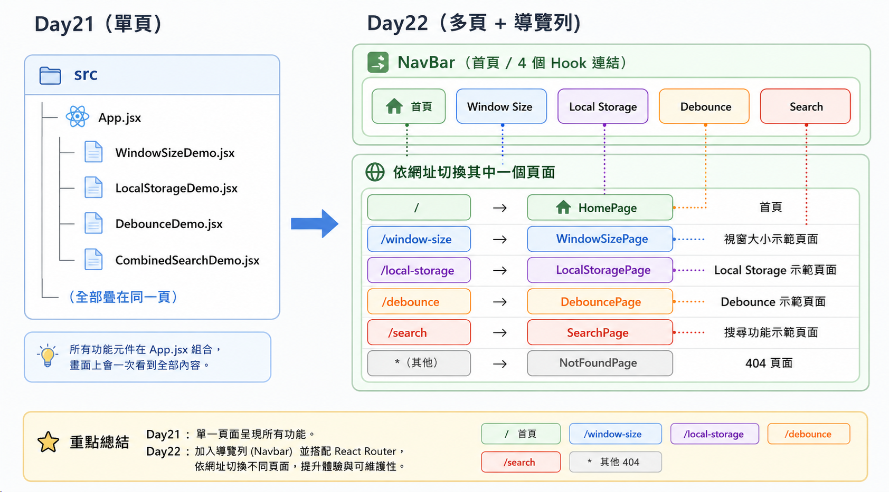

# Day 22｜React Router 基礎

- 今日範例程式碼：[`Day22\examples\day22-router-lab`](https://github.com/ShaoYuKao/2026-ithome-ironman-react-v19-30days/tree/master/Day22/examples/day22-router-lab)

## 一、為什麼需要「前端路由」？從 MPA 到 SPA

在還沒有 React Router 之前，先花點時間搞懂它到底解決了什麼問題，之後用起來才不會只是「照抄語法」。

### 1. 傳統多頁應用程式（MPA）怎麼換頁

一般傳統網站（Multi-Page Application, MPA）長這樣：每個網址對應伺服器上的一份 HTML 檔案。使用者點擊 `<a href="/about">關於我們</a>` 之後：

1. 瀏覽器對伺服器發出一個全新的 HTTP 請求
2. 伺服器回傳一份全新的 HTML
3. 瀏覽器捨棄目前畫面上的一切（DOM、JS 記憶體狀態、捲動位置……），重新下載 CSS/JS、重新解析、重新渲染

畫面會「白一下」再出現新內容，就是這個原因。這件事本身沒有不好——甚至對純內容型網站（部落格、文件站）來說，這樣做更單純。但如果是一個互動性很高的應用程式（例如 Day01～Day21 我們寫的這些 React 小專案），每次換頁都整頁重新載入，會把 React 在瀏覽器端維護的所有狀態全部砍掉重練，體驗很差。

### 2. SPA：只有一份 HTML，換頁交給 JavaScript

我們從 Day01 開始寫的 React 專案，其實一直都是 **SPA（Single Page Application）**：整個網站實際上只有一份 `index.html`，之後所有畫面內容都是 JavaScript 在瀏覽器端動態渲染出來的。

如果沒有專門的路由套件，最直覺的「切換畫面」寫法可能長這樣：

```jsx
function App() {
  const [page, setPage] = useState("home");

  return (
    <div>
      <button onClick={() => setPage("home")}>首頁</button>
      <button onClick={() => setPage("about")}>關於</button>

      {page === "home" && <HomePage />}
      {page === "about" && <AboutPage />}
    </div>
  );
}
```

這樣寫**可以動**，畫面確實會切換，而且完全不會整頁重新載入。但實際做成產品會遇到三個現實問題：

1. **網址列永遠不會變**：不管切到哪一頁，網址都停在同一個地方，使用者沒辦法把「關於頁」加入書籤、複製連結傳給別人，重新整理頁面也一定會跳回 `page === 'home'` 的初始畫面。
2. **瀏覽器的上一頁／下一頁失效**：因為我們從頭到尾都沒有告訴瀏覽器「使用者換頁了」，瀏覽器自然不知道要把這個切換記錄到瀏覽紀錄裡。
3. **狀態與網址對不起來**：畫面上顯示什麼，跟網址列寫什麼，是兩件互不相干的事，全部要靠我們手動保持同步，專案一大就很難維護。

### 3. React Router 解決的問題：讓「網址」與「畫面」同步

React Router 存在的核心目的，就是解決「SPA 換頁時，畫面跟網址對不起來」這件事。它讓我們：

- 用宣告的方式描述「這個網址 => 對應顯示哪個元件」
- 換頁時透過瀏覽器原生的 **History API**（`window.history.pushState()`）偷偷把網址列換掉，同時觸發 React Router 內部重新比對、重新渲染對應元件——**全程沒有真正對伺服器發出新的整頁請求**
- 監聽瀏覽器的上一頁／下一頁按鈕（`popstate` 事件），正確地把畫面切回對應的歷史紀錄

也就是說，React Router 幫我們把「手動用 `useState` 決定要顯示哪個畫面」這件事，升級成「網址本身就是狀態的來源（URL as source of truth）」。下表整理三者的差異：

| 面向           | 傳統多頁（MPA）      | 手刻 `useState` 切換畫面 | SPA + React Router             |
| -------------- | -------------------- | ------------------------ | ------------------------------ |
| 換頁時做什麼   | 對伺服器發出全新請求 | JS 直接抽換畫面          | JS 抽換畫面 + 呼叫 History API |
| 網址列         | 每頁都不同、正確     | 永遠不變                 | 跟著畫面正確改變               |
| 重新整理頁面   | 停在同一頁           | 回到初始畫面             | 停在同一頁                     |
| 上一頁／下一頁 | 瀏覽器原生支援       | 失效                     | 正確支援                       |
| 換頁體感       | 畫面會白一下         | 不會整頁重載             | 不會整頁重載                   |

> 💡 **小提醒**：React Router 底層雖然用了 History API，但我們平常寫程式幾乎不會直接呼叫 `pushState`，而是使用它提供的 `<Link>`、`<NavLink>`、`useNavigate()` 等元件與 Hook——這些工具的內部都已經幫我們處理好呼叫時機了。

## 二、安裝 React Router

從 React Router v7 開始，套件已經整合成單一個 `react-router`，不再需要像早期那樣額外安裝 `react-router-dom`。

```bash
npm install react-router@8.3.0
```

安裝完成後，`package.json` 會多出類似這行：

```json
"dependencies": {
  "react-router": "^8.3.0"
}
```

有兩個匯入路徑需要分清楚：

| 匯入來源           | 用途                                                 | 範例                                                |
| ------------------ | ---------------------------------------------------- | --------------------------------------------------- |
| `react-router`     | 核心 API：建立路由、`<Link>`／`<NavLink>`、各種 Hook | `createBrowserRouter`、`useNavigate`、`useLocation` |
| `react-router/dom` | 專門給瀏覽器環境使用、經過最佳化的 `RouterProvider`  | `RouterProvider`                                    |

> 官方文件（`https://reactrouter.com/start/data/installation`）明確建議：在瀏覽器專案中，`RouterProvider` 要從 `react-router/dom` 匯入，而不是從 `react-router` 匯入——兩者雖然同名，但 `react-router/dom` 版本針對瀏覽器情境做了額外優化（例如可以判斷連結是否可以預先讀取資料）。今天的範例會確實遵守這個慣例。

React Router 需要 React 19.2 以上版本作為 peer dependency，我們從 Day01 開始就一直是 React 19，所以這裡不需要額外升級。

## 三、兩種建立路由的方式：Declarative Mode 與 Data Mode

### 1. Declarative Mode：用 JSX 描述路由

這是最貼近「一般 React 元件寫法」的模式，整個路由表用 JSX 元件樹表達：

```jsx
import { BrowserRouter, Routes, Route } from "react-router";

function App() {
  return (
    <BrowserRouter>
      <Routes>
        <Route path="/" element={<HomePage />} />
        <Route path="/about" element={<AboutPage />} />
        <Route path="*" element={<NotFoundPage />} />
      </Routes>
    </BrowserRouter>
  );
}
```

- `<BrowserRouter>`：包住整個應用程式，負責跟瀏覽器的 History API 溝通。
- `<Routes>`：在目前這個位置，比對網址、決定要渲染哪一個 `<Route>`。
- `<Route path="..." element={...} />`：宣告「這個網址對應這個元件」。

### 2. Data Mode：用一般 JavaScript 陣列描述路由

Data Mode 把同一份路由表，改成用純 JavaScript 物件陣列描述，再交給 `createBrowserRouter` 建立、用 `<RouterProvider>` 渲染：

```jsx
import { createBrowserRouter } from "react-router";
import { RouterProvider } from "react-router/dom";

const router = createBrowserRouter([
  { path: "/", element: <HomePage /> },
  { path: "/about", element: <AboutPage /> },
  { path: "*", element: <NotFoundPage /> },
]);

function App() {
  return <RouterProvider router={router} />;
}
```

單看「頁面切換」這個功能，兩種寫法效果幾乎一模一樣，`<Link>`、`<NavLink>`、`useNavigate()` 等 API 在兩種模式下也是共用、寫法完全相同。真正的差異在於：Data Mode 因為路由是「一份資料」而不是「一段 JSX」，所以可以在每個路由物件上額外掛上 `loader`（進頁面前先載入資料）、`action`（處理表單送出）等「資料 API」，這些能力在 Declarative Mode 下沒辦法使用。

|                                          | Declarative Mode                               | Data Mode                                           |
|------------------------------------------|------------------------------------------------|-----------------------------------------------------|
| 路由怎麼寫                               | JSX 元件樹（`<Routes>`/`<Route>`）             | JavaScript 物件陣列（`createBrowserRouter([...])`） |
| 進入方式                                 | `<BrowserRouter>` 包住 App                     | `<RouterProvider router={router} />` 渲染 App       |
| Link／NavLink／useNavigate               | ✅ 支援                                        | ✅ 支援（寫法相同）                                 |
| `loader`／`action`（資料載入、表單處理） | ❌ 不支援                                      | ✅ 支援（                                           |
| 適合情境                                 | 只需要單純換頁；或從舊版 React Router 升級上來 | 除了換頁，之後也會需要資料載入、表單送出等進階功能  |

### 3. 今天為什麼選 Data Mode

這個系列接下來後續會學到 Nested Routes／`<Outlet>`／URL 參數、`loader`／`action` 資料載入與路由守衛——而 `loader`／`action` 這些 API **只存在於 Data Mode**。與其之後再把整個路由架構打掉重練，不如今天就用 `createBrowserRouter` 把架構搭好，之後只需要在既有的路由物件上「多加幾個欄位」即可，不需要更動渲染 App 的方式。

也因為這樣，今天範例程式碼裡看到的 `router.jsx`，會是一個獨立檔案，`export` 出一個用 `createBrowserRouter` 建立好的 `router` 常數。

> 💡 **小提醒**：Data Router（`createBrowserRouter` 建立出來的物件）應該在模組最外層建立「一次」，不要放進元件內部用 `useState`／`useMemo` 動態建立，也不要每次渲染都重新呼叫 `createBrowserRouter`——路由表在應用程式執行期間通常是固定不變的設定資料，而不是會隨畫面重新計算的狀態。

## 四、用 `createBrowserRouter` 建立路由設定

有了基本概念，來看路由設定陣列裡每個路由物件的組成：

```jsx
const router = createBrowserRouter([
  {
    path: "/window-size", // 要比對的網址路徑
    element: <WindowSizePage />, // 比對成功時要渲染的元素
  },
  // ...更多路由
]);
```

- **`path`**：字串，描述這個路由要比對的網址路徑。例如 `'/window-size'` 只會比對 `/window-size` 這個網址。
- **`element`**：比對成功後要渲染的 React 元素（用法跟平常寫 JSX 一樣，可以正常傳入 props）。

> React Router 也支援用 `Component: WindowSizePage`（傳元件本身，而不是先呼叫它產生元素）這種寫法，效果相同、由 React Router 幫你呼叫。今天的範例統一使用 `element`，這樣不管在 Declarative Mode 的 `<Route element={...} />` 還是 Data Mode 的 `{ element: ... }`，都是同一個「用 `element` 指定畫面」的概念，比較不容易搞混。

一份最小可執行的路由設定，會搭配 `main.jsx`／`App.jsx` 這樣使用：

```jsx
// App.jsx
import { RouterProvider } from "react-router/dom";
import { router } from "./router.jsx";

function App() {
  return <RouterProvider router={router} />;
}

export default App;
```

`RouterProvider` 拿到 `router` 之後，會負責：讀取目前瀏覽器網址 => 拿去跟路由陣列逐一比對 => 找到符合的路由 => 渲染它的 `element`。之後只要透過 `<Link>`／`<NavLink>` 或 `useNavigate()` 換頁，`RouterProvider` 都會自動重新跑一次這個流程。

## 五、頁面導覽：`<Link>` 與 `<NavLink>`

### 1. 為什麼不能直接寫 `<a href="...">`

```jsx
{
  /* ❌ 不建議：會整頁重新載入，回到「傳統 MPA」的行為 */
}
<a href="/about">關於</a>;
```

原生 `<a>` 標籤點下去，瀏覽器就是會真的發出 HTTP 請求、整頁重新載入——這正是我們在第一節想避免的行為。React Router 提供的 `<Link>` 元件，外觀跟使用方式幾乎跟 `<a>`一樣，但點擊時會攔截瀏覽器預設的換頁行為，改成呼叫 History API，讓畫面在**不整頁重新載入**的前提下換頁：

```jsx
import { Link } from "react-router";

<Link to="/about">關於</Link>;
```

> 💡 `<Link>` 渲染出來的還是一個 `<a>` 標籤（只是加上了自己的 `onClick` 攔截邏輯），所以「用滑鼠中鍵開新分頁」「按住 Ctrl／Cmd 點擊開新分頁」這些瀏覽器原生行為都完整保留，這也是為什麼平常換頁應該優先使用 `<Link>`，而不是用 `onClick` 搭配 `useNavigate()` 手動導頁。

### 2. `<NavLink>`：多了「目前在哪一頁」的狀態

`<NavLink>` 的用法跟 `<Link>` 幾乎一模一樣，差別是它會自動判斷「目前網址是不是符合這個連結」，這在做導覽列時非常實用：

```jsx
import { NavLink } from "react-router";

<NavLink
  to="/window-size"
  className={({ isActive }) =>
    isActive ? "nav-link nav-link--active" : "nav-link"
  }
>
  useWindowSize
</NavLink>;
```

`className` 可以傳一個函式，React Router 會呼叫它並傳入 `{ isActive }`（目前網址是否符合這個連結）等狀態，讓我們決定要套用哪個 CSS 類別。今天範例的 `NavBar.jsx` 就是用這個方式，讓目前所在的頁面在導覽列上高亮顯示。

### 3. `end` 屬性：Home 連結的陷阱

`<NavLink>` 判斷「是否符合」的預設規則是**前綴比對**：只要目前網址是用這個連結的 `to` 開頭，就算符合。這在大部分連結上沒問題，但 Home 頁面的路徑通常是 `/`，而**幾乎所有網址都是以 `/` 開頭**，結果就是：

```jsx
{
  /* ❌ 沒加 end：不管切到哪一頁，這個連結都會被判斷成 isActive */
}
<NavLink to="/">首頁</NavLink>;
```

解法是幫這種「根路徑」連結加上 `end` 屬性，要求**完全比對**才算符合：

```jsx
{
  /* ✅ 加上 end：只有網址「剛好」是 "/" 時才會高亮 */
}
<NavLink to="/" end>
  首頁
</NavLink>;
```

今天範例的 `NavBar.jsx` 就特別只在首頁連結加上 `end`，其他子頁面連結則不需要（因為它們的路徑本來就不會是別的路徑的前綴）。

### 4. 一句話認識 `useNavigate`

除了讓使用者「點擊連結」換頁，有些情境是「程式自己決定要換頁」，例如表單送出成功後自動跳轉、或倒數計時後自動導回首頁。這種情境會用到 `useNavigate()` 這個 Hook：

```jsx
const navigate = useNavigate();

function handleSubmitSuccess() {
  navigate("/success");
}
```

`useNavigate` 屬於「主動命令式換頁」，Day23 會有更完整的實際使用場景；一般使用者點擊觸發的換頁，仍然建議優先用 `<Link>`／`<NavLink>`。

## 六、404 頁面設計：用萬用路由接住「找不到頁面」

### 1. 用 `path: '*'` 接住所有沒比對到的網址

React Router 的路由比對是**由上而下、比對到第一個符合的就停止**，所以只要在路由陣列的**最後面**放一個 `path: '*'`（萬用路由，會比對任何路徑），就能接住所有「上面路由都比對不到」的網址：

```jsx
const router = createBrowserRouter([
  {
    path: "/",
    element: (
      <Layout>
        <HomePage />
      </Layout>
    ),
  },
  {
    path: "/window-size",
    element: (
      <Layout>
        <WindowSizePage />
      </Layout>
    ),
  },
  // ...其他正常路由

  // 一定要放最後：前面都比對不到，才會落到這裡
  {
    path: "*",
    element: (
      <Layout>
        <NotFoundPage />
      </Layout>
    ),
  },
]);
```

如果把 `path: '*'` 放在陣列最前面，因為它會比對任何路徑，後面所有路由都會永遠比對不到，變成整個網站都只顯示 404 頁面——這是初學者很容易踩到的順序陷阱，實作時要特別留意。

### 2. 前端渲染的 404，跟「伺服器真正的 404」不一樣

這裡有個值得特別澄清的觀念：我們做出來的 404 頁面，是**瀏覽器裡的 JavaScript 自己判斷網址、決定顯示"找不到頁面"文字**，並不是伺服器真的回應了 HTTP 404 狀態碼。實際上不管網址是什麼，SPA 情境下伺服器（或開發時的 Vite dev server）通常都是回傳同一份 `index.html`，狀態碼是 200，然後才由 React Router 在瀏覽器端接手，判斷這個網址沒有對應的路由、渲染出 `NotFoundPage`。

這帶來一個實務上要注意的重點：**部署到正式環境的靜態代管平台時**，伺服器必須設定「找不到對應檔案的網址，一律回傳 `index.html`」（常見作法是 Netlify 的 `_redirects`、Nginx 的 `try_files`），使用者重新整理一個像 `/window-size` 這樣的子路徑時，才不會直接被伺服器擋下、顯示伺服器層級真正的 404 錯誤頁。Vite 的開發伺服器預設就內建了這種行為，所以開發階段不會注意到這件事，但正式部署時要記得處理。

> 之後過幾天會介紹 `loader` 拋出 `Response` 觸發的 `errorElement`——那是「伺服器（或資料層）明確判斷這是一筆錯誤」的情境，跟今天單純「網址沒有對應路由」的前端 404 概念不同，先知道兩者的差異即可。

## 七、今日範例：把 Day21 的自訂 Hook 函式庫改成多頁面 + 導覽列

### 1. 從「單頁疊卡片」到「多頁 + 導覽列」

Day21 的範例把 `useWindowSize`、`useLocalStorage`、`useDebounce`、`useFetch` 四個自訂 Hook 的 Demo，全部疊在同一個頁面上、由上往下捲動查看。今天的練習，就是把它改成「一個 Hook 一個網址」的多頁面架構：



四個 Hook（`useLocalStorage`、`useWindowSize`、`useFetch`、`useDebounce`）與四個對應的展示元件（`WindowSizeDemo`、`LocalStorageDemo`、`DebounceDemo`、`CombinedSearchDemo`）**程式碼完全沒有變動**（只把 `localStorage` 的 key 從 `day21-*` 改成 `day22-*`，避免兩天的範例互相污染彼此的瀏覽器儲存）——今天的重點單純是「路由外層的組裝方式」，這也呼應了 React 元件化的精神：畫面邏輯（Hook + Demo 元件）跟「怎麼把畫面組合、切換」是可以分開處理的兩件事。

### 2. 專案結構

```
day22-router-lab/
├── server/                     # Day21 沿用的 Express 商品搜尋 API（port 4022）
│   ├── index.js
│   └── package.json
└── app/... （下方省略，實際檔案在專案根目錄）
    ├── src/
    │   ├── hooks/               # 與 Day21 完全相同的四個自訂 Hook
    │   │   ├── useLocalStorage.js
    │   │   ├── useWindowSize.js
    │   │   ├── useFetch.js
    │   │   ├── useDebounce.js
    │   │   └── index.js         # 統一匯出的 barrel file
    │   ├── components/
    │   │   ├── NavBar.jsx        # 導覽列（NavLink + end）
    │   │   ├── Layout.jsx        # 共用外框（NavBar + 內容）
    │   │   ├── WindowSizeDemo.jsx
    │   │   ├── LocalStorageDemo.jsx
    │   │   ├── DebounceDemo.jsx
    │   │   └── CombinedSearchDemo.jsx
    │   ├── pages/                 # 新增：一個路由對應一個頁面元件
    │   │   ├── HomePage.jsx
    │   │   ├── WindowSizePage.jsx
    │   │   ├── LocalStoragePage.jsx
    │   │   ├── DebouncePage.jsx
    │   │   ├── SearchPage.jsx
    │   │   └── NotFoundPage.jsx
    │   ├── router.jsx             # 新增：createBrowserRouter 路由設定
    │   ├── App.jsx                # 改寫：只負責渲染 RouterProvider
    │   ├── App.css
    │   ├── main.jsx
    │   └── index.css
    └── vite.config.js             # /api 代理到 http://localhost:4022
```

> 實際檔案路徑是 `examples/day22-router-lab/`（Express 後端與 Vite 前端都放在同一個資料夾內，`server/` 是後端、其餘是前端，跟 Day21 的擺放方式一致）。

### 3. 路由與頁面對照表

| 網址路徑            | 頁面元件           | 內容                                                             |
| ------------------- | ------------------ | ---------------------------------------------------------------- |
| `/`                 | `HomePage`         | 首頁：簡短介紹 + 連到四個 Hook 頁面的卡片連結                    |
| `/window-size`      | `WindowSizePage`   | 展示 `useWindowSize`：即時顯示目前視窗寬高                       |
| `/local-storage`    | `LocalStoragePage` | 展示 `useLocalStorage`：計數器數值會存進瀏覽器、重新整理不會歸零 |
| `/debounce`         | `DebouncePage`     | 展示 `useDebounce`：輸入框防抖動效果                             |
| `/search`           | `SearchPage`       | 展示 `useDebounce` + `useFetch`：向 Express API 查詢商品         |
| `*`（其他任何路徑） | `NotFoundPage`     | 404 找不到頁面，附一個回首頁的 `<Link>`                          |

### 4. `router.jsx`：路由設定總表

```jsx
import { createBrowserRouter } from "react-router";
import Layout from "./components/Layout.jsx";
import HomePage from "./pages/HomePage.jsx";
import WindowSizePage from "./pages/WindowSizePage.jsx";
import LocalStoragePage from "./pages/LocalStoragePage.jsx";
import DebouncePage from "./pages/DebouncePage.jsx";
import SearchPage from "./pages/SearchPage.jsx";
import NotFoundPage from "./pages/NotFoundPage.jsx";

// 每一筆路由的 element 都用 <Layout> 包一層,讓導覽列（NavBar）在
// 每個頁面之間切換時都能持續顯示,不會因為換頁而消失或重新製作。
export const router = createBrowserRouter([
  {
    path: "/",
    element: (
      <Layout>
        <HomePage />
      </Layout>
    ),
  },
  {
    path: "/window-size",
    element: (
      <Layout>
        <WindowSizePage />
      </Layout>
    ),
  },
  {
    path: "/local-storage",
    element: (
      <Layout>
        <LocalStoragePage />
      </Layout>
    ),
  },
  {
    path: "/debounce",
    element: (
      <Layout>
        <DebouncePage />
      </Layout>
    ),
  },
  {
    path: "/search",
    element: (
      <Layout>
        <SearchPage />
      </Layout>
    ),
  },
  // 萬用路由（catch-all）：必須放在陣列最後面,否則它會搶先比對成功,
  // 讓後面所有路由都變得不會執行。
  {
    path: "*",
    element: (
      <Layout>
        <NotFoundPage />
      </Layout>
    ),
  },
]);
```

> `router` 這裡是用**具名匯出**（named export），所以其他檔案要用 `import { router } from './router.jsx'` 引入，而不是預設匯出的 `import router from './router.jsx'`，等一下 `App.jsx` 的寫法要留意這個細節。

### 5. `Layout.jsx`：用 `children` 組合共用導覽列（先不用 `<Outlet>`）

```jsx
import NavBar from "./NavBar.jsx";

// Layout：所有頁面共用的外層結構（導覽列 + 內容區）。
//
// 這裡刻意用最單純的「一般 React children props 組合」來達成每個頁面
// 都看得到同一個 NavBar，並沒有使用 React Router 的巢狀路由（nested
// routes）與 <Outlet />——那是 Day23「巢狀路由與 Layout 元件設計」要
// 學的進階寫法。Day22 先只專心搞懂兩件事：「網址對應頁面元件」，以及
// 「用 <Link>／<NavLink> 在頁面之間導覽」。
function Layout({ children }) {
  return (
    <div className="app-shell">
      <NavBar />
      <main className="page-content">{children}</main>
    </div>
  );
}

export default Layout;
```

> `Layout` 本身不負責內容區的內距（padding）留白，而是交給**每個頁面元件自己**在最外層包一個 `<div className="page-inner">`（下一小節可以看到）。這樣拆分後，`Layout` 只需要專心處理「導覽列 + 內容容器」這一件事，版面留白則跟著每個頁面各自的排版彈性調整。

### 6. `NavBar.jsx`：`NavLink` + `end` 實戰

```jsx
import { NavLink } from "react-router";

// 導覽列上每一個連結對應的路由 path 與顯示文字，之後如果要增加頁面，
// 只需要在這裡加一筆設定，並在 router.jsx 註冊對應的路由即可。
const NAV_ITEMS = [
  { to: "/", label: "首頁", end: true },
  { to: "/window-size", label: "useWindowSize" },
  { to: "/local-storage", label: "useLocalStorage" },
  { to: "/debounce", label: "useDebounce" },
  { to: "/search", label: "商品搜尋" },
];

// NavBar：用 <NavLink> 而不是 <Link>，因為導覽列需要知道「目前在哪一頁」
// 並且加上高亮樣式（active 狀態），這是 NavLink 比 Link 多出來的能力。
function NavBar() {
  return (
    <nav className="nav-bar">
      <span className="nav-brand">Day22 · Hook Router</span>
      <ul className="nav-list">
        {NAV_ITEMS.map((item) => (
          <li key={item.to}>
            {/* end：只有網址「完全等於」to 才算 active。
                首頁 "/" 一定要加 end，否則因為每個網址都是以 "/" 開頭，
                首頁的連結會永遠被判定成 active，其他頁面反而無法正確高亮。 */}
            <NavLink
              to={item.to}
              end={item.end}
              className={({ isActive }) =>
                `nav-link${isActive ? " nav-link--active" : ""}`
              }
            >
              {item.label}
            </NavLink>
          </li>
        ))}
      </ul>
    </nav>
  );
}

export default NavBar;
```

### 7. 頁面元件：負責「排版」，展示邏輯留給 Demo 元件

五個實際頁面（`HomePage` 除外）都共用同一種結構：最外層包一個 `<div className="page-inner">`（前一小節提到、由每個頁面自己負責的內距容器），裡面放一段 `page-header`（小標籤 `eyebrow` + 標題 + 說明文字），再放進 Day21 就寫好的 Demo 元件，例如：

```jsx
// pages/WindowSizePage.jsx
import WindowSizeDemo from "../components/WindowSizeDemo.jsx";

// WindowSizePage：路由 "/window-size" 對應的頁面，內容就是 Day21 的
// WindowSizeDemo——今天的重點是「這個 Hook 有了自己獨立的網址」，
// Hook 本身的實作完全沒有改變。
function WindowSizePage() {
  return (
    <div className="page-inner">
      <header className="page-header">
        <p className="eyebrow">Hook 路由頁面</p>
        <h1>useWindowSize</h1>
        <p className="subtitle">
          延續 Day13、Day21 的實作：兩個互不認識的元件各自呼叫一次{" "}
          <code>useWindowSize()</code>，卻共用同一套「訂閱 resize
          事件、卸載時取消訂閱」的邏輯。
        </p>
      </header>
      <div className="card-grid">
        <WindowSizeDemo />
      </div>
    </div>
  );
}

export default WindowSizePage;
```

其餘三個頁面（`LocalStoragePage`、`DebouncePage`、`SearchPage`）都是相同的寫法，只是換掉標題、說明文字，以及放進去的 Demo 元件（分別是 `LocalStorageDemo`、`DebounceDemo`、`CombinedSearchDemo`）。

首頁 `HomePage.jsx` 則是把四個 Hook 頁面整理成一組資料，直接 `map` 成可以點擊的 `<Link>` 卡片，讓使用者不用打開導覽列，也能一眼看到今天有哪些 Demo：

```jsx
// pages/HomePage.jsx
import { Link } from "react-router";

const HOOK_LINKS = [
  {
    to: "/window-size",
    title: "useWindowSize",
    desc: "即時偵測瀏覽器視窗尺寸……",
  },
  {
    to: "/local-storage",
    title: "useLocalStorage",
    desc: "把 state 自動同步進 localStorage……",
  },
  {
    to: "/debounce",
    title: "useDebounce",
    desc: "打字停下來一段時間後值才會「安定」下來……",
  },
  {
    to: "/search",
    title: "商品搜尋（Debounce + Fetch）",
    desc: "把 useDebounce 與 useFetch 組合起來……",
  },
];

function HomePage() {
  return (
    <div className="page-inner">
      {/* ...page-header 省略... */}
      <div className="card-grid">
        {HOOK_LINKS.map((item) => (
          <Link key={item.to} to={item.to} className="card link-card">
            <h2>{item.title}</h2>
            <p className="card-desc">{item.desc}</p>
          </Link>
        ))}
      </div>
    </div>
  );
}
```

404 頁面則附上一個導回首頁的連結：

```jsx
// pages/NotFoundPage.jsx
import { Link } from "react-router";

// NotFoundPage：router.jsx 裡 path: '*' 的萬用路由對應的頁面。
// 只要目前網址沒有被其他任何一筆路由設定比對到，就會顯示這個頁面，
// 這是最基本、也最常見的「404 頁面」實作方式。
function NotFoundPage() {
  return (
    <div className="page-inner">
      <div className="not-found">
        <p className="not-found__code">404</p>
        <h1>找不到這個頁面</h1>
        <p className="subtitle">
          網址可能打錯了，或這個頁面已經搬家。可以先回首頁，重新選擇想瀏覽的
          Hook 範例。
        </p>
        <Link to="/" className="secondary-btn">
          回首頁
        </Link>
      </div>
    </div>
  );
}

export default NotFoundPage;
```

### 8. `App.jsx` 與 `main.jsx`：`RouterProvider` 進場

```jsx
// App.jsx
import { RouterProvider } from "react-router/dom";
import "./App.css";
import { router } from "./router.jsx";

// RouterProvider 刻意從 'react-router/dom' 匯入（而不是 'react-router'）：
// 這是官方文件建議在瀏覽器（ReactDOM）環境下使用的版本。
function App() {
  return <RouterProvider router={router} />;
}

export default App;
```

```jsx
// main.jsx（跟之前每天的結構一致，維持 StrictMode）
import { StrictMode } from "react";
import { createRoot } from "react-dom/client";
import "./index.css";
import App from "./App.jsx";

createRoot(document.getElementById("root")).render(
  <StrictMode>
    <App />
  </StrictMode>,
);
```

可以看到 `App.jsx` 變得非常單純——所有「該顯示哪個頁面」的邏輯，都已經交給 `router.jsx` 這份設定表跟 `RouterProvider` 處理了。注意 `router.jsx` 是用具名匯出，所以這裡要用 `import { router } from './router.jsx'`，而不是預設匯出的寫法。

### 9. 後端 API：延續 Day21 的商品搜尋服務

`/search` 頁面一樣需要向後端要資料，`server/index.js` 是把 Day21 的 Express 服務搬過來、把埠號改成 **4022**（維持「Day 幾號、埠號末兩碼就是幾號」的慣例：Day20 是 4020、Day21 是 4021）：

```js
// server/index.js
import express from "express";
import cors from "cors";

const app = express();
const PORT = process.env.PORT || 4022;

app.use(cors());

// products：20 筆商品的固定假資料（略）

function delay(ms) {
  return new Promise((resolve) => setTimeout(resolve, ms));
}

// GET /api/products?q=鍵盤
app.get("/api/products", async (req, res) => {
  const keyword = (req.query.q || "").trim();

  // 記錄每一次「真正打到伺服器」的請求，方便對照前端畫面上的次數統計，
  // 驗證 useDebounce 真的減少了呼叫次數。
  console.log(
    `[day22-router-lab] GET /api/products?q=${keyword || "(空字串，回傳全部)"}`,
  );

  await delay(400); // 固定模擬 400ms 網路延遲

  const matched = keyword
    ? products.filter(
        (product) =>
          product.name.toLowerCase().includes(keyword.toLowerCase()) ||
          product.category.toLowerCase().includes(keyword.toLowerCase()),
      )
    : products;

  res.json({
    query: keyword,
    count: matched.length,
    products: matched,
    fetchedAt: new Date().toISOString(),
  });
});

app.listen(PORT, () => {
  console.log(
    `[day22-router-lab] Express server ready at http://localhost:${PORT}`,
  );
});
```

> 留意回傳格式是 `{ query, count, products, fetchedAt }` 這個物件，而不是單純的商品陣列——前端 `CombinedSearchDemo.jsx` 是透過 `data.products`、`data.count` 讀取資料，兩邊的資料形狀需要對得起來。

前端 `vite.config.js` 一樣設定 `/api` 代理，開發時前端只要呼叫相對路徑 `/api/products`，Vite 會自動轉發到 `http://localhost:4022`，不會遇到跨來源請求的問題：

```js
// vite.config.js
const apiProxy = {
  "/api": {
    target: "http://localhost:4022",
    changeOrigin: true,
  },
};

export default defineConfig({
  plugins: [react()],
  server: {
    proxy: apiProxy,
  },
  preview: {
    proxy: apiProxy, // npm run build + npm run preview 時也要能連到後端
  },
});
```

---

## 八、如何在本機執行範例

範例包含前端（Vite）與後端（Express）兩個部分，**建議開兩個終端機視窗分別啟動**：

### 1. 啟動後端 API（`server/`）

```bash
cd Day22/examples/day22-router-lab/server
npm install
npm start
```

啟動成功會看到：

```
Day22 product API is running at http://localhost:4022
```

### 2. 啟動前端（Vite）

另開一個終端機：

```bash
cd Day22/examples/day22-router-lab
npm install
npm run dev
```

啟動後於瀏覽器開啟 Vite 顯示的網址（預設 `http://localhost:5173`），即可看到首頁與導覽列。

### 3. 實際操作看看

- 點擊導覽列的每一個連結，觀察網址列跟著改變，同時畫面不會整頁重新載入（不會看到瀏覽器分頁的載入圈圈轉動）。
- 切到「首頁」以外的頁面時，留意導覽列上**只有目前所在頁面**會保持高亮，首頁連結不會被誤判成一直是高亮狀態。
- 進入 `useLocalStorage` 頁面調整計數器數值，重新整理瀏覽器，數值應該還在。
- 調整瀏覽器視窗大小，`useWindowSize` 頁面的數字應該即時更新。
- 在網址列直接輸入一個不存在的路徑（例如 `http://localhost:5173/hello`），應該會看到 404 頁面，點擊「回首頁」可以正確導回 `/`。

## 參考資源

- [Picking a Mode  | React Router](https://reactrouter.com/start/modes)
- [Routing  | React Router](https://reactrouter.com/start/declarative/routing)
- [NavLink  | React Router](https://reactrouter.com/api/components/NavLink)
- [操控瀏覽器歷史紀錄 - Web API | MDN](https://developer.mozilla.org/docs/Web/API/History_API)
