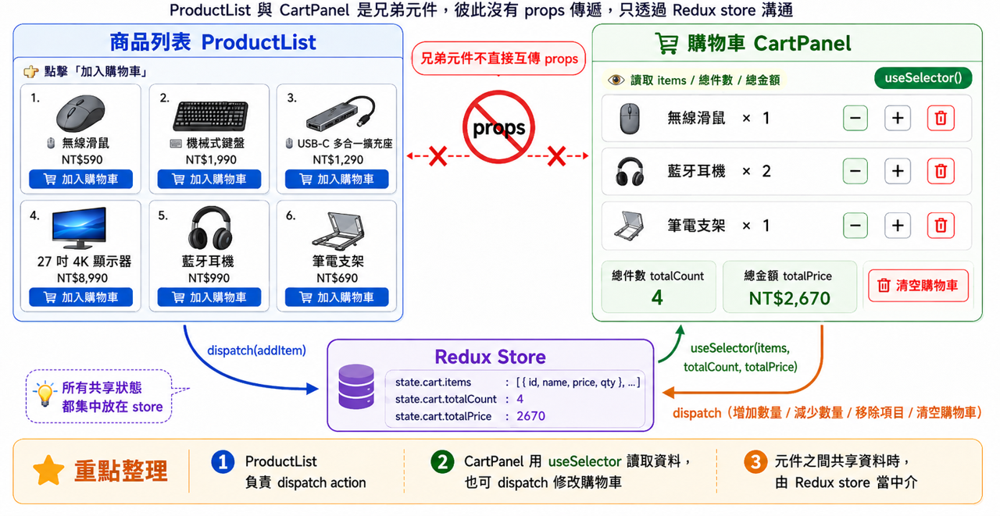

# Day 26｜Redux Toolkit 實戰（一）

- 今日範例程式碼：[`Day26\examples\day26-redux-toolkit-cart-lab`](https://github.com/ShaoYuKao/2026-ithome-ironman-react-v19-30days/tree/master/Day26/examples/day26-redux-toolkit-cart-lab)

## 一、從 Day25 的設計到 Day26 的實作：今天要把「設計圖」變成「能跑的程式碼」

Day25 花了一整天，只用文字和表格，把購物車的 State Shape、Action 清單、每個 Action 對應的 Reducer 邏輯、還有 Selector 全部設計清楚，**沒有安裝任何套件、沒有寫一行程式碼**。今天的任務很單純：把那份設計，一項一項對照著寫成 `@reduxjs/toolkit` 的程式碼，不需要重新設計、也不需要重新決策任何 edge case（例如「數量減到 0 該怎麼辦」這種問題，Day25 已經想清楚了）。

先把 Day25 設計出的規格，跟今天會寫出的程式碼位置整理成一張對照表，之後每一節都會回頭指向這張表的某一列：

| Day25 設計的規格 | Day26 對應的程式碼 |
| --- | --- |
| `state.cart` 的 State Shape（`{ items: [...] }`） | `cartSlice.js` 的 `initialState` |
| Action：`cart/addItem` | `cartSlice.js` 的 `reducers.addItem` |
| Action：`cart/removeItem` | `cartSlice.js` 的 `reducers.removeItem` |
| Action：`cart/changeQty` | `cartSlice.js` 的 `reducers.changeQty` |
| Action：`cart/clearCart` | `cartSlice.js` 的 `reducers.clearCart` |
| Selector：`selectCartItems` | `cartSlice.js` 匯出的 `selectCartItems` |
| Selector：`selectCartTotalCount` | `cartSlice.js` 匯出的 `selectCartTotalCount` |
| Selector：`selectCartTotalPrice` | `cartSlice.js` 匯出的 `selectCartTotalPrice` |
| 商品列表頁「加入購物車」按鈕 | `ProductList.jsx` 的 `dispatch(addItem(product))` |
| 購物車頁面顯示明細、調整數量、移除、清空 | `CartPanel.jsx` 的 `useSelector` + `dispatch` |

今天不會重複 Day25 已經講過的「為什麼需要 Redux」「三大核心原則」，如果還不熟悉這些動機，建議先回頭讀一遍 Day25，今天會直接站在那些結論上開始寫程式。

## 二、安裝套件：`@reduxjs/toolkit` 與 `react-redux`

Day25 第三節提過，今天要安裝的是 **Redux Toolkit**（`@reduxjs/toolkit`），而不是最原始、需要手寫大量樣板程式碼的 Redux。實際安裝時，需要兩個套件：

```bash
npm install @reduxjs/toolkit@2.12.0 react-redux@9.3.0
```

兩者的分工不一樣，第一次接觸容易搞混：

| 套件 | 負責什麼 | 跟 React 的關係 |
| --- | --- | --- |
| `@reduxjs/toolkit` | 提供 `configureStore`、`createSlice`、`createAsyncThunk`（Day27）等 API，用來建立 store、定義 reducer 邏輯 | 不綁定 React，純 JavaScript（延續 Day25 第二節第 4 小節） |
| `react-redux` | 提供 `<Provider>`、`useSelector`、`useDispatch` 等 React 專用的 Hook 與元件 | 專門負責把 Redux store 跟 React 元件樹接在一起 |

`@reduxjs/toolkit` 內部依賴了原始的 `redux` 套件（`configureStore` 其實是包了一層 `redux` 的 `createStore`），所以不需要另外手動安裝 `redux`；`react-redux` 則是獨立的橋接套件，兩個都要裝。

## 三、`configureStore`：建立整個 App 唯一的 Store

有了套件之後，第一步是建立 store。今天的範例把它獨立寫在 `src/store/store.js`：

```js
// src/store/store.js
import { configureStore } from '@reduxjs/toolkit'
import cartReducer from './cartSlice.js'

export const store = configureStore({
  reducer: {
    cart: cartReducer,
  },
})
```

`configureStore` 只需要一個 `reducer` 選項，用物件的方式把每個 slice 的 reducer 組合起來——今天只有 `cart` 一個 slice，Day28 做「多頁面電商購物車 App」時，會在這裡繼續加入 `products`、`user`，變成 Day25 第四節對照表提過的 `configureStore({ reducer: { cart, products, user } })`。

跟 Day25 第三節提到的原始 Redux `createStore` 比起來，`configureStore` 自動多做了兩件事：

1. **自動接上 Redux DevTools**：只要瀏覽器安裝了 [Redux DevTools](https://github.com/reduxjs/redux-devtools) 擴充套件，打開今天的範例就能直接看到每一次 `dispatch` 過的 action（`cart/addItem`、`cart/changeQty`……）與對應的 state 變化，這正是 Day25 第二節第 1 小節提過、純手刻 `useReducer` 沒有的除錯工具。這一步完全不需要額外設定，`configureStore` 內建就會偵測瀏覽器是否裝了這個擴充套件。
2. **自動內建一組常用的 Middleware**：其中包含 `redux-thunk`。今天還用不到，但 Day27 要學的 `createAsyncThunk`，能運作正是靠這裡內建的 thunk middleware——store 已經準備好了，只是今天的 reducer 都還是單純的同步操作。

> 💡 如果好奇 `configureStore` 內部到底做了什麼：它其實是呼叫 Redux 原始的 `combineReducers` 把 `reducer` 物件（`{ cart: cartReducer }`）組合成一個大的根 reducer，再呼叫 `createStore`（或新版的等價實作）建立 store，最後依序接上 DevTools 的 enhancer 與預設的 middleware 清單。不需要記住這些實作細節，只要知道「呼叫 `configureStore` 就等於用最佳實踐設定好了一個 Redux store」即可。

## 四、`createSlice`：把 Day25 的 State Shape／Action／Reducer 設計寫成程式碼

### 1. 對照 Day25 Step 2：`initialState`

Day25 Step 2 設計的 State Shape，直接對應成 `initialState`：

```js
// src/store/cartSlice.js
const initialState = {
  items: [], // [{ id, name, price, image, qty }]
}
```

延續 Day25 的設計決策：`items` 存放「完整商品資訊 + qty」，而不是只存 `id` + `qty`；也**沒有**任何 `totalPrice`、`totalCount` 這類算得出來的欄位——那些留到第五節用 Selector 現算。

### 2. `createSlice` 的三個必要欄位

```js
import { createSlice } from '@reduxjs/toolkit'

const cartSlice = createSlice({
  name: 'cart',       // 這個字串會變成每個 action type 的前綴
  initialState,       // 上面定義好的初始值
  reducers: {
    // 每一個 function 對應一種「可以發生的操作」
  },
})
```

- **`name`**：這個 slice 的名字，也會變成 `createSlice` 自動產生的 action type 的前綴（例如 `'cart'` + `'addItem'` → `'cart/addItem'`）——這正是 Day25 Step 3 選用 `slice 名稱/操作名稱` 命名慣例的原因：這不只是「建議的命名風格」，而是 Redux Toolkit 實際產生 action type 字串的規則，先照這個慣例設計，之後接上 `createSlice` 完全不需要再手動調整任何字串。
- **`initialState`**：上一小節定義好的初始值。
- **`reducers`**：一個物件，每個 key 是一種操作的名字（例如 `addItem`），value 是一個 `(state, action) => void`（或回傳新 state）的函式，各自負責處理 Day25 表格中對應的那一列。

### 3. 逐一對照 Day25 表格：四個 reducer

Day25 Step 3、Step 4 用文字設計好的四個 action 與對應邏輯，寫成程式碼後是這樣：

```js
// src/store/cartSlice.js
import { createSlice } from '@reduxjs/toolkit'

const initialState = {
  items: [], // [{ id, name, price, image, qty }]
}

const cartSlice = createSlice({
  name: 'cart',
  initialState,
  reducers: {
    // 對應 cart/addItem：已存在相同 id => qty + 1；不存在 → 新增一筆 qty: 1 的項目
    addItem(state, action) {
      const { id, name, price, image } = action.payload
      const existing = state.items.find((item) => item.id === id)
      if (existing) {
        existing.qty += 1
      } else {
        state.items.push({ id, name, price, image, qty: 1 })
      }
    },

    // 對應 cart/removeItem：依 id 移除整個項目
    removeItem(state, action) {
      const { id } = action.payload
      state.items = state.items.filter((item) => item.id !== id)
    },

    // 對應 cart/changeQty：qty 降到 0 或以下視同移除（Day25 Step 4 的設計決策 (a)）
    changeQty(state, action) {
      const { id, qty } = action.payload
      if (qty <= 0) {
        state.items = state.items.filter((item) => item.id !== id)
        return
      }
      const target = state.items.find((item) => item.id === id)
      if (target) {
        target.qty = qty
      }
    },

    // 對應 cart/clearCart：清空 items
    clearCart(state) {
      state.items = []
    },
  },
})

export const { addItem, removeItem, changeQty, clearCart } = cartSlice.actions
export default cartSlice.reducer
```

把這份程式碼跟 Day12 手寫的 `cartReducer.js` 放在一起比較，會發現「邏輯完全一樣」——找到就 qty+1、找不到就新增、`filter` 移除、qty<=0 視同移除——**這正是 Day25 一直強調的：Redux Toolkit 沒有改變 Redux 的核心概念，只是讓「寫法」更方便**。唯一明顯的差異，會在下一節的 Immer 說明中看到。

### 4. `createSlice` 自動產生了什麼

`cartSlice.actions` 是 `createSlice`自動幫每個 `reducers` 裡的函式產生的 **action creator**：

```js
addItem({ id: 'p01', name: '無線滑鼠', price: 590, image: '🖱️' })
// 等於手動寫出：
// { type: 'cart/addItem', payload: { id: 'p01', name: '無線滑鼠', price: 590, image: '🖱️' } }
```

對照 Day12 的 `cartReducer.js`：那裡的每一個 `dispatch({ type: 'cart/addItem', payload: {...} })` 都要手動打出完整的 action 物件、手動確保 `type` 字串沒打錯字；`createSlice` 產生的 `addItem(payload)` 函式，直接省掉了手寫 action type 字串、也不用擔心打錯字（打錯字會是 JavaScript 的「找不到這個函式」錯誤，會立刻被發現，而不是「dispatch 了一個 reducer 認不得的字串」這種要執行到 reducer 才會發現的錯誤）。

## 五、`createSlice` 幕後功臣：Immer 讓「看起來像 mutate」的寫法依然合法

仔細看第四節的 `addItem`，會發現兩行程式碼：

```js
existing.qty += 1
state.items.push({ id, name, price, image, qty: 1 })
```

這兩行**看起來**完全違反 Day25 第五節 才強調過的「Pure Function Reducer：不能 mutate，必須回傳新的 state」！但這其實完全合法，原因是 `createSlice` 內建了 **Immer** 這個函式庫。

- `createSlice` 收到的 `state` 參數，實際上不是「真正的 state」，而是 Immer 建立的一份特殊代理物件，術語叫 **Draft**。
- 對這份 Draft 做任何「看起來像 mutate」的操作（`push`、`qty += 1`、`items = [...]`），Immer 都會在背後默默記錄下來。
- 等這個 reducer 函式執行完畢，Immer 會根據記錄下來的操作，自動產生一份「全新的、不可變的 state」，過程中完全不會動到原本的 state 物件。

> 對照著看：如果不透過 `createSlice`，直接自己寫一個「純」reducer 函式（像 Day12 的 `cartReducer.js`），Immer 完全不會介入，那時候如果寫 `state.items.push(...)`，就會是真的 mutate 原本的陣列，是不折不扣的 bug——這也是為什麼 Day12 的 `cartReducer.js` 每個 case 都要用 `map`／`filter`／展開運算符手動建立新陣列。**Immer 只在 `createSlice`（或 `createReducer`）包起來的函式內部生效**，只要不是在這兩個 API 內部，state 依然是唯讀的，不能直接 mutate。

如果覺得「Draft、Proxy」這些名詞太抽象，記住一個簡單心法就夠用：**在 `createSlice` 的 `reducers` 裡，可以放心用「看起來自然」的寫法去改 `state`（該 push 就 push、該賦值就賦值），createSlice 會保證結果依然是一份合法的新 state**；反過來說，**在 `reducers` 以外的任何地方（元件裡、`useSelector` 拿到的資料上）都絕對不能直接修改 state**，那些地方沒有 Immer 保護。

同時也可以留意：`removeItem`、`changeQty`、`clearCart` 用的是 `state.items = [...]` 這種「整個賦值」的寫法，而不是呼叫陣列的 mutate 方法——Immer 兩種寫法都支援，這裡選擇跟 Day12 的 `filter`／重新賦值風格保持一致，方便對照。

## 六、把 Selector 設計也寫成程式碼

Day25 Step 5 設計的三個 Selector，直接寫成三個「輸入 state、回傳計算結果」的純函式，放在 `cartSlice.js` 檔案最下方一起匯出：

```js
// src/store/cartSlice.js（接續第四節的內容）
export const selectCartItems = (state) => state.cart.items

export const selectCartTotalCount = (state) =>
  state.cart.items.reduce((sum, item) => sum + item.qty, 0)

export const selectCartTotalPrice = (state) =>
  state.cart.items.reduce((sum, item) => sum + item.price * item.qty, 0)
```

留意這裡的 `state` 參數是**整個 store 的 state**（`{ cart: { items: [...] } }`），不是只有 `cart` 那一小塊——這是因為 `configureStore({ reducer: { cart: cartReducer } })` 把 `cartReducer` 的結果放進了 `cart` 這個 key 底下，所以 Selector 內部要透過 `state.cart.items` 才能取到資料。這也是為什麼 Day25 表格裡的 Selector 名稱都用 `selectCart` 開頭：一旦 Day28 的 store 多了 `products`、`user` 等其他 slice，光看函式名稱就能立刻知道它是在讀哪一塊資料。

`selectCartTotalCount`／`selectCartTotalPrice` 每次呼叫都重新用 `reduce` 從 `items` 現算一次，完全對應 Day25 強調的「不存衍生值，永遠即時計算」——不管 `items` 怎麼變化，這兩個 Selector 的結果永遠是最新、彼此一致的。

> 💡 進階提醒（今天的範例還不需要）：如果 Selector 回傳的是「新建立的陣列或物件」（例如 `state.cart.items.filter(...)` 這種每次呼叫都產生新參照的寫法），搭配下一節的 `useSelector` 時，可能會因為預設用 `===` 比較「回傳值有沒有變」而觸發不必要的重新渲染。今天的三個 Selector 裡，`selectCartItems` 直接回傳原本存在 state 裡的陣列（沒有另外建立新陣列），`selectCartTotalCount`／`selectCartTotalPrice` 回傳的是數字（原始型別，本來就用值比較），所以完全不會遇到這個問題。如果之後真的需要「回傳新陣列的衍生資料」，Redux Toolkit 有重新匯出 [`createSelector`](https://redux-toolkit.js.org/api/createSelector)（來自 `reselect` 函式庫）可以做記憶化，不需要額外安裝套件，是進階寫法，今天不需要用到。

## 七、`<Provider>` + `useSelector` + `useDispatch`：讓元件讀寫全域狀態

### 1. `<Provider>`：把 store 接進 React 元件樹

Store 建好之後，要讓 App 底下所有元件都能存取，做法是在最外層包一層 `react-redux` 提供的 `<Provider>`：

```jsx
// src/main.jsx
import { StrictMode } from 'react'
import { createRoot } from 'react-dom/client'
import { Provider } from 'react-redux'
import './index.css'
import App from './App.jsx'
import { store } from './store/store.js'

createRoot(document.getElementById('root')).render(
  <StrictMode>
    <Provider store={store}>
      <App />
    </Provider>
  </StrictMode>,
)
```

`<Provider store={store}>` 內部其實是用 React 的 Context 把 `store` 放進去（跟 Day11 學過的 Context 是同一種機制），但不需要自己手動建立 Context、寫 `Provider` 元件——`react-redux` 已經把這一切都包好了，只需要把 `store` 當 prop 傳進去。

### 2. `useSelector`：讀取全域狀態

元件裡要「讀」全域狀態，用 `useSelector`，把第六節寫好的 Selector 傳進去：

```jsx
// src/components/CartPanel.jsx
import { useSelector } from 'react-redux'
import { selectCartItems, selectCartTotalCount, selectCartTotalPrice } from '../store/cartSlice.js'

function CartPanel() {
  const items = useSelector(selectCartItems)
  const totalCount = useSelector(selectCartTotalCount)
  const totalPrice = useSelector(selectCartTotalPrice)
  // ...
}
```

這裡呼叫了三次 `useSelector`，而不是一次呼叫拿回整個 `state.cart` 再自己解構——這是刻意的寫法，對應 Day25 第二節第 3 小節提過的「比 Context 更細顆粒度的重新渲染」：`react-redux` 會分別比較這三個 Selector 各自的新舊回傳值；若某個結果沒有改變，這次 store 更新就不會因為該 Selector 觸發元件重新渲染。例如只呼叫 `changeQty` 而 qty 實際沒有改變時，總件數與總金額的結果都不變；若 qty 有改變，兩者才會一起更新。要注意的是，這三個 Selector 都在同一個 `CartPanel`，只要其中任一結果改變，整個元件仍會重新渲染。

> 對照著看：`useSelector` 內部的運作方式，是元件掛載時呼叫 `store.subscribe(...)` 訂閱這個 store；每次 store 的 state 更新，就重新執行一次傳進去的 Selector 函式，把新舊回傳值做一次 `===` 比較，只有「不相等」時才觸發這個元件重新渲染。不需要背下這套實作細節，只要記得「`useSelector` 幫忙訂閱了 store，state 沒變就不會白白重新渲染」即可。

### 3. `useDispatch`：觸發 action，更新全域狀態

元件裡要「寫」全域狀態，用 `useDispatch` 拿到 `dispatch` 函式，再呼叫第四節產生的 action creator：

```jsx
// src/components/ProductList.jsx
import { useDispatch } from 'react-redux'
import { addItem } from '../store/cartSlice.js'

function ProductList() {
  const dispatch = useDispatch()

  return (
    // ...
    <button type="button" onClick={() => dispatch(addItem(product))}>
      加入購物車
    </button>
    // ...
  )
}
```

```jsx
// src/components/CartPanel.jsx
import { useDispatch } from 'react-redux'
import { changeQty, removeItem, clearCart } from '../store/cartSlice.js'

// ...
dispatch(changeQty({ id: item.id, qty: item.qty - 1 }))
dispatch(removeItem({ id: item.id }))
dispatch(clearCart())
```

跟 Day12 的 `dispatch({ type: 'cart/addItem', payload: {...} })` 比起來，這裡用 `dispatch(addItem(product))` 取代了手寫的 action 物件，效果完全一樣，只是不需要記住／手打字串。

### 4. 跟 `useContext` + `useReducer` 的實際差異

對照 Day25 第四節 的表格，實際寫程式碼之後可以更具體地感受到：

- 不需要自己建立 Context、寫 `Provider` 元件、寫 `useContext(XxxContext)`——`<Provider>`、`useSelector`、`useDispatch` 都是 `react-redux` 現成提供的。
- 元件不需要知道 store 放在元件樹的哪個位置，也不需要處理「跨路由會不會卸載」的問題——只要 `<Provider>` 包在最外層（今天包在 `main.jsx`，比任何路由都高），所有元件都能直接用。
- 讀取狀態時可以拆成好幾個 `useSelector`，各自訂閱需要的那一小塊，不像 Context 的 `value` 一改變，所有訂閱者都要重新渲染。

## 八、常見陷阱整理

| 陷阱 | 說明 | 正確理解 |
| --- | --- | --- |
| 忘記包 `<Provider>` | 元件呼叫 `useSelector`／`useDispatch` 時，會丟出 `could not find react-redux context value` 這類錯誤 | `<Provider store={store}>` 一定要包在所有會用到 `useSelector`／`useDispatch` 的元件外層，今天包在 `main.jsx` 最外層 |
| 在 `reducers` 以外的地方 mutate state | 例如在元件裡直接寫 `cartItems.push(...)`，因為沒有 Immer 保護，會是真的 mutate，可能造成畫面沒有重新渲染、或資料悄悄壞掉 | Immer 只在 `createSlice`／`createReducer` 內部生效；元件裡、`useSelector` 拿到的資料，一律當成唯讀 |
| 以為要手寫 action type 字串 | 沿用 Day12 的手感，習慣手動打 `{ type: 'cart/addItem', payload }` | `createSlice` 已經自動產生對應的 action creator（`cartSlice.actions.addItem`），直接呼叫即可，不需要也不應該手動拼字串 |
| `reducers` 裡的函式忘記帶 `action` 參數 | 例如 `clearCart` 不需要 payload，但 `addItem` 忘記寫 `(state, action)`，讀 `action.payload` 時會出錯 | 需要用到 payload 的 reducer，函式簽名都要是 `(state, action)`；不需要 payload 的（像 `clearCart`）可以只寫 `(state)` |
| 用 `useSelector(state => state)` 整包拿出來 | 元件訂閱了「整個 state」，任何一個 slice 的任何欄位改變，都會讓這個元件重新渲染，等於失去了 Redux Toolkit 細顆粒度訂閱的優勢 | 一律只 `useSelector` 真正會用到的那一小塊（今天示範的三個 Selector），不要圖方便整包拿 |
| 忘記匯出 `cartSlice.reducer` | 只匯出了 `cartSlice.actions`，`store.js` 的 `configureStore` 就拿不到 reducer 可以組合 | `createSlice` 回傳的物件同時有 `.actions`（action creators）與 `.reducer`（真正的 reducer 函式），兩個都要正確匯出、正確使用 |

## 九、今日範例：Redux Toolkit 購物車 Lab

### 1. 範例總覽

今天的範例是一個單頁的小型電商畫面：左側「商品列表」、右側「購物車面板」，兩者完全透過 Redux store 溝通，彼此之間沒有任何 props 傳遞：



因為今天的重點是 Redux Toolkit 本身，商品資料是寫死的假資料（`src/data/products.js`），沒有路由（Day28 才會加回 React Router）、也沒有後端 API（Day27 才會加入非同步資料請求）。

### 2. 專案結構

```
day26-redux-toolkit-cart-lab/
├── src/
│   ├── store/
│   │   ├── store.js         # configureStore，組合 cart slice
│   │   └── cartSlice.js     # createSlice + selectCartItems/TotalCount/TotalPrice
│   ├── data/
│   │   └── products.js      # 固定的商品假資料（今天不需要 API）
│   ├── components/
│   │   ├── ProductList.jsx  # 商品卡片列表，dispatch(addItem(product))
│   │   └── CartPanel.jsx    # useSelector 讀取購物車，dispatch 調整數量/移除/清空
│   ├── App.jsx
│   ├── App.css
│   ├── main.jsx              # <Provider store={store}> 包住 <App />
│   └── index.css
└── vite.config.js
```

### 3. 商品假資料

```js
// src/data/products.js
export const PRODUCTS = [
  { id: 'p01', name: '無線滑鼠', price: 590, image: '🖱️' },
  { id: 'p02', name: '機械式鍵盤', price: 1990, image: '⌨️' },
  { id: 'p03', name: 'USB-C 多合一擴充座', price: 1290, image: '🔌' },
  { id: 'p04', name: '27 吋 4K 顯示器', price: 8990, image: '🖥️' },
  { id: 'p05', name: '藍牙耳機', price: 990, image: '🎧' },
  { id: 'p06', name: '筆電支架', price: 690, image: '💻' },
]
```

`image` 欄位只放 emoji（不是真的圖片檔）——今天的重點不是「怎麼處理圖片資源」，用 emoji 當作簡易的視覺標示即可；`id`／`price` 沿用 Day25 範例設計時使用的 `p01` 無線滑鼠 590、`p02` 機械式鍵盤 1990，方便對照兩篇文件。

### 4. `ProductList.jsx`：加入購物車

```jsx
// src/components/ProductList.jsx
import { useDispatch } from 'react-redux'
import { PRODUCTS } from '../data/products.js'
import { addItem } from '../store/cartSlice.js'

function ProductList() {
  const dispatch = useDispatch()

  return (
    <section className="card">
      <h2>商品列表</h2>
      <p className="card-desc">
        點擊「加入購物車」會 dispatch <code>cart/addItem</code>；右側購物車面板
        透過 <code>useSelector</code> 訂閱 <code>state.cart</code>，會立即顯示最新結果。
      </p>
      <div className="product-grid">
        {PRODUCTS.map((product) => (
          <article key={product.id} className="product-card">
            <div className="product-card__image" aria-hidden="true">
              {product.image}
            </div>
            <p className="product-card__name">{product.name}</p>
            <p className="product-card__price">NT$ {product.price.toLocaleString()}</p>
            <button type="button" className="primary-btn" onClick={() => dispatch(addItem(product))}>
              加入購物車
            </button>
          </article>
        ))}
      </div>
    </section>
  )
}

export default ProductList
```

### 5. `CartPanel.jsx`：讀取、調整數量、移除、清空

```jsx
// src/components/CartPanel.jsx
import { useDispatch, useSelector } from 'react-redux'
import {
  changeQty,
  clearCart,
  removeItem,
  selectCartItems,
  selectCartTotalCount,
  selectCartTotalPrice,
} from '../store/cartSlice.js'

function CartPanel() {
  const dispatch = useDispatch()
  const items = useSelector(selectCartItems)
  const totalCount = useSelector(selectCartTotalCount)
  const totalPrice = useSelector(selectCartTotalPrice)

  return (
    <section className="card cart-panel">
      <h2>🛒 購物車（{totalCount} 件）</h2>

      {items.length === 0 ? (
        <p className="empty-state">購物車是空的，從左側商品列表加入商品看看</p>
      ) : (
        <ul className="cart-list">
          {items.map((item) => (
            <li key={item.id} className="cart-item">
              <span className="cart-item__image" aria-hidden="true">{item.image}</span>
              <div className="cart-item__info">
                <span className="cart-item__name">{item.name}</span>
                <span className="form-hint">NT$ {item.price.toLocaleString()} x {item.qty}</span>
              </div>
              <div className="button-row">
                <button type="button" className="secondary-btn"
                  onClick={() => dispatch(changeQty({ id: item.id, qty: item.qty - 1 }))}>-</button>
                <span className="cart-item__qty">{item.qty}</span>
                <button type="button" className="secondary-btn"
                  onClick={() => dispatch(changeQty({ id: item.id, qty: item.qty + 1 }))}>+</button>
                <button type="button" className="secondary-btn"
                  onClick={() => dispatch(removeItem({ id: item.id }))}>移除</button>
              </div>
            </li>
          ))}
        </ul>
      )}

      <p className="live-echo">應付總金額：NT$ {totalPrice.toLocaleString()}</p>

      <button type="button" className="secondary-btn" disabled={items.length === 0}
        onClick={() => dispatch(clearCart())}>清空購物車</button>
    </section>
  )
}

export default CartPanel
```

### 6. `App.jsx`：組裝畫面

```jsx
// src/App.jsx
import './App.css'
import ProductList from './components/ProductList.jsx'
import CartPanel from './components/CartPanel.jsx'

function App() {
  return (
    <div className="shop-page">
      <header className="page-header">
        <p className="eyebrow">Day 26 Redux Toolkit 實戰（一）</p>
        <h1>Redux Toolkit 購物車 Lab</h1>
        <p className="subtitle">
          把 Day25 設計的購物車 state／action／reducer／selector 規格，
          用 <code>configureStore</code>、<code>createSlice</code>、<code>useSelector</code>、
          <code>useDispatch</code> 實作出來：加入商品、移除商品、修改數量、計算總金額。
        </p>
      </header>

      <main className="shop-layout">
        <ProductList />
        <CartPanel />
      </main>
    </div>
  )
}

export default App
```

`App.jsx` 完全沒有 import 任何 Redux 相關的東西——它只負責排版，`<Provider>` 已經在 `main.jsx` 包好，`ProductList`／`CartPanel` 各自透過 `useSelector`／`useDispatch` 直接跟 store 溝通，這正是 Redux（以及 Context）「不需要一層層手動傳遞 props」的具體展現。

## 十、如何在本機執行範例

### 1. 安裝與啟動

今天的範例是純前端專案，不需要另外啟動後端：

```bash
cd Day26/examples/day26-redux-toolkit-cart-lab
npm install
npm run dev
```

啟動後於瀏覽器開啟 Vite 顯示的網址（預設 `http://localhost:5173`）。

### 2. 實際操作看看

- 一開始購物車面板應該顯示「🛒 購物車（0 件）」與「購物車是空的」的提示。
- 點擊「無線滑鼠」的「加入購物車」兩次：購物車應該只出現**一筆**無線滑鼠、數量顯示 `2`，而不是兩筆各自數量 1 的項目（驗證 `addItem` 的「已存在就 qty+1」邏輯）。
- 接著加入一次「機械式鍵盤」：購物車件數應該變成 `3`（滑鼠 2 + 鍵盤 1），應付總金額顯示 `NT$ 3,170`（590×2 + 1990）。
- 點擊無線滑鼠列的「+」按鈕：數量應該變成 `3`，總金額同步更新。
- 點擊機械式鍵盤列的「-」按鈕（此時鍵盤數量是 1）：鍵盤項目應該**直接從清單消失**，而不是顯示數量 `0`（驗證 Day25 設計決策：qty 降到 0 視同移除）。
- 點擊無線滑鼠列的「移除」按鈕：購物車應該變回空狀態，重新看到「購物車是空的」提示。
- 重新加入幾件商品後，點擊「清空購物車」：所有項目應一次清空，總金額歸零，且「清空購物車」按鈕在購物車是空的時候應該呈現 `disabled` 狀態，避免重複點擊。
- （選用）在瀏覽器安裝 Redux DevTools 擴充套件後開啟，可以看到每一次點擊對應的 `cart/addItem`、`cart/changeQty` 等 action，以及每次 state 變化的完整紀錄，呼應 Day25 第二節提過的除錯優勢。

## 十二、延伸閱讀

- [Redux Toolkit 官方文件：Quick Start](https://redux-toolkit.js.org/tutorials/quick-start)](https://redux-toolkit.js.org/tutorials/quick-start)
- [createSlice | Redux Toolkit](https://redux-toolkit.js.org/api/createSlice)
- [Writing Reducers with Immer | Redux Toolkit](https://redux-toolkit.js.org/usage/immer-reducers)
- [Hooks | React Redux）](https://react-redux.js.org/api/hooks)
